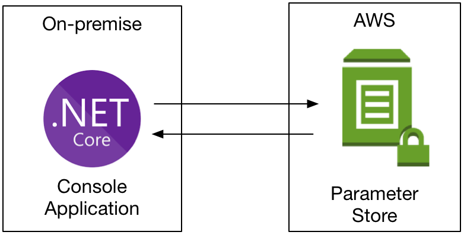
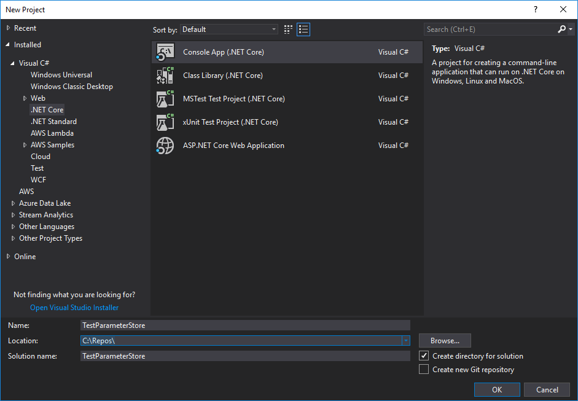

# Using AWS Systems Manager Parameter Store for Configuration

## Overview

This guide walks through how to store and retrieve application configuration settings at runtime for an application instead of hard-coding the configuration values into the application's code and configuration files. The sample application, a simple .NET Core console application, shows how to use the [AWS SDK for .NET](https://docs.aws.amazon.com/sdk-for-net/) to retrieve configuration values from [AWS Systems Manager](https://aws.amazon.com/systems-manager/) Parameter Store.

The walk-through includes creating test values in Parameter Store, creating and testing an application that reads from Parameter Store in either Visual Studio 2019+, or via the .NET Core CLI, and then deleting the test values from Parameter Store.

* Links to documentation
  * [AWS Systems Manager](https://aws.amazon.com/systems-manager/)
  * [AWS Systems Manager Parameter User Guide](https://docs.aws.amazon.com/systems-manager/latest/userguide/systems-manager-paramstore.html)

### Introduction

One common challenge in application development is ensuring that any configuration data liable to change across deployments is separated from the code, allowing a single release to be configured for multiple environments.

So important is the concept of separating configuration from code, that it\'s enshrined as one of the factors in the [12-factor app](https://12factor.net/), a set of guiding principles for modern software development. The 12-factor app advises that configuration should be stored in the environment, and while traditionally that frequently meant environment variables, that's not always an option for modern cloud applications that can use services providing various computation models from Amazon EC2, through to Amazon Elastic Container Service, and AWS Lambda.

AWS\' solution for storing configuration data is called [AWS Systems Manager Parameter Store](https://docs.aws.amazon.com/systems-manager/latest/userguide/systems-manager-paramstore.html). It is a feature of [AWS Systems Manager](https://aws.amazon.com/systems-manager), the AWS operational management and control service.

Parameter Store provides a mechanism to store and manage configuration data, encrypted or plain text, using a hierarchical structure. Parameter Store is ideal for storing passwords, database strings, and all other types of general configuration values.

For this walk-through, we will add a parameter to the Parameter Store using the [AWS Tools for PowerShell](https://aws.amazon.com/powershell/) or the [AWS CLI](https://aws.amazon.com/cli/), and then we will create a simple .NET Core console application and use the [AWS SDK for Systems Manager](https://www.nuget.org/packages/AWSSDK.SimpleSystemsManagement/) to retrieve the configuration data at runtime.

The code for this sample application shown in this tutorial can be found in the SampleApplication subfolder.

### Architecture

The application architecture for this walk-through is a simple console application calling to the AWS Systems Manager over the Internet. However, this example would work just as well if you hosted the application on an AWS EC2 instance.



### Modules

This walk-through is broken up into four modules. You must complete each module before proceeding to the next.

1. Setup Development Environment
1. Create Test Configuration Data
1. Create a .NET Core Console Application
1. Delete AWS Resources

### Prerequisities

* AWS Experience---Beginner

* Time to Complete---30-40 mins

* Cost to Complete---Each service used in this architecture is free.

* Tutorial Prerequisites---To complete this learning path, you will need:\
    ✓ An AWS Account\*\*

    ✓ An IAM user with access key credentials\*\*\*\
    ✓ (Optionally) Visual Studio 2019+ for Windows

\*This estimate assumes you follow the recommended configurations throughout the tutorial and terminate all resources within 24 hours.

\*\*Accounts that have been created within the last 24 hours might not yet have access to the resources required for this learning. If you don't have an account visit <https://aws.amazon.com> and click **Sign Up**.

\*\*\* You must have a set of valid AWS credentials, consisting of an access key and a secret key, which are used to sign programmatic requests to AWS. You can obtain a set of account credentials when you create your account, although we recommend you do not use these credentials and instead [create an IAM user](http://docs.aws.amazon.com/IAM/latest/UserGuide/Using_SettingUpUser.html) and use those credentials.

## Module 1: Setup Development Environment

In this module, you configure your development environment for working
with AWS Systems Manager. We present two different choices for your
development environment: Visual Studio 2019+ for Windows, or the .NET
Core CLI on Windows, Mac, or Linux, using an editor of your choice.

#### Things to Note

* Time to Complete---10 mins

### Implementation Instructions

Follow the instructions below to setup your development environment.

#### Step 1: Setup Visual Studio 2019+ for Windows

If your development environment is Visual Studio 2019 or higher on Windows, you need to install the following components:

* The **.NET Core SDK 3.x** for Windows:\
    <https://www.microsoft.com/net/download/>

* Visual Studio 2019 version 16.4 or later

#### Step 1: Setup .NET Core CLI on Windows, Mac, or Linux

If you are using .NET Core CLI on Windows, Mac, or Linux, you will need to install a few components, as follows:

* The **.NET Core SDK 3.x** for Windows, Mac, or Linux:\
    <https://www.microsoft.com/net/download/>

#### Step 2: Setup either the AWS Tools for PowerShell or the AWS CLI

You will also need **either** the AWS Tools for PowerShell **or** the AWS Command Line Interface (AWS CLI) installed to populate the Parameter Store with test data.

##### Installing the AWS Tools for PowerShell

* Users on Windows running PowerShell versions 2 through 5.x should install the AWS Tools for Windows PowerShell module:
    <https://www.powershellgallery.com/packages/AWSPowerShell/>

* Users on Windows, Mac, or Linux running PowerShell version 6.x should install the AWS Tools for PowerShell Core module:
    <https://www.powershellgallery.com/packages/AWSPowerShell.NetCore/>

Once the correct module for your version of PowerShell is installed you can configure the tools by opening a PowerShell shell and running the following commands:

```powershell
PS C:\> Import-Module AWSPowerShell # replace with AWSPowerShell.NetCore on PowerShell version 6 or higher
PS C:\> Set-AWSCredential -AccessKey "ACCESS-KEY-HERE" -SecretKey "SECRET-KEY-HERE" -StoreAs "default"
PS C:\> Set-DefaultAWSRegion "us-east-1" # replace with your chosen region
```

For more information on configuring the AWS Tools for PowerShell please refer to the [user guide](https://docs.aws.amazon.com/powershell/latest/userguide/pstools-welcome.html).

##### Installing the AWS CLI

1. Install the AWS CLI for Windows, Mac, or Linux:
    <https://aws.amazon.com/cli/>

1. Once installed, you can configure the CLI by running the `aws configure` command in a terminal or command-line window.

1. When prompted, enter your AWS Access Key ID and press **Return**.

1. Enter your AWS Secret Access Key when prompted and then press **Return**.

1. For the default region name you should enter your chosen region code (e.g. eu-west-1)

1. Finally, for the default output format you can just press **Return**.

Finally, you will also need a text editor or an IDE for modifying, such as vi, emacs, nano, [Visual Studio for Mac](https://www.microsoft.com/net/download/), or [Visual Studio Code](https://code.visualstudio.com/) for Windows, Mac, or Linux.

## Module 2: Create Test Configuration Data

You can use Parameter Store to store various data types, including strings, lists of strings, and encrypted strings. Parameter Store also provides a number of advanced options like hierarchical storage, restricting parameter values with regular expressions, and parameter versioning.

For this walk-through we'll focus on storing a simple string, and in this module you\'ll use either the AWS Tools for PowerShell or the AWS CLI to create a basic string value parameter and store it in the Parameter Store.

#### Things to Note

* Time to Complete---5 mins

* Services Used---AWS CLI or AWS Tools for PowerShell, AWS Systems Manager Parameter Store

### Implementation Instructions

Follow the instructions below to create a parameter in Parameter Store using your chosen command line tool.

#### Creating Parameter Store data using AWS Tools for PowerShell

To create an entry in the Parameter Store, execute the following command in a PowerShell terminal or shell:

```powershell
Write-SSMParameter -Name '/TestParameterStore/EnvironmentName' -Type String -Value 'DEV'
```

The command shown above will create the parameter in the region you specified as your default when you configured the tools after installation, using the credentials you saved to your credential profile named 'default'. To create a parameter in a different region, add the `-Region` parameter with the value of the desired region, for example `-Region eu-west-1`. Refer to the cmdlet's [documentation page](https://docs.aws.amazon.com/powershell/latest/reference/index.html?page=Write-SSMParameter.html&tocid=Write-SSMParameter) for more details on other options and settings.

On success the command will output the version number (in this case 1) of the new parameter. You can confirm the parameter was created by running the following command:

```powershell
Get-SSMParameter -Name '/TestParameterStore/EnvironmentName'
```

#### Creating Parameter Store data using AWS CLI

To create an entry in the Parameter Store, execute the following commad in the terminal or command-line window:

```bash
aws ssm put-parameter --name "/TestParameterStore/EnvironmentName" --type String --value "DEV"
```

The command shown above will create the parameter in the region you specified as your default when you configured the tools after installation, using the credentials you saved to your credential profile named 'default'. To create a parameter in a different region, add the `--region` parameter, for example `--region eu-west-1`. Refer to the command's [documentation page](https://docs.aws.amazon.com/cli/latest/reference/ssm/put-parameter.html) for more details on other options and settings.

On success the command will not print a message, but you can confirm the parameter was created by running the following command in the terminal or command-line window:

```bash
aws ssm get-parameter --name "/TestParameterStore/EnvironmentName"
```

Now that you have created a configuration value, it's time to create a basic .NET application that can retrieve the data at runtime.

## Module 3: Create a .NET Core Console Application

In this module you will create a simple project for a .NET Core Console application, add the [AWSSDK.SimpleSystemsManagement NuGet package](https://www.nuget.org/packages/AWSSDK.SimpleSystemsManagement/), and then write some code to retrieve the parameter created in Module 2.

#### Things to Note

* Time to Complete---15 mins

* Services Used---AWS Systems Manager Parameter Store

These instructions provide options for two different development environments: Visual Studio 2019 for Windows, or .NET Core CLI on Windows, Mac, or Linux.

### Implementation Instructions

Follow the instructions below to create the console application depending on your choice of development environment.

#### Create Project using Visual Studio 2019+ for Windows

You can run the sample application provided in the SampleApplication subfolder, which assumes the parameter exists in the US East (N. Virginia) region, or you can create your own. If you are using Visual Studio 2019+ on Windows as your development environment, you can create a solution as follows:

1. Open the **Visual Studio 2019+** desktop application.

1. Create a new project by selecting **File \> New \> Project**.

1. In the **New Project** dialog, go to **Installed\>Visual C\#\>.NET Core** and select **Console App (.NET Core),** entering the name **TestParameterStore** for the project name, as shown in the screenshot below:



Once you have created a project, it will contain the skeleton code required for a .NET Core console application.

The easiest way to call the Parameter Store from .NET is to use the [AWS SDK for .NET](https://docs.aws.amazon.com/sdk-for-net/). Add the NuGet package for the Systems Manager APIs to the **TestParameterStore** project, as follows:

1. Open the Visual Studio Package Manager Console by navigating to **Tools \> NuGet Package Manager \> Package Manager Console**

1. In the Package Manager Console, enter the following command\
   `Install-Package AWSSDK.SimpleSystemsManagement`

In Visual Studio's **Solution Explorer,** expand the **TestParameterStore** project and then open the **Program.cs** file. It contains some auto-generated code for a basic console application.

#### Create Project using .NET Core CLI

You can run the sample application provided in the SampleApplication subfolder, which assumes the parameter exists in the US East (N. Virginia) region, or you can create your own. If you are using the .NET Core CLI on Windows, Mac, or Linux, you will need to do the following:

1. Open a command line or terminal window.

1. Navigate to the directory you want to use as the parent for your project directory.

1. Create a project called **TestParameterStore** by executing the following command

```bash
dotnet new console -n TestParameterStore
```

The project will be created in the **/TestParameterStore** directory and contains the skeleton code required to build a .NET Core console application.

The easiest way to call the Parameter Store from .NET is to use the [AWS SDK for .NET](https://docs.aws.amazon.com/sdk-for-net/). Add the Systems Manager NuGet package to the **TestParameterStore** project by running the following command:

```bash
dotnet add TestParameterStore package AWSSDK.SimpleSystemsManagement
```

Now that you have created the project and added the required packages, you can edit the project code. Use a text editor or an IDE, such as vi, emacs, nano, [Visual Studio for Mac](https://www.microsoft.com/net/download/), or [Visual Studio Code](https://code.visualstudio.com/) for Windows, Mac, or Linux. Or use another editor.

#### Edit code

The **Program.cs** file contains some barebones C\# code for a console application, and the top of the file contains a using statement for the System namespace.

The first change needed to the file is to add using statements for the *Systems Manager* namespaces `Amazon.SimpleSystemsManagement` and `Amazon.SimpleSystemsManagement.Model`. Since they contain asynchronous methods for sending requests to the Parameter Store, you will also need to add the `System.Threading.Tasks` namespace.

```csharp
using System;
using System.Threading.Tasks;
using Amazon.SimpleSystemsManagement;
using Amazon.SimpleSystemsManagement.Model;
```

Now create a method that will create a `ParameterRequest` object and set its `Name` property to the name of the configuration parameter you want to retrieve, which you created in Module 2 as */TestParameterStore/EnvironmentName*.

You can then instantiate the `AmazonSimpleSystemsManagementClient` class, specifying the region you want to connect with by passing in an `Amazon.RegionEndpoint` value. The class creates disposable instances, so instantiate with a using block.

To send the request to Parameter Store, call the client object's `GetParameterAsync()` method. When it completes it will return a `GetParameterResponse` object containing the result of the request. The request makes a network call, so wrap it in a try... catch... block so that exceptions can be shown to the user using `Console.Error.WriteLine()`.

Finally, you can display the result of the request by passing the Value property of the response to `Console.WriteLine()`.

```csharp
static async Task GetConfiguration()
{
    // NOTE: set the region here to match the region used when you created
    // the parameter
    var region = Amazon.RegionEndpoint.EUWest1;
    var request = new GetParameterRequest()
    {
        Name = "/TestParameterStore/EnvironmentName"
    };

    using (var client = new AmazonSimpleSystemsManagementClient(region))
    {
        try
        {
            var response = await client.GetParameterAsync(request);
            Console.WriteLine($"Parameter {request.Name} value is: {response.Parameter.Value}");
        }
        catch (Exception ex)
        {
            Console.Error.WriteLine($"Error occurred: {ex.Message}");
        }
    }
}
```

Next, update the `Main()` method so that it calls the `GetConfiguration()` method:

```csharp
static void Main(string[] args)
{
    GetConfiguration().Wait();
}
```

Save your changes to the file. You are now ready to build and test the project.

#### Build and Test using Visual Studio 2019+ for Windows

You can build and test the project in Visual Studio by selecting **Debug** **\> Start Debugging**.

The console window displaying the output will disappear as soon as the code's executed. To avoid this problem set a breakpoint on the final bracket of the `Main()` method. You can also call `Console.ReadKey();` before end of the `Main()` method.

When you run the program ,the console window should now display the message\
*Parameter name /TestParameterStore/EnvironmentName value is: DEV*

Congratulations! You have created a working console application that can call Parameter Store to retrieve configuration data.

If you want to play with different types of parameters, you can create them as described in Module 2, and then update the **Program.cs** file to retrieve and display multiple parameters.

#### Build and Test using .NET Core CLI

Before deploying the solution, verify everything builds correctly. To build the solution using \>NET Core CLI, do the following:

1. Open a terminal or command-line window

1. Navigate to the **/TestParameterStore** directory

1. Run the command `dotnet run` to build and then run the program. If it succeeds it should show the message\
   *Parameter name /TestParameterStore/EnvironmentName value is: DEV*

Congratulations! You have created a working console application that can call Parameter Store to retrieve configuration data.

If you want to play with different types of parameter you can create additional parameters as described in Module 2, and then update the **Program.cs** file to retrieve and display multiple parameters.

## Module 4: Delete AWS Resources

Deleting the AWS resources used in this walk-through is simply a matter of deleting the configuration values from the Parameter Store.

#### Things to Note

* Time to Complete---5 mins

* Services Used---AWS CLI or AWS Tools for PowerShell, AWS Systems Manager Parameter Store

### Implementation Instructions

Follow the instructions below to delete the parameters created in Modules 2 and 3 using your chosen command line tool.

#### Deleting Parameter Store data using AWS Tools for PowerShell

To delete data from Parameter Store execute the following command in a PowerShell terminal or shell:

```powershell
Remove-SSMParameter -Name '/TestParameterStore/EnvironmentName'
```

The command shown above will delete the parameter in the region you specified as your default when you configured the tools after installation, using the credentials you saved to your credential profile named 'default'. If you created the parameter in a different region, add the `-Region` parameter with the value of the desired region, for example `-Region eu-west-1`.

The command will prompt for confirmation before continuing. To suppress the confirmation message, add the `-Force` parameter. You can confirm the parameter was deleted by either re-running the console application or by using the `Get-SSMParameter` cmdlet as shown in Module 2.

#### Deleting Parameter Store data using AWS CLI

To delete data from Parameter Store execute the following command in a terminal or command-line window:

```bash
aws ssm delete-parameter --name "/TestParameterStore/EnvironmentName"
```

The command shown above will delete the parameter in the region you specified as your default when you configured the tools after installation, using the credentials you saved to your credential profile named 'default'. If you created the parameter in a different region add the `--region` parameter, for example `--region eu-west-1`.

You can confirm the parameter was deleted by either re-running the console application, or by executing the following command in the terminal or command-line window:

```bash
aws ssm get-parameter --name "/TestParameterStore/EnvironmentName"
```

One of the great advantages of following the principles of Infrastructure as Code is that creating and deleting resources can be executed through commands, so if you want to reset the application, you just need to re-run the AWS Tools for PowerShell or AWS CLI cmmands shown in Module 2. You do not need to modify code.
