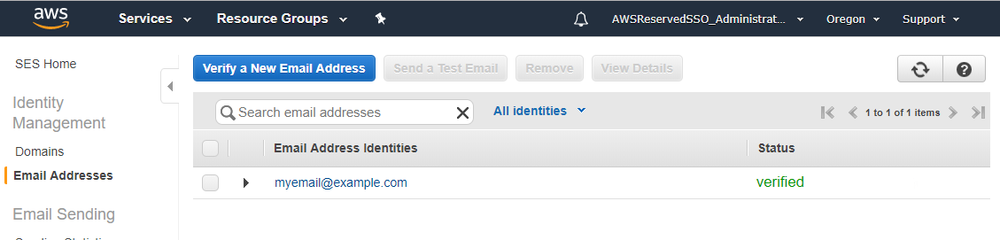
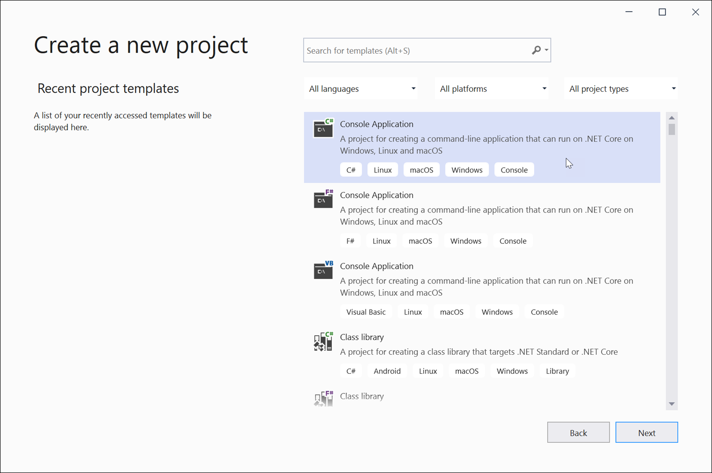
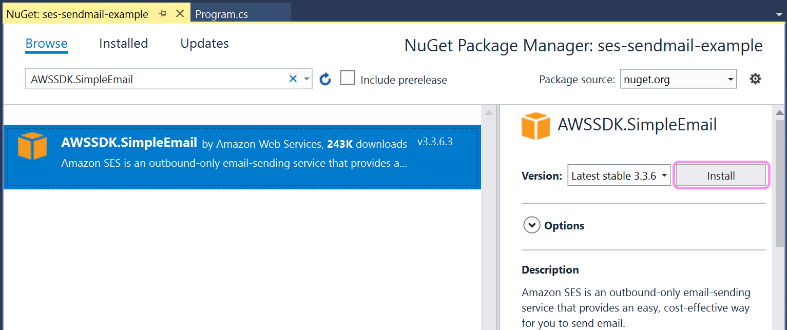
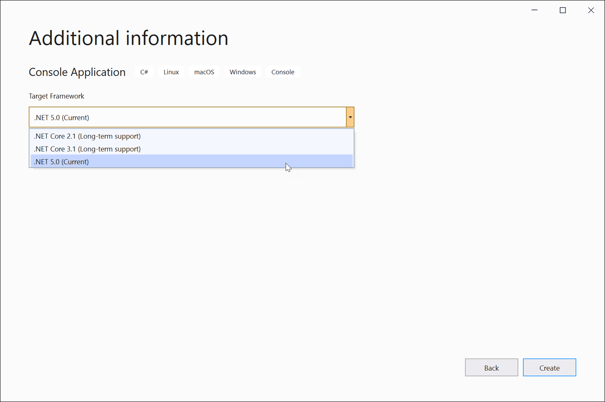
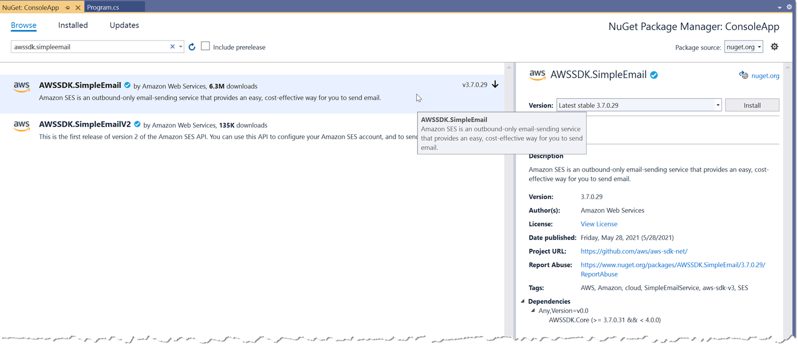

# Sending Emails with Amazon Simple Email Service (Amazon SES) and .NET

## Overview

This guide walks through how to send email from an application using Amazon Simple Email Service (Amazon SES). The walk-through includes verifying the sender email address in the AWS console, creating and configuring a simple .NET console application using either Visual Studio or 'dotnet' command line tool, and then running the app to actually send the email. The code could easily be run in an AWS Lambda function (.NET Core 3.1/.NET 5+), or anywhere else .NET code (.NET Framework/.NET Core/.NET 5+) can run.

* Links to documentation
  * [Amazon SES Service Page](https://aws.amazon.com/ses/)
  * [Amazon SES Developer Guide](https://docs.aws.amazon.com/ses/latest/DeveloperGuide/)

## Introduction

Amazon SES is an email platform that provides an easy and cost-effective way to send and receive email without managing mail servers or other infrastructure. A [NuGet package](https://www.nuget.org/packages/AWSSDK.SimpleEmail/) for the AWS SDK for .NET enables you to to programmatically send emails from your .NET application code.

In this walk-through, you will use the AWS Management Console to do the one-time verification of the email address you'll use to send mail from. Next, you'll create a new .NET console application. You may use any .NET version that supports [.NET Standard 2.0 or higher](https://docs.microsoft.com/en-us/dotnet/standard/net-standard). This includes .NET Framework 4.6 and higher, .NET Core 2 and higher, or .NET 5 and higher. The sample code provided with this guide uses .NET 5. Then you'll add the AWS SDK for .NET [NuGet package for SES](https://www.nuget.org/packages/AWSSDK.SimpleEmail/) to the project, update the application code to call Amazon SES, and run the application to send an email.

### Prerequisites

* A version of .NET supporting .NET Standard 2.0 or higher

* AWS Account with credentials configured locally in Visual Studio, or using the AWS Tools for PowerShell or the AWS CLI

* Optional: Visual Studio 2017 or higher, or Visual Studio Code, JetBrains Rider, or your preferred editor. You can also use the dotnet command line tool for .NET Core/.NET 5+.

## Verifying Email Addresses in Amazon SES

Amazon SES requires you to verify either the email addresses or the entire domain that you use to send email from, or that you use in the return address. For this walk-through, you'll just confirm a single email address.

> *Note:* Email addresses are case-sensitive. If you verify <sender@EXAMPLE.com>, you can't send from <sender@example.com> without also verifying that address.

Also, if your account is still in the Amazon SES sandbox, you will need to verify any email addresses that you send emails to, except for email addresses provided by the [Amazon SES mailbox simulator](https://docs.aws.amazon.com/ses/latest/DeveloperGuide/send-email-simulator.html).

## Step 1: Log in, and Select an AWS Region in the AWS Management Console

Amazon SES is a regional service. Log into the AWS Management Console, and using the region-selector at the top-right, select the region you want to verify your email address in. This guide, and the provided sample code, assumes you are using the US East (N. Virginia) region.

## Step 2: Verify an Email Address

1. Navigate to the Amazon SES dashboard in the management console.

1. In the navigation pane, under **Identity Management**, select **Email Addresses**.

1. Click **Verify a New Email Address**.

1. In the **Verify a New Email Address** dialog box, type your email address in the **Email Address** field, and then click **Verify This Email Address**.

    > **Note:** If your SES service has only "sandbox" access, you have to verify both sending and receiving email addresses for the email delivery to be successful, or run the application code using an address from the SES simulator.

1. You should receive an email with the subject line, "Amazon Web Services -- Email Address Verification Request in region *\<RegionName\>*." Click the link in the body of the message.

1. Back in the Amazon SES console, verify that your email status is "verified". Click the refresh icon at the top-right of the email list if necessary. See Figure 1 below.

    

    Figure 1. Verified Email Address

> **Note:** If you do not see the email verification email in your inbox, follow the [troubleshooting steps in the Amazon SES Developer Guide](https://docs.aws.amazon.com/ses/latest/DeveloperGuide/verify-email-addresses-procedure.html#verify-email-addresses-troubleshooting).

## Step 3: Create a New Console Application Project

You can create, build, and run the application using either Visual Studio or from the command line. Instructions for the command line assume you are using .NET Core or .NET 5+. Follow the steps under the relevant heading below. Alternatively you can use the prewritten code contained in the SampleApplication folder of this guide. Note that the provided code assumes use of .NET 5 and the US East (N. Virginia) region.

The complete application can be found in the SampleApplication folder for this guide, and you can use this if you wish (skip to step 5 to make changes to the provided code and then run it). Alternately, follow the steps below to create and update a new application project. Follow the steps appropriate to your chosen environment below.

### Create Project Using Visual Studio

1. Select **New Project** from the **File** menu.

1. In the _New Project_ dialog, select the **Console App** project template and fill out the project settings appropriately (name, location, and .NET version).\
    \
    **Note:** The screenshots below show the process for selecting a .NET 5.0 console application project in Visual Studio 2019. Your version may differ.

    

    

    

1. You can now skip to Step 4 below, _Add the Amazon SES NuGet Package_.

### Create Project Using the 'dotnet' Command Line Tool

Run the commands below in a command prompt on Windows, macOS, or Linux to create a new directory, and then create the console application project.

```bash
mkdir ses-sample
cd ses-sample
dotnet new console
```

The *dotnet new* command will create the project files, and restore packages referenced by the template.

## Step 4: Add the Amazon SES NuGet Package

Next you'll add the NuGet package from the AWS SDK for .NET that your application code can use to call Amazon SES APIs.

You have a choice of using the NuGet Package Manager console in Visual Studio, or adding the package at the command line. Follow the steps appropriate to your chosen environment below.

### Add NuGet Package Using Visual Studio

1. Right-click the project node for your project in the Solution Explorer, and select **Manage NuGet Packages...** from the context menu.

1. In the NuGet window that appears, click the **Browse** link  and in the search box enter **AWSSDK.SimpleEmail**.

    > **Tip:** There are two packages on NuGet for Amazon SES. For this walk-through, select the _AWSSDK.SimpleEmail_ package to match the provided example code.

1. When the package appears in the list area, select it, and then click the **Install** button in the details pane, shown in Figure 3 below.

    > **Note:** If prompted to accept the license agreement, click the "I Accept" button in the dialog.

    

    Figure 2. Adding the NuGet Package for Amazon SES in Visual Studio 2019

1. You can now skip to Step 5 below, _Edit the C\# Code_.

### Add NuGet Package Using the Command Line

1. In your command line shell ensure you are located in the same folder as the project you just created.

2. Run the command below to add the NuGet package *AWSSDK.SimpleEmail* to the project.

    ```bash
    dotnet add package AWSSDK.SimpleEmail
    ```

## Step 5: Edit the C\# Code

If you are following the steps in this guide with a new project, copy and paste the code below to replace the contents of *Program.cs* in your new project using either Visual Studio or a code editor of your choice. If you are instead using the provided code in the SampleApplication folder, skip to _Ensure you make the following changes in the code_ below.

```csharp
using System;
using Amazon.SimpleEmail;
using Amazon.SimpleEmail.Model;

namespace ses_sendmail_example
{
    class Program
    {
        static void Main(string[] args)
        {
            Console.WriteLine("Sending Email...");
            using (var client = new AmazonSimpleEmailServiceClient(Amazon.RegionEndpoint.USEast1))
            {
                var sendRequest = new SendEmailRequest
                {
                    Source = "verified-email-address@example.com",
                    Destination = new Destination { ToAddresses = {"dest@example.com"} },
                    Message = new Message
                    {
                        Subject = new Content("Hello from the Amazon Simple Email Service!"),
                        Body = new Body
                        {
                            Html = new Content("<html><body><h2>Hello from Amazon SES</h2><ul><li>I'm a list item</li><li>So am I!</li></body></html>")
                        }
                    }
                };

                try
                {
                    var response = client.SendEmailAsync(sendRequest).Result;
                    Console.WriteLine("Email sent! Message ID = {0}", response.MessageId);
                }
                catch (Exception ex)
                {
                    Console.WriteLine("Send failed with exception: {0}", ex.Message);
                }
            }

            Console.Write("Press any key to continue...");
            Console.ReadKey();
        }
    }
}
```

This sample code demonstrates a common pattern when developing with the AWS SDK for .NET, which is the use of a client object to represent an AWS service. That client object then exposes the service's APIs via methods on the client object, such as the `SendEmailAsync` method in this example.

Ensure you make the following changes in the code:

* Replace _verified-email-address@example.com_ with the email address you verified earlier

* Replace _dest@example.com_ with your email address (where emails will be sent).

    > **Note:** If your account is in the SES sandbox, the destination address you provide must have been verified, or you can use test email addresses and the SES simulator. see [Testing email sending in Amazon SES](https://docs.aws.amazon.com/ses/latest/DeveloperGuide/send-email-simulator.html) for more details.

* Replace the region parameter in the `AmazonSimpleEmailServiceClient` instantiation with the region you would like to send from. In our example, we have it set to us-east-1 corresponding to the US East (N. Virginia) region.

For our sample app, we're sending an HTML-formatted email. If you wish to send a plain text email, change the email body property in the code to read `Content("your text here")`

> *Note:* The code shown above, and in the provided sample application, assumes you have a credential profile named _default_ set up on your local machine. The SDK automatically looks for and loads credentials from this profile when no other credentials are specified. See the sample application provided with this guide for an example of how to use an alternate credential profile, with a different name.

## Step 6: Run the Application and Send an Email

To send email using the console app, just run it using either Visual Studio or the command line.

### In Visual Studio

Just press **F5** to build and run the app.

### Command Line

Use the following command to build (compile) and run the app:

```bash
dotnet run
```

If you want to run the app again without compiling, just pass the --no-build flag like this:

```bash
dotnet run --no-build
```

The console application will run. It will send an email to the destination email address you specified in *Program.cs*, and then wait for you to press any key before exiting. Be sure to check your spam folder if you don't see the email in your inbox.
