# Deploying an ASP.NET Core Application to AWS Fargate

## Overview

The guide walks you through creating a new ASP.NET MVC Core application, and deploying it as a multi-AZ service to [AWS Fargate](https://aws.amazon.com/fargate/) using the Container Publishing Wizard in the [AWS Toolkit for Visual Studio](https://aws.amazon.com/visualstudio/). As part of the deployment, you will create and configure an Application Load Balancer (ALB) and an [Amazon Elastic Container Service (ECS)](https://aws.amazon.com/ecs/) Cluster, all within the publishing wizard. Finally, you will view the website via the public IP addresses of the Tasks (containers) themselves, and also via the ALB's public DNS.

The SampleApplication folder contains the content equivalent to what you will create in the walkthrough using Visual Studio and is provided in case you wish to simply skip to the deployment step. Note that if you do skip directly to the deployment step you will still need to edit the task definition file as indicated in the instructions. If you are following the guide in its entirety you do not need the files in the SampleApplication folder.

* Links to documentation
  * [Fargate Service Page](https://aws.amazon.com/fargate/)
  * [AWS Fargate Documentation](https://docs.aws.amazon.com/AmazonECS/latest/developerguide/ECS_GetStarted.html)

### Prerequisites

* [.NET Core 2.0](https://www.microsoft.com/net/download/) or higher installed
* [Docker for Windows](https://docs.docker.com/docker-for-windows/?install_site=vsonwin)
* Visual Studio 2017 or higher (the free community editions are sufficient)*
* [AWS Toolkit for Visual Studio](https://aws.amazon.com/visualstudio/)*
* An AWS Account with credentials configured locally using the AWS Toolkit for Visual Studio, or using the [AWS Tools for PowerShell](https://aws.amazon.com/powershell/) or the [AWS CLI](https://aws.amazon.com/cli/)

\* If you are following the steps in the optional task using the command line, you do not need Visual Studio and the AWS Toolkit, and can use either Windows, MacOS or Linux.

## Introduction

AWS Fargate is a technology for [Amazon Elastic Container Service (ECS)](https://aws.amazon.com/ecs/) that allows you to run containers without having to manage servers or clusters. With AWS Fargate you no longer have to provision, configure, and scale clusters of virtual machines to run containers. Fargate supports Linux containers, so for this walk-through we'll create a containerized ASP.NET Core MVC application in Visual Studio, then use the AWS Toolkit's publishing wizard to deploy it to Fargate (screenshots in this walk-through are taken from Visual Studio 2019).

> Note: You can also create the application and deploy it to Fargate from Windows, MacOS or Linux using AWS-provided extensions to the dotnet CLI. The AWS dotnet CLI extensions for publishing to ECS can also be used by Visual Studio developers and support round-tripping between the IDE and the command line.

We'll complete the following modules in order to get our ASP.NET Core MVC application running in Fargate containers behind a load balancer in AWS:

1. Create a new ASP.NET Core MVC web application
1. Publish our application using the AWS Toolkit's publishing wizard for ECS
1. View the ECS cluster and Tasks in the AWS Toolkit plugin for Visual Studio
1. View our application in a browser via the container public IPs and also the ALB's public DNS
1. Resource cleanup

## Module 1: Create a new ASP.NET Core MVC Web Application

In this module we're going to create a new default ASP.NET Core MVC web application using the Microsoft-supplied project template, and then add a simple line of code to write the hostname of the container in which the app is running out to the UI as HTML.

> Note: If you have your own application, or want to use the provided sample in the repository, you can skip this module.

1. In Visual Studio select the *File > New Project* menu item to launch the New Project dialog.

1. In the New Project dialog select the ASP.NET Core Web Application project type.
  

1. Fill in a name and a location for your project and then click the **Ok** button.
  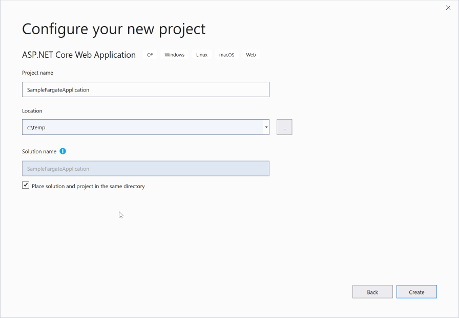

1. In the New ASP.NET Core Web Application dialog, select *Web Application (Model-View-Controller)*, ensuring that *ASP.NET Core 2.0* (or higher) is selected for the .NET Core version.
  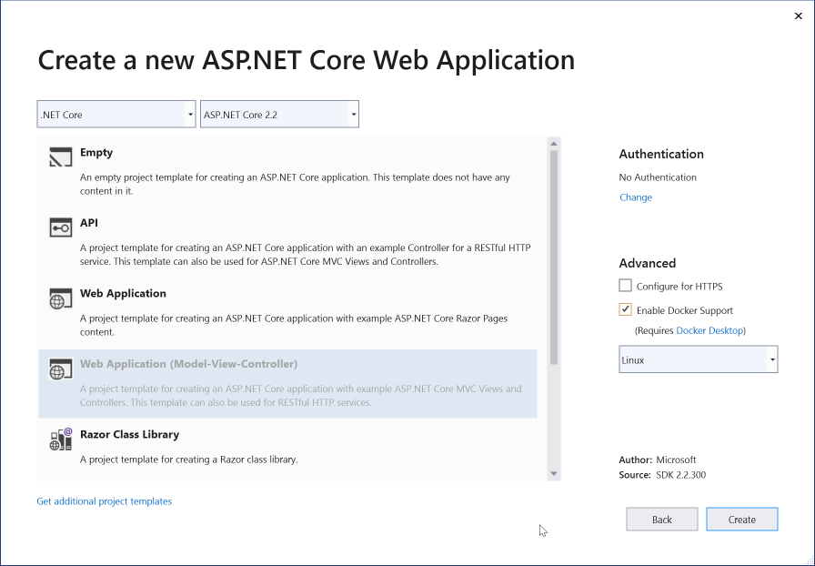

1. Check the box to Enable Docker Support, and select **Linux** as the container OS from the drop-down, then click the **OK** button to generate the project.

1. When project generation completes expand the project node in the Solution Explorer pane, expand the project node for the app and navigate into the *Views > Home* folder and double-click the *Index.cshtml* file to open it in the editor. This is the HTML template file that will render the home page for our web application.

1. In *Index.cshtml*, before the first `<div>` statement, add a header element:

    ```html
    <h2>Hostname = @System.Environment.MachineName</h2>
    ```

1. Save your changes to the file.

> *Note: If you want to test out the web project locally, you have two options. You can run it in a container by clicking the **Docker** button on the toolbar to build the container locally and run it (**warning**: this is slow). Or you can launch it using your configured web-server by right-clicking the project node in Solution Explorer and selecting **Debug Start new instance** (much faster).

You've now completed this module and are ready to deploy the application to Fargate.

## Module 2: Publish to Fargate using the AWS Toolkit for Visual Studio Wizard

In this module we will deploy the sample application to two containers running your application, in two availability zones (AZs), behind an Application Load Balancer with AWS Fargate.

1. Right-click the project node in Solution Explorer then select **Publish Container to AWS**. This will launch the toolkit's wizard.

1. On the first step of the wizard choose the account profile to use for deployment and the region in which the deployment will be performed (*US East (N. Virginia)* is used in the screenshots below). Ensure **Service on an ECS Cluster** is selected as the Deployment Target then click the **Next** button.

    > Note: to enable deployment using the AWS extensions for the dotnet CLI, also check the *Save settings to aws-ecs-tools-defaults.json* option. This will add a configuration file to the project containing deployment settings that can be used when deploying from the command line. The file is shared with the Visual Studio tooling enabling you to use either the IDE or the command line to perform your deployments.

    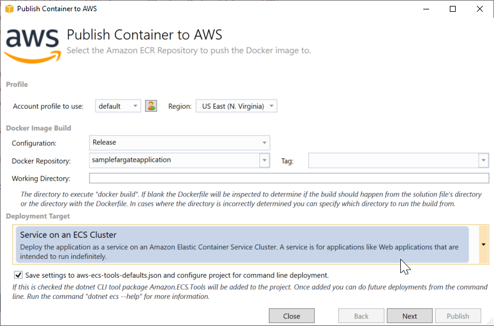

1. On the Launch Configuration page, choose **Create an empty cluster** (unless you already have a cluster you intend to use), and provide a name for the cluster. *Launch Type* should be set to **FARGATE**.

1. Under *Network Configuration*, select two subnets in two separate availability zones (AZs). You can pick more than two, but for this walk-through, we'll keep it simple and choose subnets in AZs "a" and "b".

1. Select **Create New** next to Security Groups. This will create a new security group with TCP port 80 open to the world. If you are creating a container service for use inside a VPC only, choose a security group you created for that purpose outside of this walk-through.

1. Check the box to *Assign Public IP Address*.

    > Note: In a real-world scenario, we wouldn't need to assign public IPs to each task (container) individually. Instead, we would access the services via the application load balancer. However, for demo purposes, we want to show that it's you can if you wish reach each task (container) directly by its public IP as well as via the ALB's public fully qualified domain name (FQDN).

1. The Launch Configuration page should look like the below image. Leave the remaining settings on the page at their default settings and click the **Next** button to continue.

    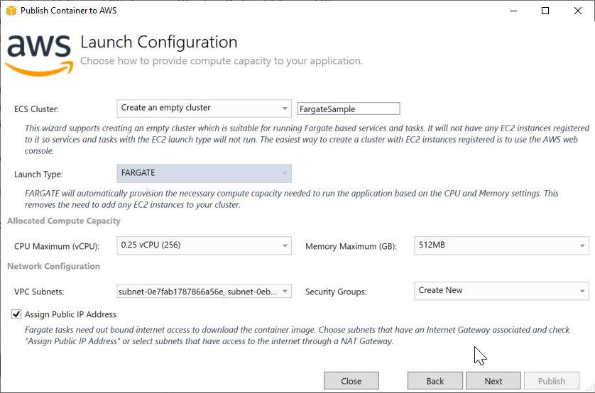

1. On the Service Configuration page, choose **Create New** for the service, and provide a name for your service. The wizard will by default use the name of the project but you may change this. In the image below, the service will be called *SampleFargateApplication*.

1. For the number of tasks enter **2**, which will place one task in each of the two AZs we selected earlier. Leave the other settings at their defaults and click the **Next** button to continue.

    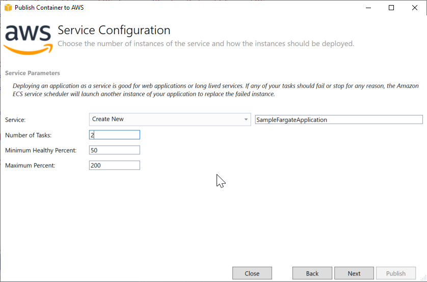

1. On the Application Load Balancer Configuration page, check the box next to *Configure Application Load Balancer*.

1. Choose **Create New** in the load balancer drop-down and provide a name for your load balancer (the wizard uses the project name by default).

1. Enter **80** as the listener port in the box to the right of the (defaulted) *Create New* selection.

1. In the Load Balancer Target Group section, enter a name for the new target group into which your Tasks (containers) will be placed. In the example below we have chosen to use the default name, that of the project.

    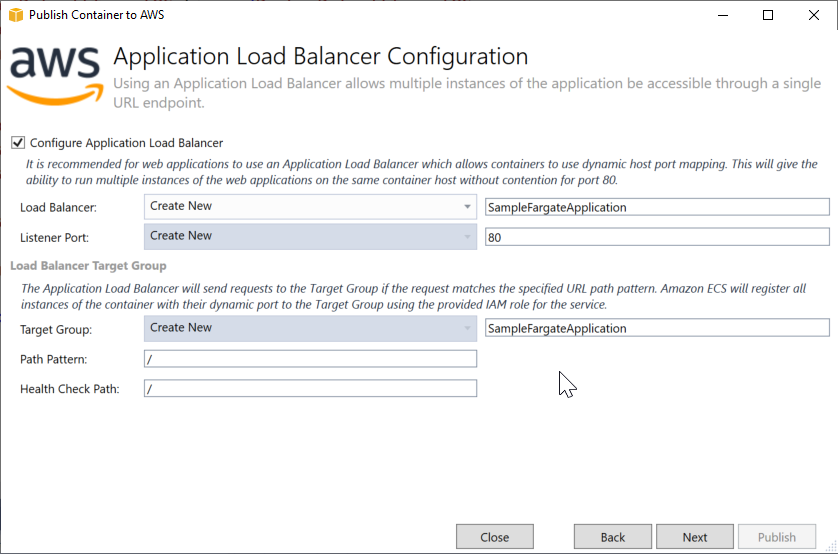

1. Leave the other entries as their defaults and click the **Next** button.

1. On the Task Definition page, choose **Create New** for the task definition and enter a name for it (the wizard will again default to using the project name).

1. Enter a name for the container that will run inside of the task or use the default wizard-provided value that is the project name.

    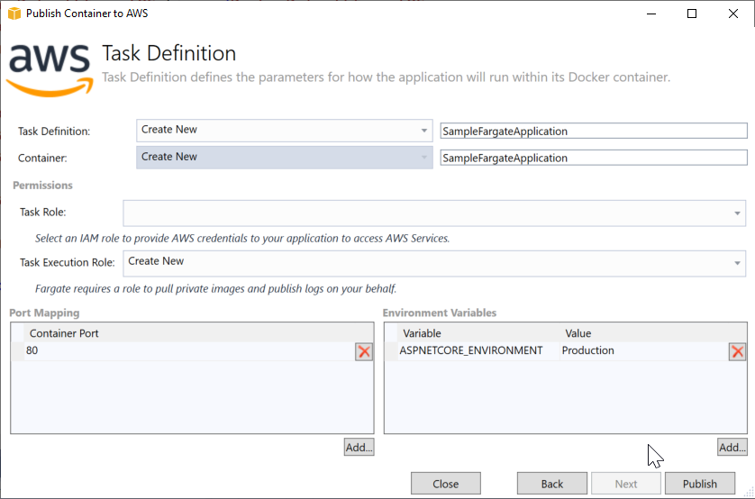

1. Leave the Task Role selection blank since our app doesn't need to access any AWS services. Leave the Task Execution Role to the default value.

    > Note: the Task Role is used to associate a role with the running application. Depending on how the role is configured it can be used to provide temporary AWS credentials to the application and also scope what AWS services, resources and APIs the running application can access. The Task Execution role is used to permit ECS to access your repository to pull images and also to write logging information to CloudWatch Logs.

1. The Port Mapping should already have default values **80** for the container port and *ASPNETCORE\_ENVIRONMENT* set as an environment variable. Click the **Publish** button to begin the publish process.

  > During the publish process, the AWS Toolkit will call *docker-compose build* to build the solution and container image on your computer, then call the ECR API to get credentials for ECR. It will then tag the container image, and push it to ECR -- you will see the container being pushed up by Docker in a command window that will appear, for example:

  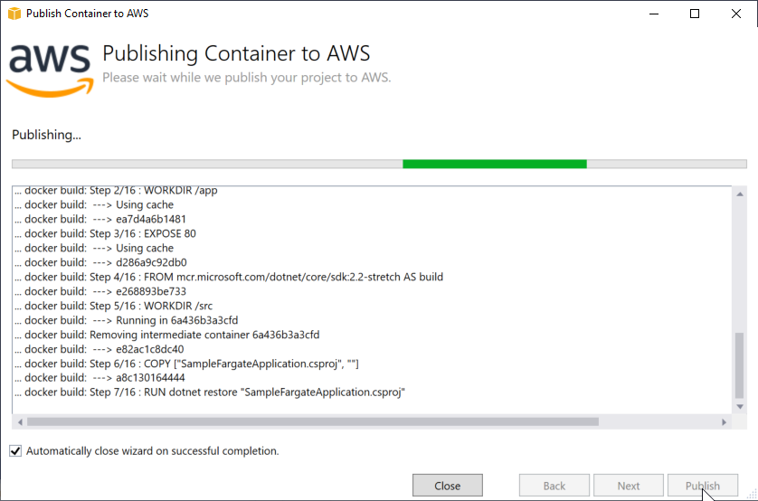

  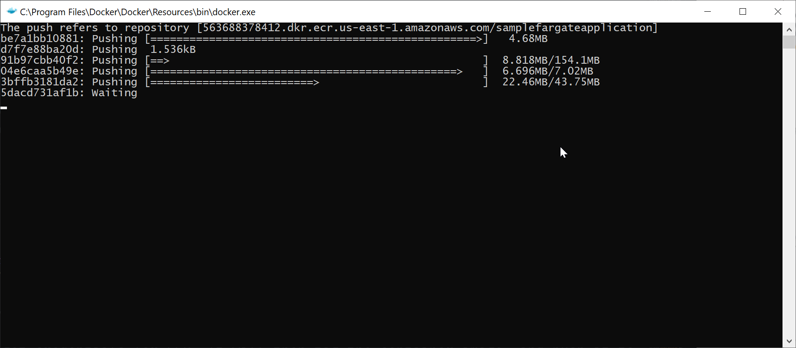

## Module 3: View the Cluster and Tasks in AWS Toolkit

In this module we will use the toolkit to access details about the cluster we just deloyed.

When the deployment process completes the toolkit will open a view onto the cluster. In the image below you can see that the cluster is being launched and is currently pending provisioning of the application load balancer (which can take a few minutes to complete).

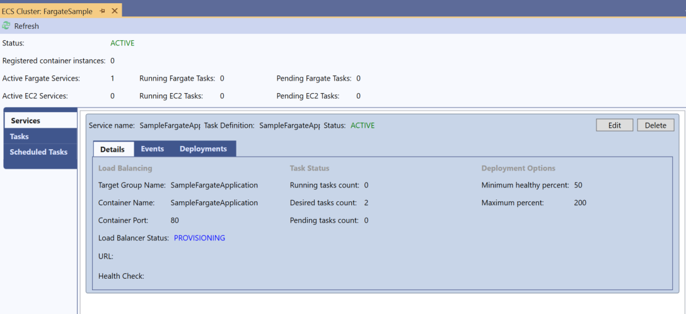

One the load balancer provisioning is completed, refreshing the view will show the URL to the application.

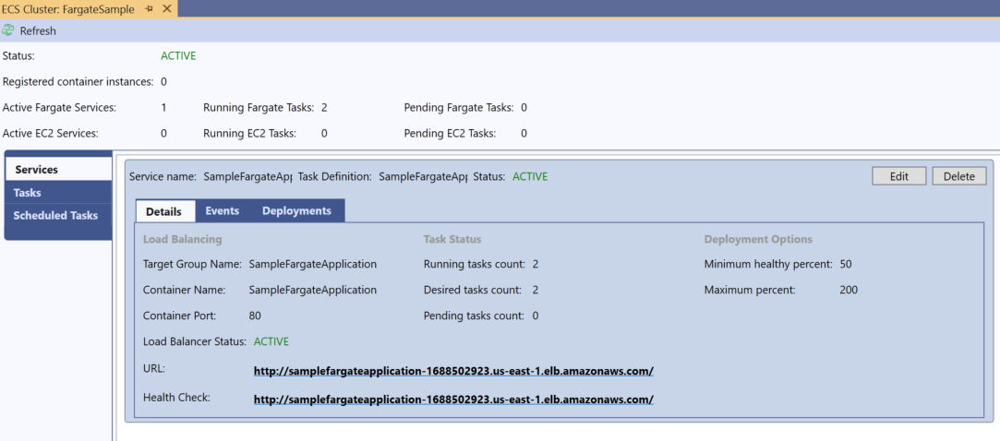

If the cluster view is not automatically opened when the deployment wizard completes, or you wish to open it at a later time, you can navigate to the cluster and open the view using the toolkit's AWS Explorer as follows.

If the Explorer window is not already open select the *View > AWS Explorer* menu item from the IDE's main menu. In the AWS Explorer tool window, ensure the region and account profile match those you used when deploying, then locate the *Elastic Container Service* node and expand it, then expand the *Clusters* node. You should see the clusters in your currently-selected region. Double-click the cluster you created to open the ECS Cluster view in Visual Studio corresponding to the image above. If you don't see your cluster, check that your region is set to the one you selected when deploying and click the refresh icon to refresh the Explorer view.

The default selection in the ECS Cluster pane (in the shaded left menu) is "Services". You should see your service here, including the *Desired tasks count* and *Running tasks count*. When the ALB is created, its URL will appear and be clickable. If you select *Tasks* from the left shaded menu, you will see the two tasks we created and their status, as shown below.

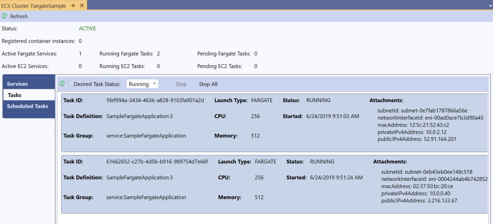

## Module 4: View the Application in a Browser

In this final module we will access the running application in the tasks in our cluster.

1. In the tookit's ECS Cluster view that was opened in module 3 above, find the status of the tasks. Wait until either of the tasks shows a status of *RUNNING*. You may need to click the refresh icon that is above the tasks list.

1. At the right side of each task row, in the *Attachments* section, you will find the public IP address and DNS for the task. Copy the *publicIPv4Address* value or the *publicDNS* value (the DNS value resolves to the IP address, so use either) for a running task and paste it into a browser.

1. If the task is running, you should see the website which shows the hostname of the container in which the app is running.

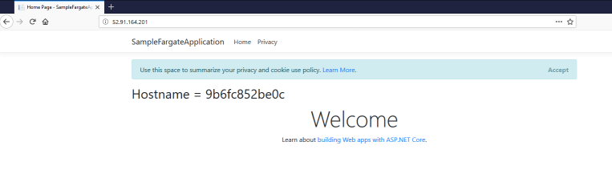

1. Next, click back to *Services* in the shaded left menu, and click on the load balancer URL link. The website should open in a new tab or browser using the ALB's public DNS.

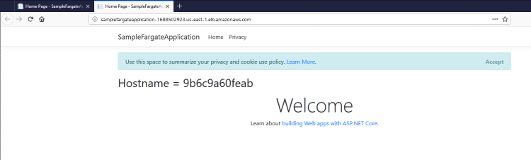

1. When both tasks are running, click the refresh button in your browser a few times. You should see the hostname that is displayed flip back and forth as your requests are routed to the two containers.

## Module 5: Resource cleanup

Now that you have explored deploying applications to AWS Fargate you may want to delete the created resources to avoid future charges to your account. This module shows how to delete the cluster and associated resources from within Visual Studio. Alternatively you can use the AWS Management Console to delete the tasks running in the cluster, the application load balancer and the container image repository.

1. In Visual Studio, using the AWS Explorer as outlined in module 3, open the cluster view for the cluster you created in this guide.

    

1. Click **Delete** in the upper right corner of the *Services* pane. A confirmation dialog will be displayed. Click **OK** to proceed.

    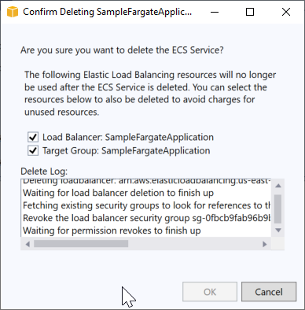

1. The toolkit will delete the running tasks in the cluster and then the load balancer and its associated resources.

1. When the tasks in the service have been deleted (the *Services* pane shows empty and the *Tasks* pane shows no running tasks) you can close the cluster view.

1. Open the AWS Explorer window (if not already open) and locate the *Amazon Elastic Container Service* node and expand it, then expand the *Clusters* child node. Select the cluster corresponding to the one created for the guide then right click and select **Delete**.

    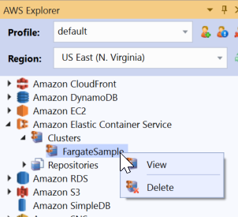

1. The toolkit will display a confirmation message. Click **Yes** to confirm deletion.

1. Expand the *Repositories* child node and select the repository that was created during deployment of the application. Right click and select **Delete**. The toolkit will again prompt for confirmation. Check the option labelled *Delete the repository even if it contains images* and then click **Yes** to confirm.

  > Note: **CAUTION** - be sure to select the repository that was created while using this guide and which should not contain any images other than those for the sample application!

You have now deleted all resources related to this guide.
