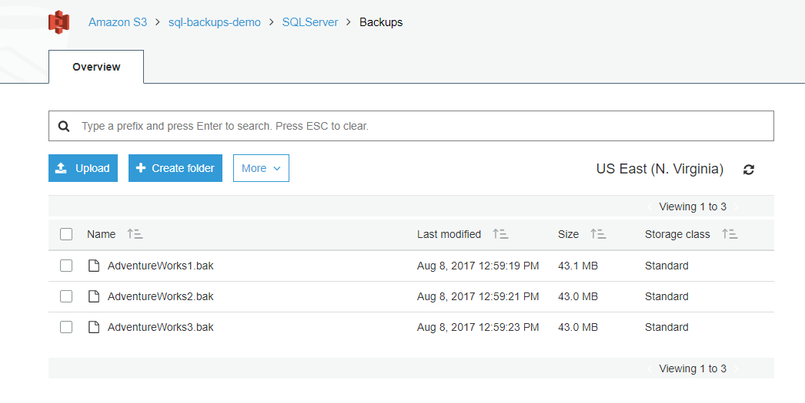
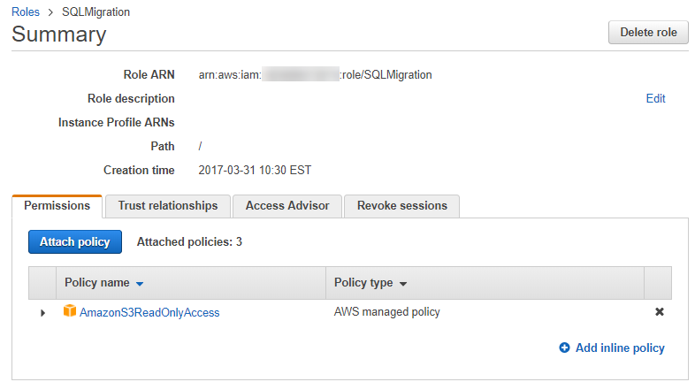
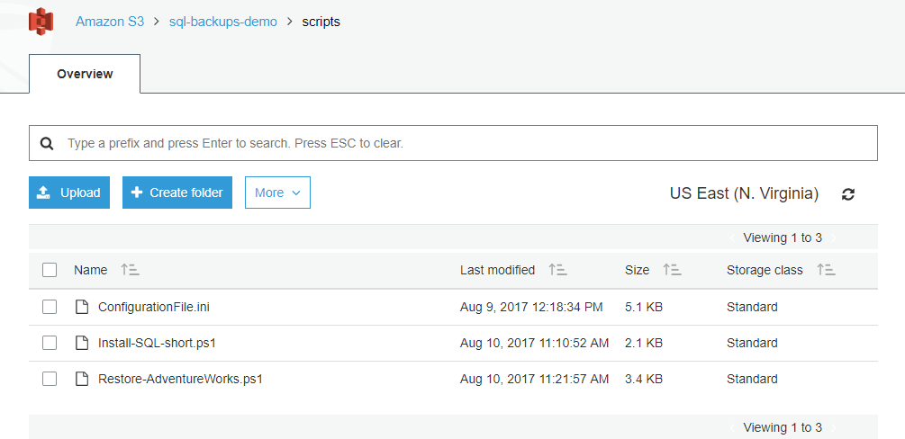

# Bootstrapping Your Large Production On-Premises SQL Server Databases to Amazon EC2

## Overview

How to use PowerShell and native Microsoft SQL Server backups to migrate
an on-premises SQL Server database to an [Amazon
EC2](https://aws.amazon.com/ec2/) instance.

In general, we recommend that where possible you should make every
attempt to migrate your on-premises SQL Server databases to [Amazon Relational Database Service (RDS)](https://aws.amazon.com/rds/).
You can find more details on how to do this in [the Amazon RDS User
Guide](http://docs.aws.amazon.com/AmazonRDS/latest/UserGuide/Welcome.html),
specifically in [the guide\'s SQL Server
topic](http://docs.aws.amazon.com/AmazonRDS/latest/UserGuide/CHAP_SQLServer.html).
But in some cases, RDS might not be a viable solution for you.

AWS offers many paths to migrating your on-premises SQL Server databases
to AWS. We recommend using the native tools for homogeneous database
migrations. If you are planning heterogeneous migration, perhaps moving
to [Amazon Aurora](https://aws.amazon.com/rds/aurora/) or [Amazon RDS
for PostgreSQL](https://aws.amazon.com/rds/postgresql/), then [AWS
Database Migration Service (DMS)](https://aws.amazon.com/dms/) is a good
choice. Otherwise, stick to the native replication options.

The scenario described in this post is that your DBA team uploads your
SQL .bak files to [Amazon S3](https://aws.amazon.com/s3/). By your
team\'s executing PowerShell bootstrapping scripts during the cutover
downtime, your database will be up and running in AWS.

You might typically want to perform the migration during a period of
inactivity or low traffic. Following are the key aspects you need to
factor in when deciding on your downtime and security. Here are some
ways to keep your downtime to a minimum.

-   **Network bandwidth** -- Are you using [AWS Direct
    Connect](https://aws.amazon.com/directconnect/), [AWS VPN](https://aws.amazon.com/vpn/), or something
    else? We recommend that you simulate an S3 upload of your .bak file
    to get an estimate of your upload times.

-   **Compression** -- You can also include the option to compress the
    database backup. Doing this uses slightly more CPU but reduces the
    migration time because the amount data being transferred is less.

-   **Backup size** -- The backup size might have an impact on whether
    you need to stripe the backup into smaller chunks to improve the
    upload completion time and success:

    -   Striping your backups has the potential to dramatically shorten
        the time it takes for your backups to complete.

    -   By keeping your individual striped files less than 5 GB, you
        avoid using multi-part upload capability. For further details,
        see [this topic in the S3
        documentation](http://docs.aws.amazon.com/AmazonS3/latest/dev/UploadingObjects.html).
        The max file size for a single file in S3 is 5 TB. Thus, if the
        database is bigger than that, you have to stripe across multiple
        files.

    -   For parallel S3 uploads, you might also want to consider some
        third-party options out there that can shorten your transition
        time by uploading your split files in parallel. André Rocha
        Agostinho, a software engineer, wrote an excellent article using
        C\#, [Using C\# Parallel to copy files to
        S3](http://aragostinho.github.io/2015/03/11/using-c-parallel-to-copy-files-to-s3.html).

-   Encryption -- You have several options:

    -   You can back up and upload using [AWS
        KMS](https://aws.amazon.com/kms/) encryption and then download
        and restore using the same encryption. With AWS KMS encryption,
        even if someone gets access to the S3 bucket where the files are
        stored they can\'t restore the database. In addition, you can
        use AWS KMS to encrypt the entire S3 bucket, providing an even
        greater level of security.

    -   Another option is to include a **MEDIAPASSWORD** value in SQL
        Server for the backup, though this is not as secure as
        encryption and is going to be deprecated by Microsoft soon.

Another important factor to consider is the destination EC2 instance
class and [Amazon EBS](https://aws.amazon.com/ebs/) geometry. For a
Microsoft SQL Server instance, you can find the recommended DB instance
class for your requirements in the [DB Instance Class
topic](http://docs.aws.amazon.com/AmazonRDS/latest/UserGuide/Concepts.DBInstanceClass.html)
in the Amazon RDS documentation, which goes into great detail. The
recommended EBS volume type is Provisioned IOPS SSD (io1), which gives
highest-performance SSD volume for mission-critical low-latency or
high-throughput workloads.

For the purposes of this example, I am going to create a striped backup
of the Adventureworks database. You can find an excellent blog post at
[SQL CAT New Whitepaper: Data Compression: Strategy, Capacity Planning
and Best Practices by Sanjay Mishra, et
al.](https://blogs.msdn.microsoft.com/jimmymay/2009/05/29/sql-cat-new-whitepaper-data-compression-strategy-capacity-planning-and-best-practices-by-sanjay-mishra-et-al/),
on how to determine the optimal number of files you want to stripe your
database backups onto. Later, I demonstrate how to do a batch upload to
S3.

## Get your database backup into AWS

To get your database backup into AWS, you first create striped backups.

### Create striped backups

Using the following PowerShell command to back up the database.

```powershell
#Load required assemblies**
[reflection.assembly]::LoadWithPartialName("Microsoft.SqlServer.Smo")
[System.Reflection.Assembly]::LoadWithPartialName("Microsoft.SqlServer.SmoExtended") | Out-Null
[Reflection.Assembly]::LoadWithPartialName("Microsoft.SqlServer.ConnectionInfo") | Out-Null
[Reflection.Assembly]::LoadWithPartialName("Microsoft.SqlServer.SmoEnum") | Out-Null
$server = New-Object("Microsoft.SqlServer.Management.Smo.Server") $dbInstance

#Allow time for backup
$server.ConnectionContext.StatementTimeout = 0

#Backup Database
$MachineName = (Get-WmiObject -Class Win32_ComputerSystem -Property Name).Name
$myarr=@($RelocateData,$RelocateLog)
$backupfile1 = "D:\Backup\AdventureWorks1.bak"
$backupfile2 = "D:\Backup\AdventureWorks2.bak"
$backupfile3 = "D:\Backup\Adventureworks3.bak"
$dbname = 'AdventureWorks'
Backup-SqlDatabase
    -ServerInstance MachineName
    -Database $dbname
    -BackupFile $backupfile1,$backupfile2,$backupfile3
```


Another approach is to back up to S3 directly and restore from S3
directly. This approach is instead of backing up to local disk,
copying to S3, downloading to S3, and then doing a restore. Direct
backup and restore to and from S3 reduces the migration time by
avoiding the number of times we need to read the same blocks.

## Upload striped backups to S3

Next, you upload the striped backups to S3 using a PC with AWS Tools for
Windows PowerShell installed. You can find details on [the Amazon
PowerShell site](https://aws.amazon.com/powershell/). Connect to your
AWS account using an authorized user and execute the command following
to back up your database to S3. Ensure that you upload your backup to a
private bucket, and encrypt your file.

The prerequisites for this are the following:

-   A backup uploaded to an accessible S3 bucket
-   An [IAM](https://aws.amazon.com/iam/) user that has required access
    to your AWS account

```powershell
Write-S3Object
    -BucketName sql-backups-demo
    -Folder "D:\Backup"
    -KeyPrefix "/SQLServer/Backups"
    -Region 'us-east-1'
    -ServerSideEncryption AES256
```

To confirm the successful upload to S3, you can use the following
command:

```powershell
Get-S3Object
    -BucketName sql-backups-demo
    -KeyPrefix "/SQLServer/Backups"
    -Region 'us-east-1'
```



### Provision an IAM role with the correct policies

Next, create an IAM role, SQLMigration, that you can use to allow the
EC2 instance to access the S3 bucket holding the backups.

For greater security, I give the IAM role to perform this task read-only
policy rights: AmazonS3ReadOnlyAccess.



### Bootstrap the EC2 instance

Next, you bootstrap the EC2 instance using a PC with AWS Tools for
Windows PowerShell installed. You can find details on [the Amazon
PowerShell site](https://aws.amazon.com/powershell/). Connect to your
AWS account using an authorized user and execute the command described
following to do the following:

1.  Provision an EC2 instance
1.  Install SQL and SSMS
1.  Restore the Adventureworks database uploaded to S3

The prerequisites for this are the following:
-   An IAM user that has required access to your AWS account

My scripts are stored and downloaded as needed from S3.



### Provision an EC2 instance

The following PowerShell script provisions an EC2 instance. When that
instance is launched, it bootstraps itself by downloading scripts to
install SQL. Then finally it restores the Adventureworks database.

```powershell
$userDataString = @"
<powershell>
#Initialise New Volume
Initialize-Disk -Number 1 -PartitionStyle GPT
New-Partition -DiskNumber 1 -AssignDriveLetter -UseMaximumSize
Format-volume -DriveLetter D
#Bootstrap SQL Installation
Copy-S3Object -BucketName sql-backups-demo -Key scripts/Install-SQL-short.ps1 -LocalFile 'D:\\Install-SQL-short.ps1'  -Region 'us-east-1'
D:\\Install-SQL-short.ps1
#Restore AdventureWorks from S3
Copy-S3Object -BucketName sql-backups-demo -Key scripts/Restore-AdventureWorks.ps1 -LocalFile 'D:\\Restore-AdventureWorks.ps1'  -Region 'us-east-1'
D:\\Restore-AdventureWorks.ps1
</powershell>
"@

$EncodeUserData = [System.Text.Encoding]::UTF8.GetBytes($userDataString)
$userData = [System.Convert]::ToBase64String($EncodeUserData)
#Get Latest AMI
$latestamiid = ((Get-EC2Image -Filter @{"Name"="platform";"Value"="windows"} | where {$_.name -like "*2016*english*full*base*"} | sort -Property CreationDate -Descending)[0]).imageid
 
$reservation = New-EC2Instance -ImageId $latestamiid -MinCount 1 -MaxCount 1 -InstanceType m4.large -KeyName "Prototyping(Virigina).pem" -SecurityGroup default -AvailabilityZone us-east-1a -Region us-east-1 -InstanceProfile_Name UA-Role-Demo -UserData $userData

#Get the instanceID of the running instance
$InstanceId = (Get-ec2instance -Filter @{Name = "reservation-id"; Values = $reservation.ReservationId}).RunningInstance[0].InstanceID

#Create New Volume for SQL Installation
$newvolumnid = New-EC2Volume -Size 100 -AvailabilityZone us-east-1a -VolumeType gp2 -Region us-east-1
#Check Volume is OK Before Launching Instance 
$volumecontinue = $true
while($volumecontinue)
{
    $volumnestatus = Get-EC2VolumeStatus -VolumeId $newvolumnid.VolumeId       
    if ($volumnestatus.VolumeStatus.Status -ne "ok")
    {
        Start-Sleep -Milliseconds 500
    }    
    else
    {
        $volumecontinue = $false
    }
} 
Check Instance is Running before Mounting     
$continue = $true
while($continue)
{
    $status = Get-EC2InstanceStatus -InstanceId $InstanceId
    
    if ($status.InstanceState.Name -eq "running")
    {
        Add-EC2Volume -InstanceId $InstanceId -VolumeId $newvolumnid.VolumeId -Device xvdf
        $continue = $false        
    } 
    else
    {
        Start-Sleep -Milliseconds 500
    }    
}
```

### Install SQL and SSMS

If you prefer, you can source an Amazon Machine Image (AMI)
preconfigured with SQL Server. However, in some cases you might want to
have complete control over the installation.

```powershell
<powershell>
#Initialise New Volume
Initialize-Disk -Number 1 -PartitionStyle GPT
New-Partition -DiskNumber 1 -AssignDriveLetter -UseMaximumSize
Format-volume -DriveLetter D

#Bootstrap SQL Installation
Copy-S3Object 
-BucketName sql-backups-demo 
-Key scripts/Install-SQL-short.ps1 
-LocalFile 'D:\\Install-SQL-short.ps1'  
-Region 'us-east-1'
D:\\Install-SQL-short.ps1

#Restore AdventureWorks from S3
Copy-S3Object 
-BucketName sql-backups-demo 
-Key scripts/Restore-AdventureWorks.ps1 
-LocalFile 'D:\\Restore-AdventureWorks.ps1' 
-Region 'us-east-1'
D:\\Restore-AdventureWorks.ps1
</powershell>
```

For the purposes of this example, I am using a ConfigurationFile.ini
file to perform the silent install. You can find details about this
approach in [the Microsoft
documentation](https://docs.microsoft.com/en-us/sql/database-engine/install-windows/install-sql-server-2016-using-a-configuration-file).

The PowerShell for the SQL installation is shown following. The
installations are sourced directly from Microsoft. I tailored
ConfigurationFile.ini to my needs and downloaded from S3.

```powershell
#Helper Functions
function Create-Folder {
    Param ([string]$path)
    if ((Test-Path $path) -eq $false) 
    {
        Write-Host $path +' doesn''t exist. Creating now..'
        New-Item -ItemType 'directory' -Path $path
    }
}

function Download-File{
    Param ([string]$src, [string] $dst)

    (New-Object System.Net.WebClient).DownloadFile($src,$dst)
    #Invoke-WebRequest $src -OutFile $dst
}

$setupFolder = 'D:\installs'
Create-Folder $setupFolder
Create-Folder $setupFolder'\sqlbi'
Create-Folder $setupFolder'\sqlbi\datasets'
Create-Folder $setupFolder'\sqlbi\installations'
$setupFolder = Join-Path -Path $setupFolder -ChildPath '\sqlbi\installations'
(Get-Content $setupFolder'\ConfigurationFile.ini').replace('USERNAMETBR', $env:computername+'\'+$env:username) | Set-Content $setupFolder\ConfigurationFile_local.ini
Copy-S3Object -BucketName sql-backups-demo -Key scripts/ConfigurationFile.ini -LocalFile $setupFolder'\ConfigurationFile.ini'  -Region 'us-east-1'

Download-File 'https://go.microsoft.com/fwlink/?LinkID=799012' $setupFolder\SQLServer2016-SSEI-Expr.exe
Download-File 'https://download.microsoft.com/download/3/1/D/31D734E0-BFE8-4C33-A9DE-2392808ADEE6/SSMS-Setup-ENU.exe' $setupFolder\SSMS-Setup-ENU.exe

(Get-Content $setupFolder'\ConfigurationFile.ini').replace('USERNAMETBR', $env:computername+'\'+$env:username) | Set-Content $setupFolder\ConfigurationFile_local.ini

$localconfigfilepath = $setupFolder + '\ConfigurationFile_local.ini'
$argulist1 = '/ConfigurationFile=' + $localconfigfilepath 
$argulist2 = '/MediaPath=' + $setupFolder
Write-Host 'Installing SQL Server..'
Start-Process -FilePath $setupFolder\SQLServer2016-SSEI-Expr.exe -ArgumentList $argulist1, $argulist2, '/IAcceptSqlServerLicenseTerms' -Wait

Write-Host 'Installing SSMS..'
Start-Process -FilePath $setupFolder\SSMS-Setup-ENU.exe -ArgumentList '/install','/passive' -Wait

Add-PSSnapin SqlServerCmdletSnapin* -ErrorAction SilentlyContinue   
Import-Module SQLPS -WarningAction SilentlyContinue  

Write-Host 'Installation completed.'
```

### Restore the Adventureworks database uploaded to S3

Once the SQL installation is complete, I query to check the SQL Server
service is running before I attempt to do the restore. [An excellent
PowerShell script by Brenton
Blawat](https://gallery.technet.microsoft.com/scriptcenter/PowerShell-queryService-94ecfac6)
shows how to keep querying for a service over a set period before
attempting to use it.

The PowerShell command is following:

```powershell
function Restore-Database
{
    # Create Data locations
    $path = "D:\DATA\"
    If(!(test-path $path))
        {
            New-Item -ItemType Directory -Force -Path $path
        }
    #Load Assemblies Required for Restore
    [reflection.assembly]::LoadWithPartialName("Microsoft.SqlServer.Smo")
    [System.Reflection.Assembly]::LoadWithPartialName("Microsoft.SqlServer.SmoExtended") | Out-Null
    [Reflection.Assembly]::LoadWithPartialName("Microsoft.SqlServer.ConnectionInfo") | Out-Null
    [Reflection.Assembly]::LoadWithPartialName("Microsoft.SqlServer.SmoEnum") | Out-Null
    #Create server object and set timeout to 0 to avoid restore time out
    $server = New-Object ("Microsoft.SqlServer.Management.Smo.Server") $dbInstance
    $server.ConnectionContext.StatementTimeout = 0
    $MachineName = (Get-WmiObject -Class Win32_ComputerSystem -Property Name).Name + '\SQLEXPRESS'
    $RelocateData = New-Object Microsoft.SqlServer.Management.Smo.RelocateFile("AdventureWorks_Data", "D:\DATA\AdventureWorks_Data.mdf") 
    $RelocateLog = New-Object Microsoft.SqlServer.Management.Smo.RelocateFile("AdventureWorks_Log", "D:\DATA\AdventureWorks_Log.ldf") 
    $file = New-Object Microsoft.SqlServer.Management.Smo.RelocateFile($RelocateData,$RelocateLog) 
    $myarr=@($RelocateData,$RelocateLog)
    #Restore Database
    $backupfile1 = "D:\Backups\Adventureworks1.bak"
    $backupfile2 = "D:\Backups\Adventureworks2.bak"
    $backupfile3 = "D:\Backups\Adventureworks3.bak"
    Restore-SqlDatabase -ServerInstance $MachineName -Database AdventureWorks -BackupFile $backupfile1,$backupfile2,$backupfile3 -RelocateFile $myarr
}   

# This Function Will Query A Dependancy Service and wait until the timer expires OR for the service to start. 
function QueryService { param($Service,$timer1) 
    $success = "" 
    write-host "Waiting on $Service Service..."      
    # Create a for loop to INC a timer Every Second 
    for ($b=1; $b -lt $timer1; $b++) {
            { 
            #.......(See Brenton Blawat original code for complete script)
            } 
         
        # Start-Sleep is available for the write-progress. Its value is in seconds. 
        start-sleep 1  
    } 
    # The script will now stop as the above loop has meet its time criteria and the success is not set to yes.time has expired. 
    if ($success -ne "yes") {  
        # Stop the Script 
       BREAK 
    }  
    Else
    {
       #Restore Database
        Restore-Database
    }
} 

$region = "us-east-1"
# The name of your S3 Bucket
$bucket = "sql-backups-demo"
# The folder in your bucket to copy, including trailing slash. Leave blank to copy the entire bucket
$keyPrefix = "SQLServer/Backups/"
# Create Download locations
$path = "D:\Backups\"
If(!(test-path $path))
    {
        New-Item -ItemType Directory -Force -Path $path
    }

#Download Database from S3
$objects = Get-S3Object -BucketName $bucket -KeyPrefix $keyPrefix -Region $region

foreach($object in $objects) {
    $localFileName = $object.Key -replace $keyPrefix, ''
    if ($localFileName -ne '') {
        $localFilePath = Join-Path $path $localFileName
        Copy-S3Object -BucketName $bucket -Key $object.Key -LocalFile $localFilePath -Region $region
    }
}

#Begin Restore Process, check if SQL is up and running first give it 2 hours to standup
QueryService 'MSSQL$SQLEXPRESS' "7200"
```