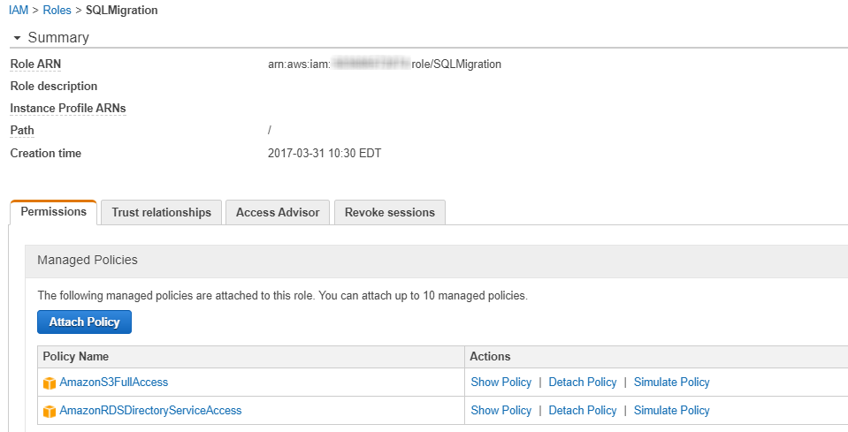
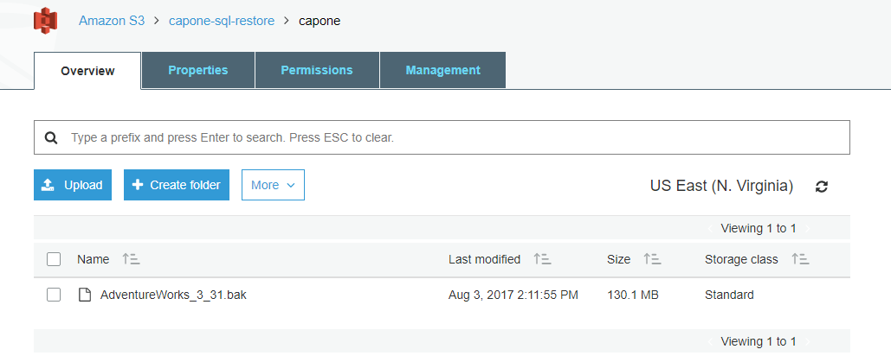
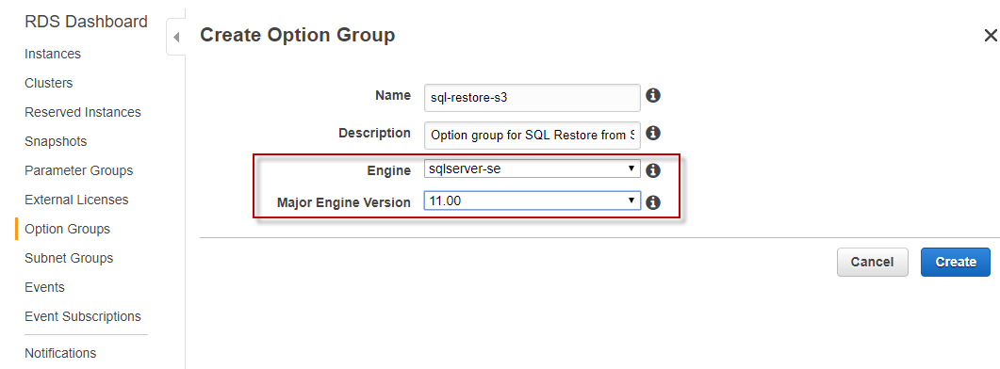
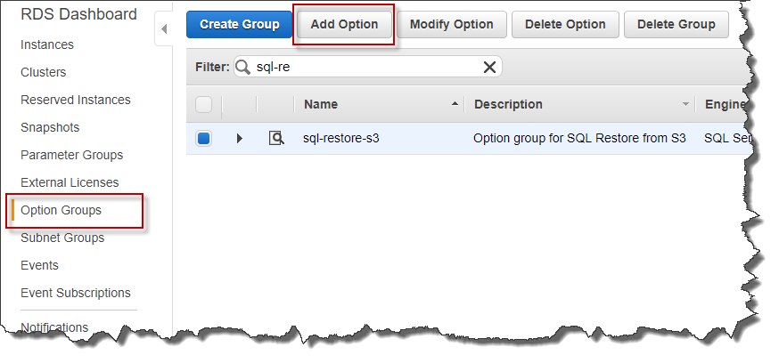
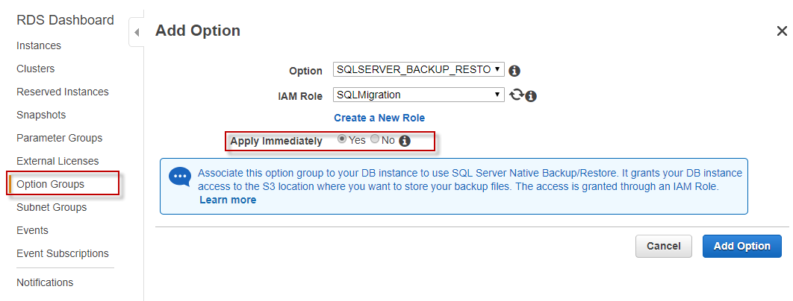
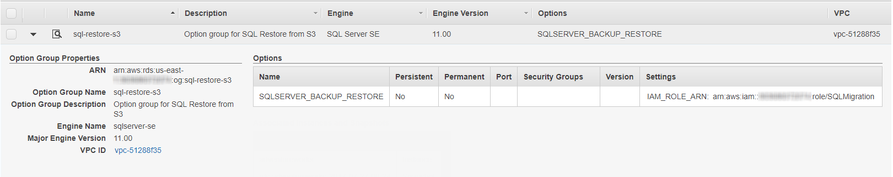
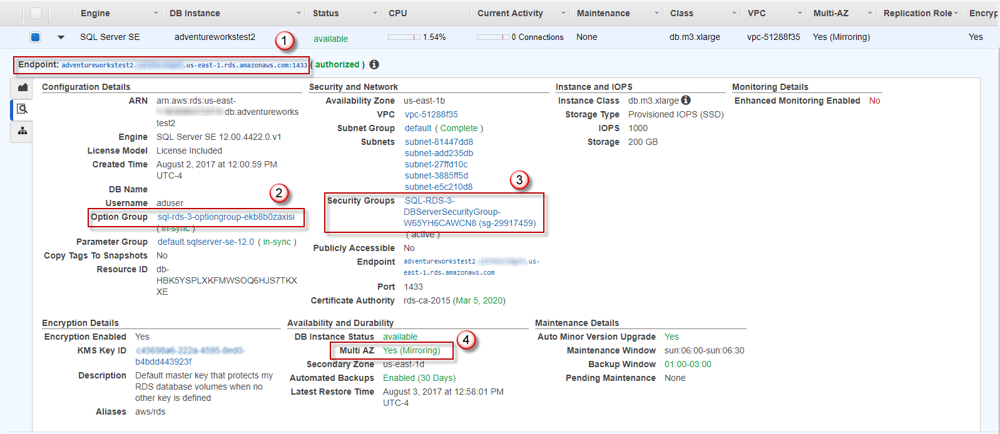
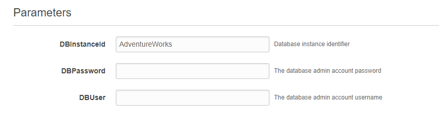

# Migrating Your Legacy On-Prem SQL Server Databases to RDS

## Overview

AWS offers many paths for migrating your on-premise SQL Server databases
to [Amazon Relational Database Service (RDS)](https://aws.amazon.com/rds/). [AWS Database Migration
Service (DMS)](https://aws.amazon.com/dms/) is our primary migration choice, but in some cases your
database migration is homogeneous and may be in the GBs not the TBs. In
this scenario, DMS may be unnecessary overhead compared to some
alternative solutions, such as leveraging [Amazon Simple Storage Service (Amazon S3)](https://aws.amazon.com/s3/) and Windows PowerShell.

The scenario described here is an upload of your SQL Server database backup
files (.BAK) to Amazon S3, followed by a deployment of an [AWS CloudFormation](https://aws.amazon.com/cloudformation/) template, and the execution of Windows PowerShell scripts to be up and running in Amazon RDS with minimal downtime of your
database.

You will want to perform the migration during a period of inactivity or
minimal database traffic. Below are the key aspects you need to factor
in when deciding on your downtime window.

- **Network bandwidth**: Are you using [AWS Direct Connect](https://aws.amazon.com/directconnect/), [AWS VPN](https://aws.amazon.com/vpn/), or something else?  It is recommended to simulate an Amazon S3 upload of your .BAK file to get
    an estimate of your upload times.

- **Backup size:** The backup size may impact whether you need to
    strip the backup of into smaller chunks to improve the upload
    completion time and success.

    - Uploading files greater than 5GB would require a multi-part
        upload. Please review this page for
        [further](http://docs.aws.amazon.com/AmazonS3/latest/dev/UploadingObjects.html)
        details.

## Provision an IAM role with the correct policies

For this example my CloudFormation template will create an [AWS Identity and Access Management](https://aws.amazon.com/iam/) (IAM) role named
**SQLMigration**, which will be used to allow the RDS instance to be
able to access the Amazon S3 bucket holding my the SQL Server backup (.bak)
file.

For this demonstration I have given my role full policy rights for the
following pre-defined policies, for greater security you should limit
these policies in your own environments.

- AmazonS3FullAccess
- AmazonRDSDirectoryServicesAccess



## Upload your backup to Amazon S3

For this demonstration I have uploaded the sample AdventureWorks
database. Ensure you upload your backup to a private bucket, and we
recommend encrypting your backup file(s).



#### To continue, the [AWS Tools for Windows PowerShell](https://aws.amazon.com/powershell/) must be installed on your windows computer. Connect to your AWS account using an authorized user and execute the command below to restore your database from S3.

### Prerequisites:

- Backup uploaded to an accessible Amazon S3 bucket
- An IAM User which has required access to your AWS Account

***PowerShell Command:***

```powershell
Write-S3Object
-BucketName <Your-bucketname> 
-Key <Folder-name>/AdventureWorks_3_31.bak 
-File 'C:\\ <File-Path>\AdventureWorks_3_31.bak'  
-Region 'us-east-1'
-ServerSideEncryption AES256
```

## Create an Option Group

AWS CloudFormation will also create a key component of this solution with
the RDS Option Group.

IMPORTANT: Ensure you select the correct Engine and Version as this is
tied to the version of RDS SQL Server that is targeted.





Select the Option: SQLSERVER\_BACKUP\_RESTORE, for the IAM Role created
earlier.

IMPORTANT: It is recommended to select **Yes** to **Apply Immediately**
to avoid having to wait to perform the Amazon S3 restore before the next
restart of your database server.



If successful you should see the role show up in Settings in the details
under Options, by clicking the small arrow to the left of the Name.



## Launch the Amazon RDS instance

Now launch the SQL Server RDS instance ensuring the Engine and Version
match those assigned to the Option Group.

The image below highlights the key settings of the RDS SQL Server
instance as shown in the AWS Console:



1.  Endpoint: The host name and port for the RDS instance.
   
2.  Option Group: Used to allow Amazon S3 restores for a specified IAM role.

3.  Security Groups: Ingress and Egress settings for the RDS instance.
  
4.  Multi AZ: For production instances a [multi-AZ installation](http://docs.aws.amazon.com/AmazonRDS/latest/UserGuide/Concepts.MultiAZ.html) is
    essential.

## Let's use the CloudFormation template to do all the above

Use the provided CloudFormation template simple-rds-restore-arn. This
CloudFormation template automates the functionality as demonstrated
manually in the earlier steps.

The template parameters are limited to the following:



Once the stack has been successfully created, the backup in Amazon S3 can be
restored to RDS.

## Restore the Backup from Amazon S3

Using the [AWS Tools for Windows PowerShell](https://aws.amazon.com/powershell/), connect to your AWS
account using an authorized user and execute the command below to
restore your database from Amazon S3.

### Prerequisites:

- Backup uploaded to an accessible Amazon S3 bucket
- An IAM User which has required access to your AWS Account

***PowerShell Command:***

```powershell
Invoke-Sqlcmd 
-Query "exec msdb.dbo.rds_restore_database @restore_db_name='AdventureWorks', @s3_arn_to_restore_from='arn:aws:s3::: <S3-Path>/AdventureWorks.bak';" 
-ServerInstance <RDS-DNS> 
-Database "AdventureWorks" 
-Username <RDS-User> 
-Password <RDS-Password>
```