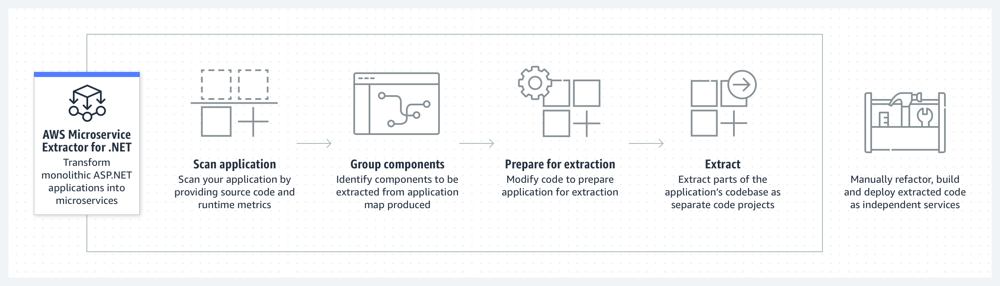
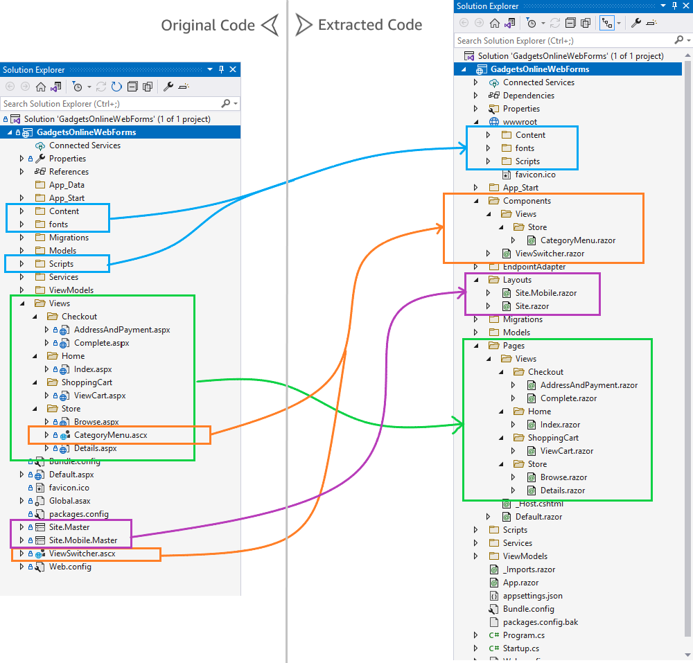
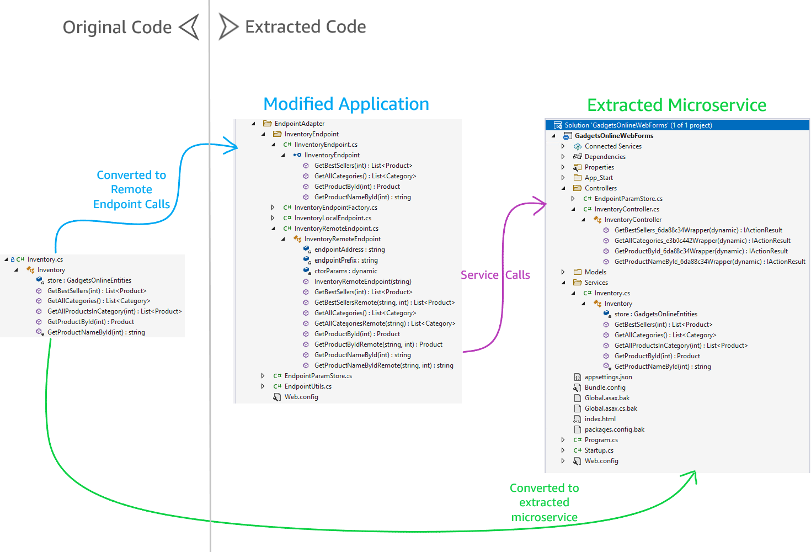

# Extracting microservices from a monolithic ASP.NET Web Forms application using AWS Microservice Extractor for .NET

## Overview
AWS Microservice Extractor for .NET is an assistive tool that simplifies refactoring monolithic .NET applications into independent microservices. AWS Microservice Extractor for .NET helps extract source code segments as microservices or shared libraries from legacy ASP.NET based applications, and ports those directly to modern cross-platform .NET. This new capability of extract and port workflow now enables developers to refactor older, Windows OS-dependent applications with minimal rewrite to newer .NET running on Linux containers, thereby reducing costs and improving performance. 

## How it works 

## Application visualization
AWS Microservice Extractor for .NET uses source code analysis and runtime metrics to produce a visualization that shows dependency graphs, runtime metrics (for example, runtime call counts), and static references between code artifacts (for example, classes). You can use the visualization and call counts to understand dependencies between components and identify the heavily called ones. AWS Microservice Extractor for .NET also provides you with alternate visualizations for grouping based on namespaces and islands.

## Code extraction and transform
After manually removing dependencies to prepare parts of the application for extraction (shown as “islands” in the visualization), you can use AWS Microservice Extractor for .NET to extract API endpoints. AWS Microservice Extractor for .NET carves out the code that underlies these API endpoints by replacing local calls with network calls. You may then develop, build, and deploy these projects as you see fit. AWS recommends that you thoroughly test your application after transforming it with AWS Microservice Extractor for .NET before using it in production.

## How can you use this?
- This blog can guide you step-by-step on how you can use Gadgets Online Web Forms Application (inside the src folder above) and modernize the same. [This is the link to the blog.](https://aws-blogs-prod.amazon.com/modernizing-with-aws/extracting-microservices-from-asp-net-web-forms-app)
- A part of the instuctions, you will be able to:
    - Port the older ASP.NET Web Forms application to newer .NET Blazor application
    - Extract out microservice from the current monolithic application

## Final output
You can look at modernization changes that happen from two perspectives: 
1.	Porting of .NET Web Forms to .NET 6 Blazor application
1.	Microservice extraction of InventoryService

## Porting of .NET Web Forms to .NET 6 Blazor application: 
As shown in the figure, here are some key changes:
1.  Static content folders: **Content, fonts and Scripts** are moved under **wwwroot** folder
1.  Code for **ASP.NET Pages** (with extension .aspx) has been transformed to **Razor Pages**
1.	Code for **ASP.NET User Controls** (with extension .ascx) has been transformed to **Razor Components**
1.	Code for **ASP.NET Master Pages** has been transformed to **Razor Layouts**

## Changes for microservices extraction
As shown in the figure, here are some key changes:
1.  In the residual application code, it creates an endpoint adapter implementing factory pattern to abstract remote calls. The previous local calls to the service are updated to the new service using an auto-generated interface to provide the abstraction between the monolithic application and the microservice.
1.	ASP.NET Web API project is generated as a microservice extracted with endpoints exposed for the node we selected (Inventory in our case). The methods of the Inventory class are exposed via the controller class that’s generated.

## Conclusion
With the AWS Microservice Extractor for .NET, you can:
- Onboard an application by providing access to buildable source code.
- Visualize a graph of the application components and their dependencies.  By selecting the **Inventory** component, you created an extractable group. There are three separate ways to visualize the components: standard view, island view and namespace view. You can create separate visualizations of your application by taking advantage of multiple canvases.
- Extract the group into an independent service and refactor the existing codebase to convert local calls to network-based REST API calls and port the ASP.NET Web Forms application to .NET Blazor application.

## Next Steps

1. Learn more about the [AWS Microservice Extractor for .NET](https://aws.amazon.com/microservice-extractor/) and try it out at no cost.

1. Visit the [.NET on AWS](https://aws.amazon.com/developer/language/net/) site to learn more about developing, running and modernizing .NET applications on AWS.

1. Visit the the related workshop, [Deploy .NET Apps on AWS](https://catalog.us-east-1.prod.workshops.aws/workshops/02696107-09ac-4313-a6cb-3798048b07d7/en-US/2-how-to-deploy-dotnet-apps) for hands-on experience running .NET on AWS.