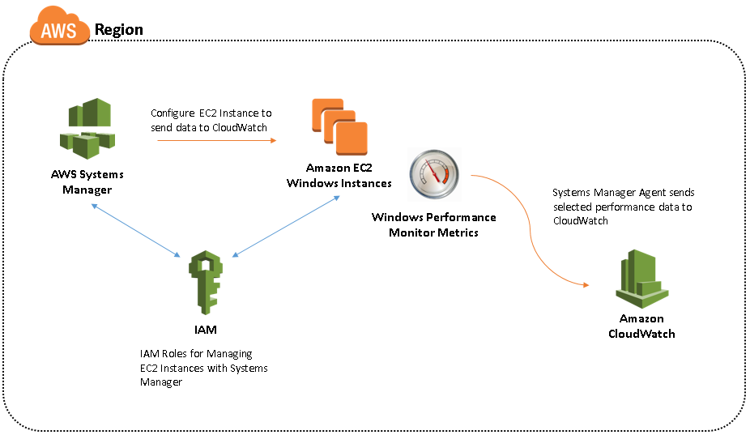
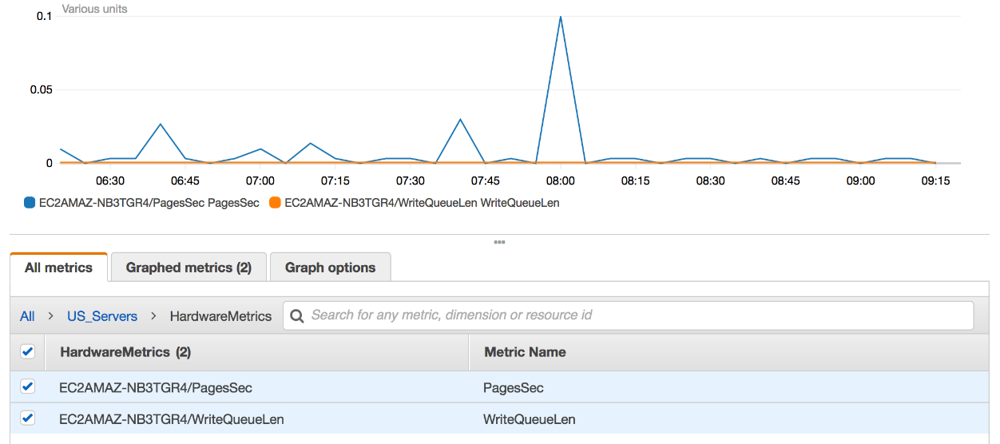

# Sending Windows Performance Monitor (PerfMon) Data to Amazon CloudWatch

## Overview

This step by step guide is a tutorial designed to walk you through the
process of sending Performance Monitor data from your [Amazon EC2](https://aws.amazon.com/ec2/) instances to [Amazon CloudWatch](https://aws.amazon.com/cloudwatch/).

**AWS Experience**: Beginner\
**Time to complete**: 30 minutes\
**Cost to complete**: Each service used in this architecture is eligible for the AWS Free Tier. If you are outside the usage limits of the Free Tier, completing this learning path will cost you less than \$0.25

  > Note: This estimate assumes you follow the recommended configurations throughout the tutorial and terminate all resources within 24 hours.

### Prerequisites

To complete this learning path, you will need:

- An AWS Account\*
- A web browser
- Visual Studio or similar IDE/ISE to edit JSON files
- At least one running Amazon EC2 Windows instance

\*Accounts that have been created within the last 24 hours might not yet have access to the resources required for this learning.

### Links to documentation

- [Amazon CloudWatch Documentation Home](https://docs.aws.amazon.com/cloudwatch/)
- [Quick Start: Enable your Amazon EC2 instances running Windows Server 2016 to send logs to CloudWatch Logs using the CloudWatch Logs agent](https://docs.aws.amazon.com/AmazonCloudWatch/latest/logs/QuickStartWindows2016.html)

## Introduction

You can configure your Amazon EC2 instances to send Windows Server logs, events, and performance counters to Amazon CloudWatch Metrics, Amazon CloudWatch Logs and Amazon CloudWatch Events. Amazon EC2 offers several methods for configuring your instances to send this data. The method you choose will depend, in part, on the version of Windows Server you are running and the version of the configuration agent running on your instance. It will also depend on whether you want to manually configure your instances to use a local configuration file or remotely configure them using [AWS Systems Manager](https://aws.amazon.com/systems-manager/) Run Command or AWS Systems Manager State Manager.

This guide will focus on configuring your EC2 instances using Run Command or State Manager from AWS Systems Manager.

## Architecture

The architecture will use Amazon CloudWatch, AWS Systems Manager, Amazon EC2 and [AWS Identity and Access Management](https://aws.amazon.com/iam/) (IAM).

## Example Scenario

The example scenario used in this guide covers Amazon EC2 instances running Windows Servers in the US West (N. California) region sending Windows Performance Monitor Metrics to Amazon CloudWatch for consolidated monitoring and alerting purposes.



In this scenario we will be collecting performance data for the following counters and grouping them in CloudWatch under a namespace named US\_Servers:

- .NET CLR Exceptions(\*)\\# of Exceps Thrown
- Memory\\Pages/sec
- LogicalDisk\\Avg. Disk Write Queue Length

## Modules

This tutorial contains the following modules:

1. Preliminary tasks for configuring integration with CloudWatch
1. Configuring integration with CloudWatch
1. Configure instances for CloudWatch
1. Viewing metrics in CloudWatch

You must complete each module before proceeding to the next.

### Module 1: Preliminary tasks for configuring integration with CloudWatch

In this module you'll set up an IAM user and role which you will use in a future step. An IAM role for instance credentials is required when you use Systems Manager Run Command or State Manager.

This role enables Systems Manager to perform actions on the instance. You can optionally create a unique IAM user account for configuring and running Systems Manager.

#### Step 1: Creating an IAM User (Optional)

You can optionally create a unique IAM user account for configuring and running Systems Manager. If your IAM user account, group, or role is assigned administrator permissions, then you have access to Systems Manager. You can skip this task. If you don\'t have administrator permissions, then an administrator must update your IAM user account, group, or role to include the following permissions. There are basically two ways to create IAM users: use the AWS Management Console or use the AWS CLI, AWS Tools for Windows PowerShell, or IAM HTTP API.

In these steps we will focus on usng the AWS Management Console or AWS Tools for Powershell to create necessary IAM user.

##### Creating an IAM user via AWS Management Console

1. Sign in to the AWS Management Console and open the IAM console at <https://console.aws.amazon.com/iam/>.

1. In the navigation pane, choose *Users* and then choose **Add user**.

1. Type the user name for the new user. This is the sign-in name for AWS. If you want to add more than one user at the same time, choose *Add another user* for each additional user and type their user names. You can add up to 10 users at one time.

1. Select the type of access this set of users will have. You can select programmatic access, access to the AWS Management Console, or both.

    1. Select **Programmatic access** if the users require access to the API, AWS CLI, or Tools for PowerShell. This creates
        an access key for each new user. You can view or download the access keys when you get to the Final page.

    1. Select **AWS Management Console access** if the users require access to the AWS Management Console. This creates a password for each new user.

1. Choose **Next: Permissions**.

1. On the Set permissions page, specify how you want to assign permissions to this set of new users. Choose *Attach existing policies to user directly* and add the **AmazonSSMFullAccess** policy to your user.

1. Choose **Next**: Review to see all of the choices you made up to this point. When you are ready to proceed, choose **Create user**.

##### Creating an IAM user with AWS Tools for PowerShell (Alternative)

The [AWS Tools for Powershell](https://aws.amazon.com/powershell/) are PowerShell modules that are built on the functionality exposed by the AWS SDK for .NET. Available for use on Windows, macOS and Linux the tools enable you to script operations on your AWS resources from the PowerShell command line. Follow the [steps to setup AWS Tools for PowerShell](https://docs.aws.amazon.com/powershell/latest/userguide/pstools-getting-set-up.html)

To create an IAM user from PowerShell:

1. On your Windows Server/Client: From the Start Menu, Click **Start**, type **PowerShell**, and then click the resulting option to open a Windows PowerShell command shell.

1. Or, from the Start menu, click **Start**, click All Programs, click **Accessories**, click the Windows PowerShell folder, and then click the Windows PowerShell command shell start link.

1. Copy/Paste the following code block to create an IAM user with the *AmazonSSMFullAccess* IAM policy attached, replacing the \<username\> and \<password\> parts with your choice of username and password:

    ```powershell
    Register-IAMUserPolicy -PolicyArn arn:aws:iam::aws:policy/AmazonSSMFullAccess -UserName (New-IAMLoginProfile -UserName (New-IAMUser -UserName <username>).UserName -Password "<password>").UserName
    ```

#### Step 2: Create an IAM Role

An IAM role for instance credentials is required when you use Systems Manager Run Command or State Manager. You can create the role using either the AWS Management Console or the AWS Tools for PowerShell.

##### Create an Instance Profile Role for Systems Manager using AWS Console

1. Open the IAM console at <https://console.aws.amazon.com/iam/>.

1. In the navigation pane, choose **Roles**, and then choose **Create role**.

1. On the *Select type of trusted entity* page, under *AWS Service*, choose **EC2**.

1. In the *Select your use case* section, choose **EC2 Role for Simple Systems Manager**, and then choose Next: **Permissions**.

1. On the *Attached permissions policy* page, verify that **AmazonEC2RoleforSSM** is listed, and then choose **Next: Review**.

1. On the *Review* page, type a name in the **Role** name box, and then type a description.

1. After creating the new role navigate to the *Roles* section of the IAM conole and select the role you just created.

1. Go to the *Trust Relationship* tab when viewing the role and then click **Edit trust relationship** button.

1. Replace the contents with the following JSON block.

    ```json
    {
        "Version":"2012-10-17",
        "Statement":[
            {
                "Sid":"",
                "Effect":"Allow",
                "Principal":{
                    "Service":[
                    "ec2.amazonaws.com",
                    "ssm.amazonaws.com"
                    ]
                },
                "Action":"sts:AssumeRole"
            }
        ]
    }
    ```

1. Click **Update Trust Policy** to save your changes.

##### Create an Instance Profile Role for Systems Manager with AWS Tools for Powershell (Alternative)

1. Create a new text file with any text editor, IDE or ISE. This file will contain the policy, in JSON format, for the role.

2. Add the following JSON block to the file, then save and close the editor.

    ```json
    {
        "Version":"2012-10-17",
        "Statement":[
            {
                "Sid":"",
                "Effect":"Allow",
                "Principal":{
                    "Service":[
                    "ec2.amazonaws.com",
                    "ssm.amazonaws.com"
                    ]
                },
                "Action":"sts:AssumeRole"
            }
        ]
    }
    ```

3. Run the following Powershell cmdlets in order. Replace the *\<profile name\>* and *\<role name\>* values of your choice with unique values for each of them.

    ```powershell
    # Define a parameter for IAM Instance Profile Name
    $instance_profile=”<profile name>”

    # Define a parameter for IAM Role Name
    $iam_rolename=”<role name>”

    # Create an Instance Profile for AWS Systems Manager
    New-IAMInstanceProfile -InstanceProfileName $instance_profile ; New-IAMRole -AssumeRolePolicyDocument (Get-Content -raw <file_location>\policy.json) -RoleName $iam_rolename ; Add-IAMRoleToInstanceProfile -InstanceProfileName $instance_profile –RoleName $iam_rolename ; Register-IAMRolePolicy -PolicyArn arn:aws:iam::aws:policy/service-role/AmazonEC2RoleforSSM -RoleName $iam_rolename
    ```

#### Step 3: Attach the role to an EC2 Instance

1. Open the Amazon EC2 console at <https://console.aws.amazon.com/ec2/>

1. In the navigation pane, choose *Instances*

1. Select the instance to which the role should be applied, then choose *Actions > Instance Settings > Attach/Replace IAM role*.

1. Select the IAM role to attach to your instance, and choose **Apply**.

#### Step 4: Verify Systems Manager Prerequisites

Before you use either the Systems Manager Run Command or State Manager to configure integration with CloudWatch, verify that your instances meet the minimum requirements. For more information, see [Systems Manager Prerequisites](https://docs.aws.amazon.com/systems-manager/latest/userguide/systems-manager-setting-up.html).

#### Step 5: Download the Sample Configuration File

Before you start the next module download the following sample file to your computer: [AWS.EC2.Windows.CloudWatch.json](https://s3.amazonaws.com/ec2-downloads-windows/CloudWatchConfig/AWS.EC2.Windows.CloudWatch.json)

This file will be used as a boilerplate to create the Amazon CloudWatch integration throughout this guide.

### Module 2: Configuring integration with CloudWatch

You determine which performance counters are sent to CloudWatch by specifying your choices in a configuration file. The process of creating this file and specifying your choices can take 30 minutes or more to complete. Once you have completed creating the configuration file, you can reuse the configuration file on all of your instances and distribute this configuration using AWS Systems Manager.

By specifying a region and metric namespace for CloudWatch, you enable an instance to send performance counter data to CloudWatch. To send the same performance counter data to different locations within Amazon CloudWatch, you can add additional sections with unique IDs (for example, CloudWatch2 and CloudWatch3) and a different region for each ID.

In this guide you will send some application and hardware metrics of our application hosted in us-west-1 (N.California) to Amazon CloudWatch. You will work on CloudWatch, PerformanceCounter and Flows sections of the JSON file (AWS.EC2.Windows.CloudWatch.json) you have downloaded.

#### Step 1: Configure settings for CloudWatch

CloudWatch namespaces are containers for metrics. Metrics in different namespaces are isolated from each other, so that metrics from different applications are not mistakenly aggregated into the same statistics.

1. In the JSON file, locate the CloudWatch section near the bottom of the file.

    ```json
    {
        "Id": "CloudWatch",
        "FullName":"AWS.EC2.Windows.CloudWatch.CloudWatch.CloudWatchOutputComponent,AWS.EC2.Windows.CloudWatch",
        "Parameters": {
            "AccessKey": "",
            "SecretKey": "",
            "Region": "<region>",
            "NameSpace": "<namespace>"
        }
    },

    ```

1. For **\<region\>** enter the region where you want to send log data (for example us-west-1). Although you can send performance counters to a different region from where you send your log data, we recommend that you set this parameter to the same region where your instance is running.

1. For **\<namespace\>**, type the metric namespace where performance counter data will be written.

Continuing from our example performance counter data of servers in us-west-1 will be sent to us-west-1 region under "US\_Servers" namespace.

```json
{
    "Id": "CloudWatch",
    "FullName":"AWS.EC2.Windows.CloudWatch.CloudWatch.CloudWatchOutputComponent,AWS.EC2.Windows.CloudWatch",
    "Parameters": {
        "AccessKey": "",
        "SecretKey": "",
        "Region": "us-west-1",
        "NameSpace": "US_Servers"
    }
},

```

#### Step 2: Getting a list of Windows Performance Metrics and Metric Instances

The PowerShell cmdlet `Get-Counter` can be used to list performance category, counter and instance names from your server.

1. On your Windows Server/Client: Click *Start*, type **PowerShell**, and then right click and choose *Run as Administrator* on Windows PowerShell.

1. Or, from the Start menu, click *All Programs*, click *Accessories*, click the Windows PowerShell folder, and then right click and choose *Run as Administrator* on Windows PowerShell.

1. Copy/Paste any of the following Powershell cmdlets to get the list of counters, metrics and their instance values:

    ```powershell
    # List of categories:
    Get-Counter -ListSet *

    # List of counters in Memory category:
    (Get-Counter -ListSet Memory).Paths

    # Display metric instances if the counter has instances per counter:
    (Get-Counter -ListSet LogicalDisk).PathsWithInstances
    ```

#### Step 3: Configure the data to send

1. Locate the *PerformanceCounter* section in the sample JSON configuration file you downloaded in module 1 step 5 (AWS.EC2.Windows.CloudWatch.json) file. The sample section is already populated to collect Memory data:

    ```json
    {
        "Id": "PerformanceCounter",
        "FullName":            "AWS.EC2.Windows.CloudWatch.PerformanceCounterComponent.PerformanceCounterInputComponent,AWS.EC2.Windows.CloudWatch",
        "Parameters": {
            "CategoryName": "Memory",
            "CounterName": "Available MBytes",
            "InstanceName": "",
            "MetricName": "AvailableMemory",
            "Unit": "Megabytes",
            "DimensionName": "",
            "DimensionValue": ""
        }
    },
    ```

1. You can select any performance counter that are available in Windows Performance Monitor. You may use different categories and upload data to CloudWatch as metrics, such as .NET CLR Data, ASP.NET Applications, HTTP Service, Memory, or Process and Processors.

1. For each performance counter, copy the PerformanceCounter section and change the Id parameter to make it unique (in our example we use, PerformanceCounter, PerformanceCounter2 and PerformanceCounter3 names for collecting **\#.NET CLR Exceps Thrown, Pages/Sec and Avg. Disk Write Queue Length** metrics). Update the other parameters as necessary.

1. For **CategoryName**, type the performance counter category. To find the available categories and counters, use the `Get-Counter` cmdlet described in Step 2 earlier in this module.

1. For **CounterName**, type the name of the performance counter.

1. For **InstanceName**, type values from the Add Counters dialog box in Performance Monitor, which can be one of the following:

    - Blank, if the selected object has no instances.

    - A single instance of the selected object.

    - **\_Total** to use the aggregate of all instances. (In some performance counter instances this value is **\_Global\_** rather than **\_Total**. In our example the **\#.NET CLR Exceps Thrown** counter has instance value of **\_Global\_** to address all instances for that metric. Please refer to the list of metrics and instances returned from the Powershell cmdlet used above or Performance Monitor snap-in).

    Do not use an asterisk (\*) to indicate all instances because each performance counter component only supports one metric.

1. For **MetricName**, type the CloudWatch metric that you want performance data to appear under.

1. For **Unit**, type the appropriate unit of measure for the metric. The possible values are as follows:

    - Seconds
    - Microseconds
    - Milliseconds
    - Bytes
    - Kilobytes
    - Megabytes
    - Gigabytes
    - Terabytes
    - Bits
    - Kilobits
    - Megabits
    - Gigabits
    - Terabits
    - Percent
    - Count
    - Bytes/Second
    - Kilobytes/Second
    - Megabytes/Second
    - Gigabytes/Second
    - Terabytes/Second
    - Bits/Second
    - Kilobits/Second
    - Megabits/Second
    - Gigabits/Second
    - Terabits/Second
    - Count/Second
    - None

1. For this guide choose from:

    - .NET CLR Exceptions(\*)\\# of Exceps Thrown **Count**
    - Memory\\Pages/sec **Count/Second**
    - LogicalDisk\\Avg. Disk Write Queue Length **Count**

1. To specify a dimension for your metric, type a dimension name and value for DimensionName and DimensionValue. These parameters provide another view when listing metrics. In our example we are organizing performance counter metrics under ".NET Metrics" and "HardwareMetrics" dimensions. You can also use the same dimension for multiple metrics so that you can view all metrics belonging to a specific dimension. The following predefined variables can be used alongside with your definition; {instance\_id}, {hostname}, and {ip\_address}, or a combination of these to customize DimensionName and DimensionValue. In this example we used {hostname} variable.

    ```json
    {
        "FullName": "AWS.EC2.Windows.CloudWatch.PerformanceCounterComponent.PerformanceCounterInputComponent,AWS.EC2.Windows.CloudWatch",
        "Id": "PerformanceCounter",
        "Parameters": {
            "CategoryName": ".NET CLR Exceptions",
            "CounterName": "# of Exceps Thrown",
            "DimensionName": ".NET Metrics",
            "DimensionValue": "{hostname}/NumberofExceptions",
            "InstanceName": "_Global_",
            "MetricName": "NumberofExceptions",
            "Unit": "Count"
        }
    },
    {
        "FullName": "AWS.EC2.Windows.CloudWatch.PerformanceCounterComponent.PerformanceCounterInputComponent,AWS.EC2.Windows.CloudWatch",
        "Id": "PerformanceCounter2",
        "Parameters": {
            "CategoryName": "Memory",
            "CounterName": "Pages/sec",
            "DimensionName": "HardwareMetrics",
            "DimensionValue": "{hostname}/PagesSec",
            "InstanceName": "",
            "MetricName": "PagesSec",
            "Unit": "Count/Second"
        }
    },
    {
        "FullName": "AWS.EC2.Windows.CloudWatch.PerformanceCounterComponent.PerformanceCounterInputComponent,AWS.EC2.Windows.CloudWatch",
        "Id": "PerformanceCounter3",
        "Parameters": {
            "CategoryName": "LogicalDisk",
            "CounterName": "Avg. Disk Write Queue Length",
            "DimensionName": "HardwareMetrics",
            "DimensionValue": "{hostname}/WriteQueueLen",
            "InstanceName": "_Total",
            "MetricName": "WriteQueueLen",
            "Unit": "Count"
        }
    },
    ```

#### Step 4: Configure flow control

Each performance counter must have a corresponding destination in the Flows section. For example, to send a performance counter defined in the PerformanceCounter section to the destination defined in the CloudWatch section, add PerformanceCounter, CloudWatch to the Flows section.

1. In the AWS.EC2.Windows.CloudWatch.json file, locate the *Flows* section:

    ```json
    "Flows": {
            "Flows":
            [
                "(ApplicationEventLog,SystemEventLog),CloudWatchLogs",
                "PerformanceCounter,CloudWatch"
            ]
        }
    ```

1. For Flows, add each data type that to be uploaded (for example, PerformanceCounter2) and its destination (for example, CloudWatch). Continuing the performance monitoring example, since we are collecting three Performance Monitor counters and sending them to one destination (CloudWatch), the Flow section should look like below for the metrics and the structure we defined earlier:

    ```json
    "Flows": {
        "Flows": [
            "(PerformanceCounter,PerformanceCounter2,PerformanceCounter3),CloudWatch"
        ]
    }
    ```

1. Different sets of metrics can be sent to different destinations in the CloudWatch to group the performance metrics based on monitoring needs.

#### Step 5: Removing unused configuration data

You may delete the other sections in the AWS.EC2.Windows.CloudWatch.json file which you don't need to complete this guide. These are:

- CloudWatchLogs
- CustomLogs
- IISLogs
- ETW
- SecurityEventLog
- SystemEventLog
- ApplicationEventLog

### Module 3: Configure instances for CloudWatch

Verify that you have completed the prerequisites before moving forward. You can apply the configuration to your instance(s) using either AWS Systems Manager's Run Command or State Manager features.

#### Use Systems Manager Run Command to apply configuration

Run Command enables you to manage the configuration of your instances on demand. You specify a Systems Manager document, specify parameters, and execute the command on one or more instance. The SSM agent on the instance processes the command and configures the instance as specified.

You can use Run Command to configure integration with CloudWatch. After you configure integration, the SSM Agent sends the specified performance monitor metrics you configured in your JSON file to CloudWatch.

1. Open the Amazon EC2 console at <https://console.aws.amazon.com/ec2/> or AWS Systems Manager console at <https://console.aws.amazon.com/systems-manager/>

1. In the navigation pane, choose Systems Manager Services, **Run Command** or choose **Run Command** in the Actions menu.

1. Choose **Run a command**.

1. For Command document, choose **AWS-ConfigureCloudWatch**.

1. For Target instances, choose the instances to integrate with CloudWatch. If you do not see an instance in this list, it might not
    be configured for Run Command. For more information, see [Systems Manager Prerequisites](https://docs.aws.amazon.com/systems-manager/latest/userguide/systems-manager-setting-up.html) in the AWS Systems Manager User Guide.

1. For Status, choose **Enabled**.

1. For **Properties**, copy and paste your JSON content from module 4.

1. Complete the remaining optional fields and choose Run.

##### To view command output in the console

1. Select a command.

1. Choose the Output tab.

1. Choose View Output. The command output page shows the results of your command execution.

#### Using Systems Manager State Manager to apply configuration (Alternative)

1. Open the Amazon EC2 console at <https://console.aws.amazon.com/ec2/> or AWS Systems Manager console at <https://console.aws.amazon.com/systems-manager/>

1. In the navigation pane, choose Systems Manager Services, State Manager on the Amazon EC2 console or on the AWS Systems Manager console choose State Manager in the Actions menu.

1. Choose **Create an association**.

1. For Document, choose **AWS-ConfigureCloudWatch**.

1. For Document Version, choose **Default** version at runtime.

1. For **Targets**, choose the instances to integrate with CloudWatch. If you do not see an instance in this list, it might not be configured for Run Command. For more information, see [Systems Manager Prerequisites](https://docs.aws.amazon.com/systems-manager/latest/userguide/systems-manager-setting-up.html) in the AWS Systems Manager User Guide.

1. For Schedule, choose how often you want Systems Manager to apply this policy. This indicates how often you want Systems Manager to ensure the integration with CloudWatch is still valid. This does not affect the frequency when the SSM Agent sends data to CloudWatch.

1. For **Parameters, Status**, choose **Enabled**.

1. For Properties, copy and paste your JSON content from module 4.

1. *Optional* To send command output to an Amazon S3 bucket, choose Advanced, **Write to S3**.

1. Choose **Create Association**.

1. Choose the association you just created, and then choose **Apply Association Now**.

### Module 4: Viewing metrics in CloudWatch

In this module we'll view available metrics coming from our configured instances by namespace and dimension using the AWS Management Console.

1. Open the CloudWatch console at <https://console.aws.amazon.com/cloudwatch/>.

1. In the navigation pane choose *Metrics*.

1. Select a metric namespace (US\_Servers for this guide).

    

1. Choose a dimension to view metrics in that group (.NET Metrics or Hardware Metrics).

    

1. Under the chosen dimension you should be able to see your performance counter data.

    
