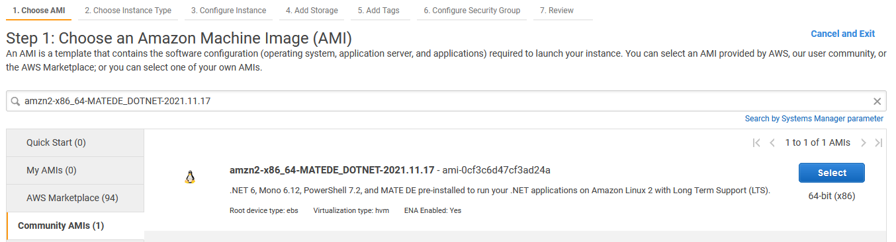
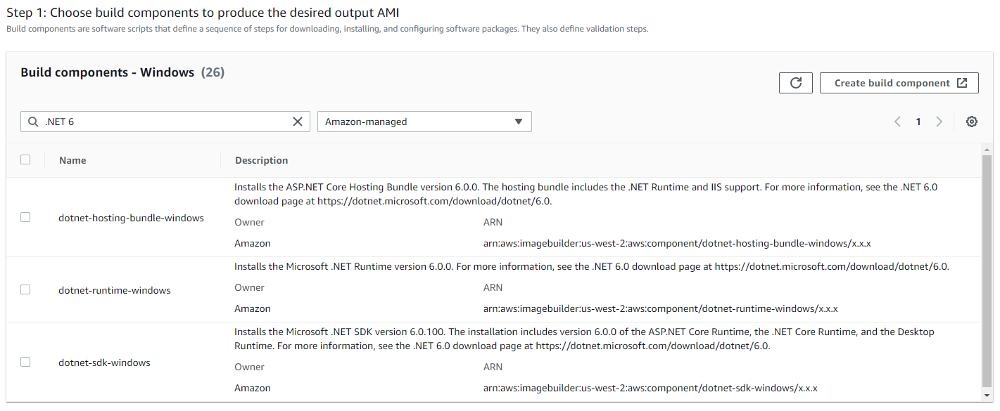
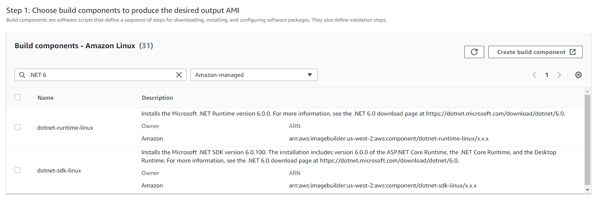

# .NET 6 support on AWS

## Overview

This guide describes .NET 6 support provided by AWS services and tools. The guide will be updated as new support is added. 

Related Content:
  * [GitHub home for .NET on AWS](https://github.com/aws/dotnet)
  * [AWS Developer Center - .NET on AWS](https://aws.amazon.com/developer/language/net/)

## Introduction

Customers and AWS teams are excited about the release of .NET 6. Many organizations will want to target .NET 6 because it is a Long Term Support (LTS) release. 
.NET 6 applications can already use many AWS services without additional work. For example, it is possible to deploy a new virtual machine instance ([Amazon EC2](https://aws.amazon.com/ec2/)) and by 
adding a command to install the .NET 6 runtime as part of the deployment, the instance will support .NET 6 applications. 

This guide is focused on AWS services and tools that have either been updated, or are being updated, to provide .NET 6 support. While we work to test and validate support for the GA release of .NET 6 to all services and tools, 
there are some steps you can take to use .NET 6 today. These are called out in the sections below. 

Please open an [Issue on this repository](https://github.com/aws-samples/aws-net-guides/issues) with questions about .NET 6 support on AWS. We use this feedback to help us prioritize updates. 


## Compute Services

### Amazon EC2

Customers can install .NET 6 on over 400 [Amazon EC2 instances types](https://aws.amazon.com/ec2/instance-types/). 

The following EC2 [User Data](https://docs.aws.amazon.com/AWSEC2/latest/UserGuide/user-data.html#user-data-console) example installs .NET 6 targeting ARM64 ([AWS Graviton2](https://aws.amazon.com/ec2/graviton/) processors):
```
#!/bin/bash
# Install .NET 6 SDK for ARM64
sudo apt-get update -y
curl -O https://download.visualstudio.microsoft.com/download/pr/adcd9310-5072-4179-9b8b-16563b897995/15a7595966f488c74909e4a9273c0e24/dotnet-sdk-6.0.100-linux-arm64.tar.gz
mkdir /usr/bin/dotnet
sudo tar -zxvfdotnet-sdk-6.0.100-linux-arm64.tar.gz -C /usr/bin/dotnet
sudo ln -s /usr/bin/dotnet/dotnet /usr/bin/dotnet
sudo sh -c 'echo "export DOTNET_ROOT=/usr/bin/dotnet" >> /etc/environment'
sudo sh -c 'echo "export PATH=$PATH:$DOTNET_ROOT" >> /etc/environment'
```

An updated version of the preconfigured Amazon Machine Image (AMI) with [MATE Desktop Environment](https://mate-desktop.org/) that includes .NET 6 is available. Search for amzn2-x86_64-MATEDE_DOTNET-2021.11.17 AMI and select the result under the Community AMI section:

 
 

[EC2 Image Builder](https://aws.amazon.com/image-builder/) simplifies the building, testing, and deployment of virtual machines and container images for use on AWS or on-premises. 
.NET 6 can be added to images created with Image Builder in two ways:

1. [AWS CloudFormation Template](https://aws.amazon.com/cloudformation/resources/templates/) - A sample Image Builder CloudFormation Template can be used to build an [Ubuntu Server 20 Image with .NET 6](https://github.com/aws-samples/amazon-ec2-image-builder-samples/tree/master/CloudFormation/Linux/ubuntu-with-net6). 
1. Image Builder Components - Image Builder offers Amazon-managed .NET 6 components (runtime and SDK) supporting Windows and Linux distributions. Additionally, a component that provides the ASP.NET Core Hosting Bundle for .NET 6 is available for Windows. 





### AWS Elastic Beanstalk

[AWS Elastic Beanstalk](https://aws.amazon.com/elasticbeanstalk/) is an easy-to-use service for deploying and scaling web applications and services developed with .NET and other languages. Customers can target both Windows Server and Amazon Linux 2 platforms to deploy their applications. 


### Containers

AWS customers can deploy .NET applications running on either Windows or Linux containers using [Amazon Elastic Container Software](https://aws.amazon.com/ecs/) (ECS) and 
[Amazon Elastic Kubernetes Service](https://aws.amazon.com/eks/) (EKS). [AWS Fargate](https://aws.amazon.com/fargate/) is a service that you can use to run and manage the 
lifecycle of ECS and EKS containers without the need to manage the container infrastructure yourself

[AWS App Runner](https://aws.amazon.com/apprunner/) is a fully managed service that makes it easy to quickly deploy containerized web applications and APIs, 
scaling up or down automatically to meet application traffic needs. To use with .NET 6 applications, upload an image with the .NET 6 application to 
[Amazon Elastic Container Registry](https://aws.amazon.com/ecr/) (ECR) and use the [source image](https://docs.aws.amazon.com/apprunner/latest/dg/service-source-image.html) support 
to configure AWS App Runner to start, run, scale, and load balance the application. 

### AWS Lambda

[AWS Lambda](https://aws.amazon.com/lambda/) is a serverless, event-driven compute service that can run virtually any type of application or backend service without provisioning or managing servers. 

You can run .NET 6 applications, targeting x86_64 or ARM64 (AWS Graviton2), on AWS Lambda using any of the following options:
1. [Managed Runtime](https://docs.aws.amazon.com/lambda/latest/dg/lambda-runtimes.html) - This option uses a .zip file archive for the deployment package. This [blog post](https://aws.amazon.com/blogs/compute/introducing-the-net-6-runtime-for-aws-lambda/) provides more details.
1. Managed [base container image](https://docs.aws.amazon.com/lambda/latest/dg/csharp-image.html) - Pull from the [ECR Public Gallery](https://gallery.ecr.aws/lambda/dotnet) or use .NET 6 container image Blueprint in the AWS Toolkit for Visual Studio. 
1. Custom container image - Build a container image with the .NET 6 application packaged inside it. This [PowerShell script](https://github.com/aws/aws-lambda-dotnet/tree/master/LambdaRuntimeDockerfiles) will build a .NET 6 base container image. 
1. Custom runtime - The custom runtime bundles all necessary .NET 6 libraries in the zip file archive that is deployed to Lambda, see this [example](https://github.com/normj/LambdaNETCoreSamples/tree/master/CustomRuntimeListBucketsNET6). For an ARM64 see this [example](https://github.com/normj/LambdaNETCoreSamples/tree/master/ArmLambdaFunction#net-5-and-6-with-custom-runtimes).

The [AWS Toolkit for Visual Studio](https://aws.amazon.com/visualstudio/) allows customers to build and deploy .NET 6 applications that run on AWS Lambda. 

 
## Tools, Libraries, and SDK

### AWS Toolkit for Visual Studio

The [AWS Toolkit for Visual Studio](https://aws.amazon.com/visualstudio/) is an extension for Microsoft Visual Studio on Windows that makes it easier for developers to develop, debug, 
and deploy .NET applications using Amazon Web Services. Visual Studio 2022 supports .NET 6 development, and customers can download the AWS Toolkit for 
[Visual Studio 2022](https://marketplace.visualstudio.com/items?itemName=AmazonWebServices.AWSToolkitforVisualStudio2022) from the Visual Studio Marketplace. 

When deploying .NET 6 applications to Elastic Beanstalk, make sure the "Build self contained deployment bundle" is selected. 


### AWS Toolkit for Rider

The [AWS Toolkit for Rider](https://aws.amazon.com/rider/) is an open source plug-in for the [JetBrains Rider](https://www.jetbrains.com/rider/) IDE that makes it easier to create, debug, and deploy .NET applications on Amazon Web Services. The Toolkit supports creating a new AWS App Runner service to manage containers, which can host .NET 6 applications. Follow the [documentation](https://docs.aws.amazon.com/toolkit-for-jetbrains/latest/userguide/creating-service-apprunner.html) to setup. Note, select the "ECR/ECR public" option (image source) for .NET applications. 

The Toolkit also provides an option to create a new .NET application that runs on AWS Lambda, including creation of the [AWS Serverless Application Model](https://aws.amazon.com/serverless/sam/) (SAM) template used to deploy to Lambda. The Toolkit also provides the ability to deploy a .NET application to Lambda using a SAM template. Matt Ellis details these steps in his [blog post](https://blog.jetbrains.com/dotnet/2019/12/09/working-aws-lambda-rider/). Support for deploying .NET 6 applications targeting Lambda is available for both x86_64 and ARM64 (AWS Graviton2). 

### AWS Toolkit for Visual Studio Code

The [AWS Toolkit for Visual Studio Code](https://aws.amazon.com/visualstudiocode/) is an open source plug-in for the Visual Studio Code editor that makes it easier to create, 
debug, and deploy applications on Amazon Web Services. The Toolkit supports creating a new AWS App Runner service to manage containers, which can host .NET 6 applications. 
The Toolkit supports building and debugging [AWS Serverless Application Model](https://aws.amazon.com/serverless/sam/) (SAM) templates used to deploy applications to AWS Lambda targeting .NET 6 applications. 

### AWS Toolkit for Azure DevOps

The [AWS Toolkit for Azure DevOps](https://aws.amazon.com/vsts/) is an extension for hosted and on-premises Microsoft Azure DevOps that makes it easy to manage and deploy applications to AWS. .NET 6 applications can be used with the Toolkit.

### AWS SAM CLI

The [AWS Serverless Application Model (SAM)](https://aws.amazon.com/serverless/sam/) is an open-source framework for building serverless applications. It provides shorthand syntax to express functions, APIs, databases, and event source mappings. The [SAM CLI](https://docs.aws.amazon.com/serverless-application-model/latest/developerguide/serverless-sam-reference.html#serverless-sam-cli) provides a Lambda-like execution environment that lets you locally build, test, and debug applications defined by SAM templates or through the AWS Cloud Development Kit (CDK). The SAM CLI provides support for targeting .NET 6. 


## AWS SDK for .NET

The [AWS SDK for .NET](https://github.com/aws/aws-sdk-net) allows .NET developers to integrate AWS services into their application code in a familiar and consistent manner. The library is compatible with .NET 6, and is available from [NuGet](https://www.nuget.org/packages/awssdk.core/). Learn how to get started with the 
[AWS SDK for .NET in the Developer Guide](https://docs.aws.amazon.com/sdk-for-net/v3/developer-guide/welcome.html). 

## .NET High Level Libraries
All the below libraries have been tested and are compatible with .NET 6. 

* [AWS Extensions .NET Core Setup](https://github.com/aws/aws-sdk-net/tree/master/extensions/src/AWSSDK.Extensions.NETCore.Setup) library supports integrations with .NET Core configuration and dependency injection frameworks.

* [AWS Logging .NET](https://github.com/aws/aws-logging-dotnet) library allows integration of Amazon CloudWatch Logs with popular .NET logging libraries.

* [Amazon Cognito Authentication Extension Library](https://github.com/aws/aws-sdk-net-extensions-cognito) simplifies the authentication process of Amazon Cognito User Pools for .NET developers. 

* [ASP.NET Core Identity Provider for Amazon Cognito](https://github.com/aws/aws-aspnet-cognito-identity-provider) simplifies using Amazon Cognito as a membership storage solution for building ASP.NET Core web applications.

* [AWS .NET Configuration Extension for Systems Manager](https://github.com/aws/aws-dotnet-extensions-configuration) library simplifies using AWS SSM's Parameter Store as a source for configuration information for .NET Core applications. 

* [AWS Systems Manager ASP.NET Core Data Protection Provider](https://github.com/aws/aws-ssm-data-protection-provider-for-aspnet) library allows you to use AWS SSM's Parameter Store to store keys generated by ASP.NET's Data Protection API.

* [Amazon S3 Encryption Client for .NET](https://github.com/aws/amazon-s3-encryption-client-dotnet) is a client side library that makes it easy to encrypt and decrypt data using industry standards and best practices.


## .NET deployment tool

The [AWS .NET deployment tool](https://aws.amazon.com/blogs/developer/reimagining-the-aws-net-deployment-experience/) preview helps customers choose the right AWS service to host a .NET application, 
and guides them through the deployment process. The deployment tool supports targeting .NET 6 for deployments to AWS App Runner, AWS Fargate, and AWS Lambda. Learn more about the 
.NET deployment tool preview using either the [.NET CLI](https://docs.aws.amazon.com/sdk-for-net/v3/developer-guide/deployment-tool.html) or the 
AWS Toolkit for Visual Studio [Publish to AWS](https://docs.aws.amazon.com/toolkit-for-visual-studio/latest/user-guide/publish-experience.html) option.

### Porting Assistant for .NET

The [Porting Assistant for .NET](https://aws.amazon.com/porting-assistant-dotnet/) is an analysis tool that scans .NET Framework applications and generates 
a .NET Core compatibility assessment, making it faster and easier to port .NET Framework applications to Linux. The tool quickly scans .NET Framework applications to identify 
incompatibilities with .NET Core, finds known replacements, and generates a detailed compatibility assessment. .NET Core 3.1, .NET 5, and .NET 6 are supported as targets. 

### AWS App2Container
[AWS App2Container (A2C)](https://aws.amazon.com/app2container/) is a command-line tool for modernizing .NET and Java applications into containerized applications. A2C analyzes and builds an inventory of all applications running in virtual machines, on-premises or in the cloud. Applications are selected to be containerized, and A2C packages the application artifact and identified dependencies into container images, configures the network ports, and generates the ECS task and Kubernetes pod definitions. A2C provisions, through CloudFormation, the cloud infrastructure and CI/CD pipelines required to deploy the containerized .NET or Java application into production. Customers can containerize .NET Framework, .NET Core 3.1, .NET 5, and .NET 6 applications with A2C. 

## Security and Diagnostics

### AWS Secrets Manager

[AWS Secrets Manager](https://aws.amazon.com/secrets-manager/) helps you protect secrets needed to access your applications, services, and IT resources. 
The service enables you to easily rotate, manage, and retrieve database credentials, API keys, and other secrets throughout their lifecycle. 

The [AWS Secrets Manager Caching Client for .NET](https://github.com/aws/aws-secretsmanager-caching-net) enables in-process caching of secrets and is compatible with .NET 6. 
Please refer to this [blog post](https://aws.amazon.com/blogs/security/how-to-use-aws-secrets-manager-client-side-caching-in-dotnet/) to learn more about how to use 
AWS Secrets Manager client-side caching in .NET.

### AWS X-Ray

[AWS X-Ray](https://aws.amazon.com/xray/) helps developers analyze and debug distributed applications, such as those built using a microservices architecture. 
.NET 6 applications can integrate AWS X-Ray with [AWS X-Ray SDK for .NET](https://github.com/aws/aws-xray-sdk-dotnet) and the 
[AWS Distro for OpenTelemetry .NET](https://docs.aws.amazon.com/xray/latest/devguide//xray-dotnet-opentel-sdk.html). 

## DevOps

### AWS CodeBuild

[AWS CodeBuild](https://aws.amazon.com/codebuild/) is a fully managed continuous integration service that compiles source code, runs tests, and produces 
software packages that are ready to deploy. Currently .NET Core 3.1 and .NET 5 are supported on Linux and Windows. 
[Available runtimes](https://docs.aws.amazon.com/codebuild/latest/userguide/available-runtimes.html) are documented with a detailed list of runtime versions and Operating Systems 
supported by CodeBuild. Support for .NET 6 will be added in the near future. To use CodeBuild before .NET 6 support is added, use of the following options: 
1. Create a [custom image](https://docs.aws.amazon.com/codebuild/latest/userguide/sample-docker-custom-image.html) that can be run in CodeBuild. 
1. Add a command to install the .NET runtime or SDK in the [buildspec.yml](https://docs.aws.amazon.com/codebuild/latest/userguide/build-spec-ref.html) file. Note, the following example uses $DOTNET_SDK_URL to store value of the path the .NET 6 SDK:
```
version: 0.2
phases:
  install:
    commands:
      - curl $DOTNET_SDK_URL -o dotnet-sdk-6.tar.gz
      - mkdir -p $HOME/dotnet && tar zxf dotnet-sdk-6.tar.gz -C $HOME/dotnet
      - export DOTNET_ROOT=$HOME/dotnet
      - export PATH=$HOME/dotnet:$PATH
```

### AWS Cloud Development Kit (CDK)

[AWS Cloud Development Kit](https://aws.amazon.com/cdk/) (AWS CDK) is an open source software development framework to define your cloud application resources using familiar programming languages. 
The CDK supports .NET 6. Learn how to get started with these [CDK with C#](https://docs.aws.amazon.com/cdk/latest/guide/work-with-cdk-csharp.html) examples.

## Databases

AWS offers 15+ [purpose-built engines](https://aws.amazon.com/products/databases/) to support diverse data models, including relational, key-value, document, in-memory, graph, time series, wide column, 
and ledger databases. Customers can incorporate these managed database instances into their .NET 6 applications using the AWS SDK for .NET. 

### Amazon DynamoDB

[Amazon DynamoDB](https://aws.amazon.com/dynamodb/) is a fully managed, serverless, key-value NoSQL database designed to run high-performance applications at any scale. 
DynamoDB offers built-in security, continuous backups, automated multi-region replication, in-memory caching, and data export tools. The AWS SDK for .NET 
offers several programming models to access DynamoDB. Follow these [examples](https://docs.aws.amazon.com/amazondynamodb/latest/developerguide/GettingStarted.NET.html) to get started. 
.NET 6 applications are supported. 

[Amazon DynamoDB Accelerator](https://aws.amazon.com/dynamodb/dax/) (DAX) is a fully managed, highly available, in-memory cache for DynamoDB that delivers up to a 10 times 
performance improvement-from milliseconds to microseconds-even at millions of requests per second. The DAX .NET Client is compatible with .NET 6. 

### Amazon Quantum Ledger Database (QLDB)

[Amazon Quantum Ledger Database](https://aws.amazon.com/qldb/) (QLDB) is a fully managed ledger database that provides a transparent, immutable, and cryptographically 
verifiable transaction log. The [Amazon QLDB driver for .NET](https://docs.aws.amazon.com/qldb/latest/developerguide/getting-started.dotnet.html) supports .NET 6 and 
other versions of .NET to support applications interacting with data stored in ledgers.
