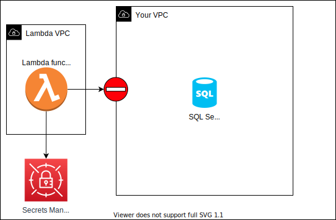
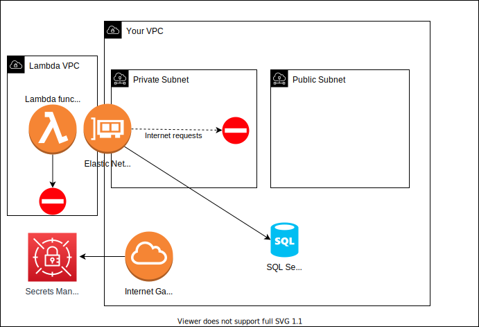
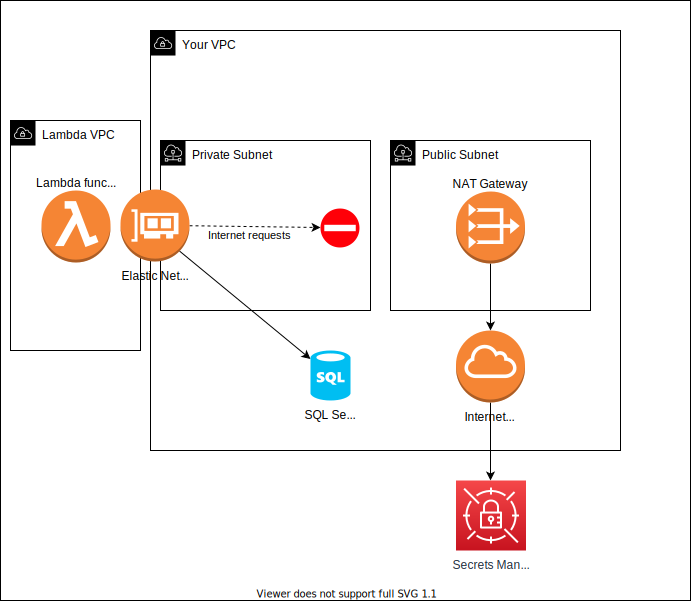
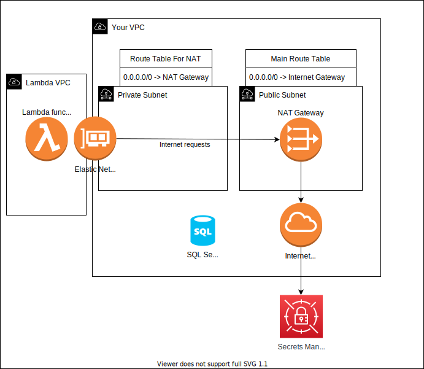

# Using a NAT Gateway - Command Line 

This approach uses a [NAT gateway](https://docs.aws.amazon.com/vpc/latest/userguide/vpc-nat-gateway.html) to give your Lambda function access to the internet, not only to the Secrets Manager service. It is the simpler of the two approaches, but your traffic to Secrets Manager will travel over the internet. In the second approach, using a VPC endpoint, your traffic to Secrets Manager will travel within the VPC. 

For most people, sending secrets over the internet is not a problem, as the data is end-to-end encrypted.

*Another advantage of this approach is that your function will have full internet access, not limited to just the Secrets Manager service. So this approach will work for you if your Lambda function needs to connect to other AWS services, or some third party service accessible over the internet.*

## Some Background and Concepts

### Subnets 

By default, your VPC has multiple subnets, one for each availability zone. You are going to use two of these subnets in this tutorial.

One will be designated as public, and one as private. There is no setting on the subnet that makes it public or private. For the purposes of this tutorial, a public subnet is one that has a route to the internet via an [Internet Gateway](https://docs.aws.amazon.com/vpc/latest/userguide/VPC_Internet_Gateway.html), and a private subnet is one that has a route to the internet via a [NAT Gateway](https://docs.aws.amazon.com/vpc/latest/userguide/vpc-nat-gateway.html).

### NAT Gateway

The NAT (Network Address Translation) Gateway is a managed service that allows your private subnets to access the internet. It does this by routing internet traffic to another subnet that has access to the internet via an Internet Gateway.

It may feel a little unintuitive, but you will add a NAT Gateway to the **public** subnet. More on this later.

### Internet Gateway

An Internet Gateway is an AWS service that allows resources in public subnets access the internet.

### Route tables

A route table is a collection of routes. Route tables can be associated with zero or more subnets. 
Each route in the table has a destination and a target. 
The destination is the range of IP address the route applies to, and the target is where the data is sent, e.g. a NAT Gateway, or Internet Gateway.

### Security Groups

A security group is a set of rules controlling what traffic is allowed to enter or leave a resource. As mentioned in the assumptions section, your default security group needs to allow all egress traffic, and all internal traffic within that security group.

## 1 - Create the AWS RDS SQL Server database

The first thing you will do is create the database. Each AWS region has different SQL Server versions available. To see what is available in your region, run the following command: 

`aws rds describe-db-engine-versions --engine sqlserver-ex --query 'DBEngineVersions[*].EngineVersion'`

You will see a list that looks like this: 
```
[
    "12.00.5571.0.v1",
    "12.00.6293.0.v1",
    "12.00.6329.1.v1",
    "12.00.6433.1.v1",
    "13.00.5598.27.v1",
    "13.00.5820.21.v1",
    "13.00.5850.14.v1",
    "13.00.5882.1.v1",
    "13.00.6300.2.v1",
    "14.00.3281.6.v1",
    "14.00.3294.2.v1",
    "14.00.3356.20.v1",
    "14.00.3381.3.v1",
    "14.00.3401.7.v1",
    "14.00.3421.10.v1",
    "15.00.4043.16.v1",
    "15.00.4073.23.v1",
    "15.00.4153.1.v1",
    "15.00.4198.2.v1"
]
```
Remember, depending on the region you are in, the list will be different.

Choose the highest version available in your region, and use that in the following command:

`aws rds create-db-instance --db-instance-identifier demo-sql-server --db-instance-class db.t3.small --engine sqlserver-ex --master-username admin --master-user-password SOME_COMPLEX_PASSWORD123! --allocated-storage 20 --license-model license-included --engine-version VERSION --no-publicly-accessible` 

Replace the `VERSION` with the version you chose from the list above.

This will take some time to run complete. 

Once the server is running, you can't access from your home computer, because you made the accessible from with the VPC only. Note the `--no-publicly-accessible` flag.

To get the endpoint, run the following command, but remember, it takes a while for the server to start up:
`aws rds describe-db-instances --db-instance-identifier demo-sql-server --query 'DBInstances[0].Endpoint.[Address,Port]' --output text`

If you get "None" back, it means the server has not started yet. Wait a few minutes and try again.

Once the server is running, the command will return the endpoint and port, it will look like:

`demo-sql-server.yyyyyyyyy.us-east-1.rds.amazonaws.com  1443`

Because you didn't specify a security group, the database uses the default security group, and because you didn't specify any subnets, the database will be available in all subnets in the VPC. This will be important later, when connecting the Lambda function to the VPC.

Now you have a SQL Server database running. Next you will add the credentials to Secrets Manager.

## 2 - Add the credentials to Secrets Manager

Open the file `Credentials\DatabaseCredentials.json`. Replace the `host` value with the endpoint address you got from the previous step.

From the command line run:
`aws secretsmanager create-secret --name demo-sql-server --secret-string file://Credentials/DatabaseCredentials.json`

You will see output like:
```
{
    "ARN": "arn:aws:secretsmanager:us-east-1:000000000000:secret:demo-sql-server-UFE2ki",
    "Name": "demo-sql-server",
    "VersionId": "4a60c581-e613-4e32-8907-ecdf2c26b653"
}
```

Note the ARN, you will need this later. 

Now you have a database and the credentials to access it. Next you will create the Lambda function that tries to access both Secrets Manager and the database.

## 3 - Create an S3 bucket

Before you can deploy the Lambda function, you need to create an S3 bucket to store the CloudFormation stack that will be created. Run:

`aws s3api create-bucket --bucket cloudformation-templates-2022`

If you are using a region other than us-east-1 region, add `--create-bucket-configuration LocationConstraint=REGION` to the end of the above command.

*Note, you must use a [unique name](https://docs.aws.amazon.com/AmazonS3/latest/userguide/bucketnamingrules.html) for the bucket, you can’t use the one shown here.*

## 4 - Deploy the Lambda function

At the end of this step you will have a Lambda function that partially works, it will be able to access Secrets Manager, but not the database. 

This is because the Lambda function will not be connected to the VPC yet, that is for later step. Then, when the Lambda function is connected to the VPC, it will be able to access the database, but not Secrets Manager!

I'm not going to guide you through each step in creating the Lambda function code, because it is available as part of this repository. The project was created using the [AWS Lambda Templates](https://github.com/aws/aws-lambda-dotnet/#dotnet-cli-templates), specifically using the `serverless.AspNetCoreWebAPI` template.

Open the accompanying directory, `src`, in your favorite IDE.

Open the `Startup.cs` file. The `ConfigureServices(..)` does three things 
1. loads configuration settings from the `appsettings.json` file
2. creates the database connection string by getting the credentials from Secrets Manager
3. creates an Entity Framework database context

The `Configure(..)` method configures makes sure that the database is created, and seeded. 

Open the `SecretsService.cs` file, it uses the configuration settings to load the appropriate secret from Secrets Manager, and returns a connection string for the database.

Open the `Data` directory, it contains the invoice model, the database context, and the database seeder.  

Open the `Controllers` directory, it contains an `InvoicesController`, its `Get(..)` method returns a list of invoices.

Open the file `appsettings.json`, the `Region` blank, if you need to deploy your Lambda function to a different region than where your secret is stored, set the region of the secret here.

You don't need to make any changes to the code. 

To deploy the function, run the following from the `src` directory:

`dotnet lambda deploy-serverless --stack-name AspNetCoreWebApiRds --s3-bucket cloudformation-templates-2022`

This will take a few minutes to complete the deployment, and will return output that ends like this:
```
//snip..
9/7/2022 3:56 PM     ServerlessRestApiProdStage               CREATE_COMPLETE
9/7/2022 3:56 PM     AspNetCoreFunctionRootResourcePermissionProd CREATE_COMPLETE
9/7/2022 3:56 PM     AspNetCoreFunctionProxyResourcePermissionProd CREATE_COMPLETE
9/7/2022 3:56 PM     AspNetCoreWebApiRdsTestForArticle        CREATE_COMPLETE
Stack finished updating with status: CREATE_COMPLETE

Output Name                    Value
------------------------------ --------------------------------------------------
ApiURL                         https://xxxxxxxx.execute-api.us-east-1.amazonaws.com/Prod/
```

That last line is the URL of your API.

If you try to access it now, you will get an internal server error, because the Lambda function attempts to access the Secret Manager secret, but does NOT have permission to do so. 

## 5 - Grant the Lambda function role access to the secret in Secrets Manager

Before the function can access the secret it needs to be granted permission to do so. You do this by adding a policy to the role that the Lambda function uses.

But, the function name is not the same as the stack name. To find the function name run the following command:

```
aws lambda list-functions --query 'Functions[?starts_with(FunctionName, `AspNetCoreWebApiRds`) == `true`].FunctionName' --output text
```

You will see something like:

`AspNetCoreWebApiRds-AspNetCoreFunction-aaaaa`

To find the name of the role the function uses, run the following command:
`aws lambda get-function --function-name AspNetCoreWebApiRds-AspNetCoreFunction-aaaaa --query 'Configuration.Role' --output text`

You will see something like:
`arn:aws:iam::000000000000:role/AspNetCoreWebApiRds-AspNetCoreFunctionRole-bbbbb`

Now you are going to give that role access to the secret you created earlier. 

Open the file `Policies\SecretesManagerAccess.json`, and replace the `Resource` with the ARN of the secret you created earlier.

Then run the following command:

`aws iam put-role-policy --role-name AspNetCoreWebApiRds-AspNetCoreFunctionRole-bbbbb --policy-name SecretsManagerAccess --policy-document file://policies/SecretsManagerAccess.json`

This command adds a policy to the role that allows the Lambda function to access the secret in Secrets Manager.

At this point, your function can access the secret in Secrets Manager, but not the database. If you invoked the Lambda now, it would fail when it tries to connect to the database, but you would see a message in the log with the database name on port.

<figure>
  
  <figcaption>Lambda function with access to Secrets Manager, but not the database</figcaption>
</figure>

## 6 - Connect the Lambda function the VPC

Now you are going to connect the Lambda function to the VPC. This will allow the Lambda function to access the database, but you will lose access to Secrets Manager! 

For simplicity, you are going to connect the Lambda function to a single subnet in the VPC. If you want more resiliency, you can connect the Lambda function to multiple subnets in different availability zones.

Before you connect the Lambda function the VPC, you need to find out the ID of your default security group, and choose your public and private subnets.

### 6.1 - Get the VPC ID and Default Security Group ID

The following command will get the VPC id and its default security group id:
```
aws ec2 describe-security-groups --query 'SecurityGroups[?GroupName==`default`].[VpcId, GroupId]' --output text
```

You will see output like:

`vpc-11111   sg-22222`

### 6.2 - Designate public and private subnets

For this tutorial, you are going to use two subnets, one designated as public, and one designated as private.

But first, get the list of all subnets in your VPC:

```
aws ec2 describe-subnets --query 'Subnets[?VpcId==`vpc-11111`].SubnetId' --output text
```

The output will look like:
`subnet-33333        subnet-44444        subnet-yyyyy        subnet-yyyyy        subnet-yyyyy        subnet-yyyyy`

Depending on your region you may have fewer subnets. 

For the purposes of this tutorial, you are going to use the first two subnets. 

Designate `subnet-33333` as the public subnet, it will host the NAT gateway and route internet traffic to the Internet Gateway.  
Designate `subnet-44444` as the private subnet, it will route internet traffic to the NAT gateway in the public subnet.

### 6.3 - Update the Lambda function, connecting it to the VPC

Run the following command:

`aws lambda update-function-configuration --function-name AspNetCoreWebApiRds-AspNetCoreFunction-aaaaa --vpc-config SubnetIds=subnet-44444,SecurityGroupIds=sg-22222``

You will see output showing the new function configuration, but it will take a few minutes to complete. 

Once complete, the Lambda function will have access to the database, but not Secrets Manager! If you attempt to invoke the function, it will fail again!

<figure>
  
  <figcaption>Lambda function access to the database, but not Secrets Manager</figcaption>
</figure>

#### Permissions to connect the Lambda function to the VPC

If you are wondering how the Lambda function was able to connect to the VPC, it's because the Lambda function role has a policy that allows it to do so.
Open the `serverless.template` file in the root of the project, there is a section that looks like this:
```
"Policies": [
    "AWSLambda_FullAccess",
    "AWSLambdaVPCAccessExecutionRole"
]
```
These are the polices that are attached to the role that the Lambda function uses. The policy `AWSLambdaVPCAccessExecutionRole` allows the role to create the required network interfaces to connect to the VPC.

## 7 - Create a NAT gateway in the public subnet

The NAT Gateway will allow the Lambda function to access the internet, and therefore access Secrets Manager. 

### 7.1 - Allocate and IP address for the NAT gateway

Before you create a NAT gateway, you need to allocate an IP address for it.

Run:
`aws ec2 allocate-address --domain vpc`

In the output of the command, you will see the allocation id:
`"AllocationId": "eipalloc-55555"

If you didn't see the id, run this command:

`aws ec2 describe-addresses`

### 7.2 - Create the NAT gateway

You are going to create the NAT gateway in the **public subnet**, it is very important that it is in the **public subnet**.

Run the the following command:

`aws ec2 create-nat-gateway --subnet-id subnet-33333 --allocation-id eipalloc-55555 --tag-specifications 'ResourceType=natgateway,Tags=[{Key=Name,Value=my-nat-gateway}]'`

You will find the NAT Gateway Id in the output of the command, it will look like:

`"NatGatewayId": "nat-66666",` 

Almost there, now you need to route internet traffic from the private subnet to the NAT gateway. On to the last step and routing tables!

<figure>
  
  <figcaption>Lambda function sending internet traffic to private subnet, but no route to NAT Gateway</figcaption>
</figure>

## 8 - Route internet traffic from the private subnet to the NAT Gateway

To route internet traffic from the private subnet to the NAT gateway, you need to create a route table, associate it with the private subnet, and add a route to it directing internet traffic to the NAT Gateway.

### 8.1 - Create a route table

You should already have a route table that routes all internet traffic to your internet gateway. We are going to refer to this as the "main" route table. It should already be associated with all your subnets. 

You are going to create a new route table that routes your internet traffic from the private subnet to the NAT gateway.

If you want tp review your existing route table(s), run:
```
aws ec2 describe-route-tables --query 'RouteTables[?VpcId==`vpc-11111`]'
```

Now create a new route table:
`aws ec2 create-route-table --vpc-id vpc-11111 --tag-specifications 'ResourceType=route-table,Tags=[{Key=Name,Value=my-nat-route-table}]'`

The output will include the id of the new route table:

`"RouteTableId": "rtb-77777",`

#### 8.1 - Associate the new route table with the private subnet

The new route table is not associated with any subnets yet. Now you are going to associate it with the **private subnet**.

Run the following:
`aws ec2 associate-route-table --route-table-id rtb-77777 --subnet-id subnet-44444`

The output will include the association id:

`"AssociationId": "rtbassoc-88888"`

This route table has no routes yet. One last thing to do.

#### 8.2 - Direct internet traffic from the private subnet to the NAT gateway

Run:

`aws ec2 create-route --route-table-id rtb-77777 --destination-cidr-block 0.0.0.0/0 --nat-gateway-id nat-66666`

Now your Lambda function can access the internet to reach Secrets Manager, and access the database! 

<figure>
  
  <figcaption>All done! Lambda has access to database, and internet</figcaption>
</figure>

## 9 - Invoke the Lambda function

Back in your browser, go to the URL from step 4, https://xxxxxxxx.execute-api.us-east-1.amazonaws.com/Prod/Invoices.

You should see a list of invoices displayed in the browser.

There you go, a Lambda function that accesses a non public database, and Secrets Manager.

If you want to create more Lambda functions that do the same, the process is much easier now that you have the subnets, routes, and NAT gateway set up. All you need to do is connect the Lambda function to the VPC, using the same subnet and security group as you did for this function.

## Clean up

It's always a good idea to delete resources after you are finished with them.

#### Delete the database

`aws rds delete-db-instance --db-instance-identifier demo-sql-server --final-db-snapshot-identifier SkipFinalSnapshot`

#### Delete the secret

`aws secretsmanager delete-secret --secret-id demo-sql-server`

#### Delete the Lambda function

`dotnet lambda delete-serverless --stack-name AspNetCoreWebApiRds`

#### Release the IP address

`aws ec2 release-address --allocation-id eipalloc-55555`

### Delete the NAT gateway

`aws ec2 delete-nat-gateway --nat-gateway-id nat-66666`

### Disassociate the route table from the private subnet

`aws ec2 disassociate-route-table --association-id rtbassoc-88888`

### Delete the route table

`aws ec2 delete-route-table --route-table-id rtb-77777`