# Using a VPC Endpoint - Console UI

This approach uses a [VPC endpoint](https://docs.aws.amazon.com/vpc/latest/privatelink/what-is-privatelink.html) to give your VPC connected Lambda function access to the Secrets Manager service only. It does not give your Lambda function access to the internet.

The traffic between the Lambda function and the Secrets Manager service will travel over the AWS network.

## Some Background and Concepts

### VPC Endpoints

A VPC endpoint is a logical connection between your VPC and another AWS service. It is a private connection between your VPC and the service, and does not traverse the internet. In the case of a Secrets Manager VPC endpoint, the traffic between your Lambda function and the Secrets Manager service will travel over the AWS network.

For each subnet you create a VPC endpoint for you are charged a fee. You need to find a balance between resilience and availability of the VPC endpoint and the price you pay for it.

For this tutorial, you should create a VPC endpoint for the subnet(s) that your Lambda function will be connected to, otherwise you will see errors when you try to access Secrets Manager from your Lambda function.

## 1 - Create the AWS RDS SQL Server database

The first thing you will do is create the database. Each AWS region has different SQL Server versions available. 

Log into the AWS Console and search for the [RDS service](https://console.aws.amazon.com/rds/home).

<figure>
  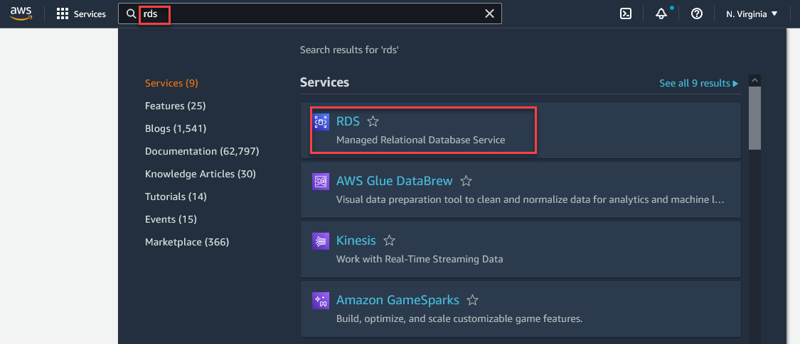
  <figcaption></figcaption>
</figure>

Select Databases from the menu on the left.

<figure>
  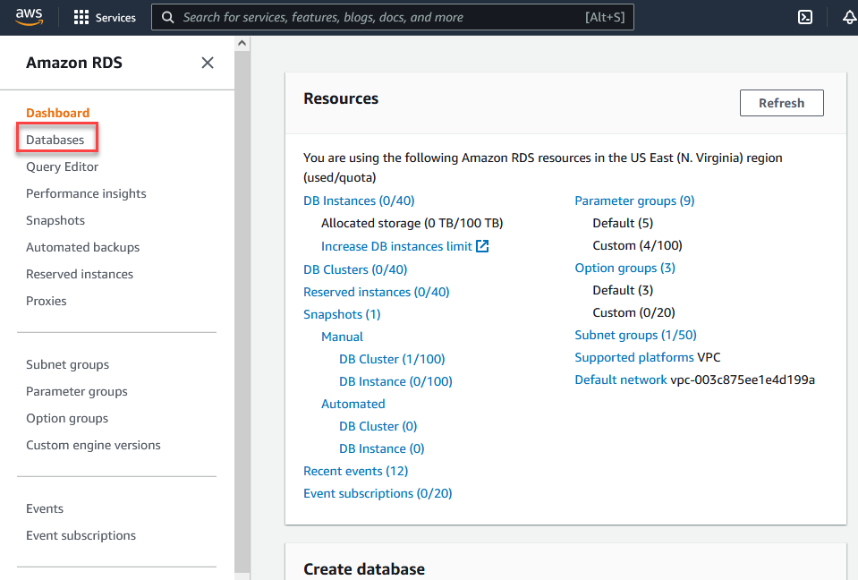
  <figcaption></figcaption>
</figure>

Select Create database.

<figure>
  
  <figcaption></figcaption>
</figure>

On this page you can create a database in a few steps. 
<figure>
  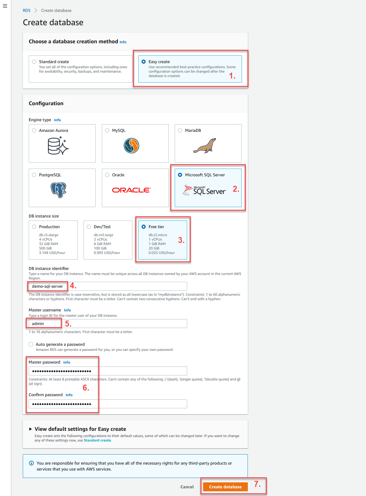
  <figcaption></figcaption>
</figure>

1. Choose Easy Create
2. Select Microsoft SQL Server
3. Stay on the Free tier unless you want to pay for a larger database
4. Give the server the name `demo-sql-server`
5. Leave the admin username as `admin`
6. Use `SOME_COMPLEX_PASSWORD123!` as the password
7. Click Create database

It will take a while for the database to be created. You can check the status of the database in the AWS Console.

<figure>
  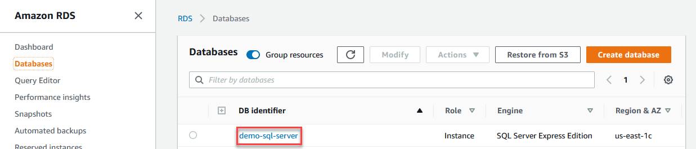
  <figcaption></figcaption>
</figure>

Once it is created, click on the database name.

<figure>
  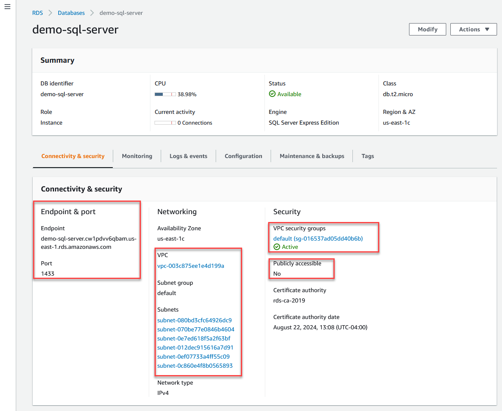
  <figcaption></figcaption>
</figure>

Here you will see the endpoint and port, the VPC it is on, subnets it is connected to, and the security group it is using.

You can't connect to the database from your computer, because it is not publicly accessible.

## 2 - Add the credentials to Secrets Manager

Open [Secrets Manager](https://console.aws.amazon.com/secretsmanager/) in the AWS Console, and click on Store a new secret.

<figure>
  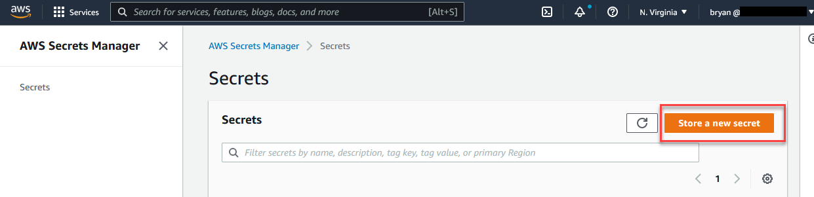
  <figcaption></figcaption>
</figure>

Enter the username, password, and select the database you created in the previous step. Click Next.
<figure>
  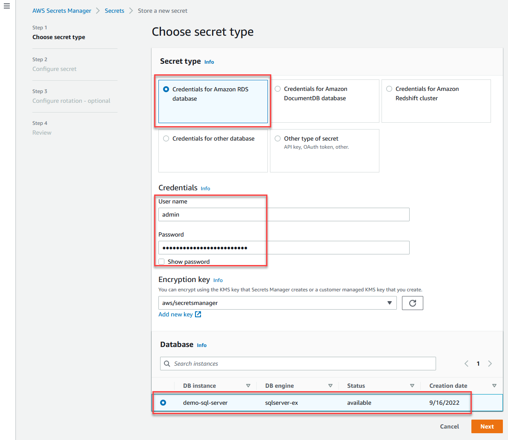
  <figcaption></figcaption>
</figure>

Enter the name of the secret, `demo-sql-server` and click Next.

<figure>
  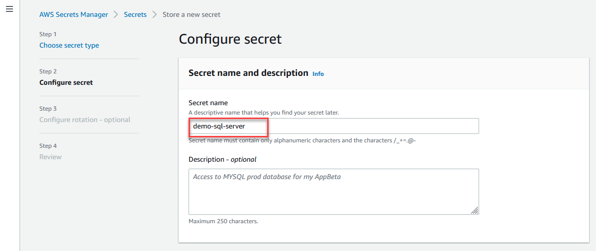
  <figcaption></figcaption>
</figure>

Don't change anything on the Configure rotation page and click Next.

On the review page, click Store. 


When you view your secret, you will ARM of the secret, you will need this later.

<figure>
  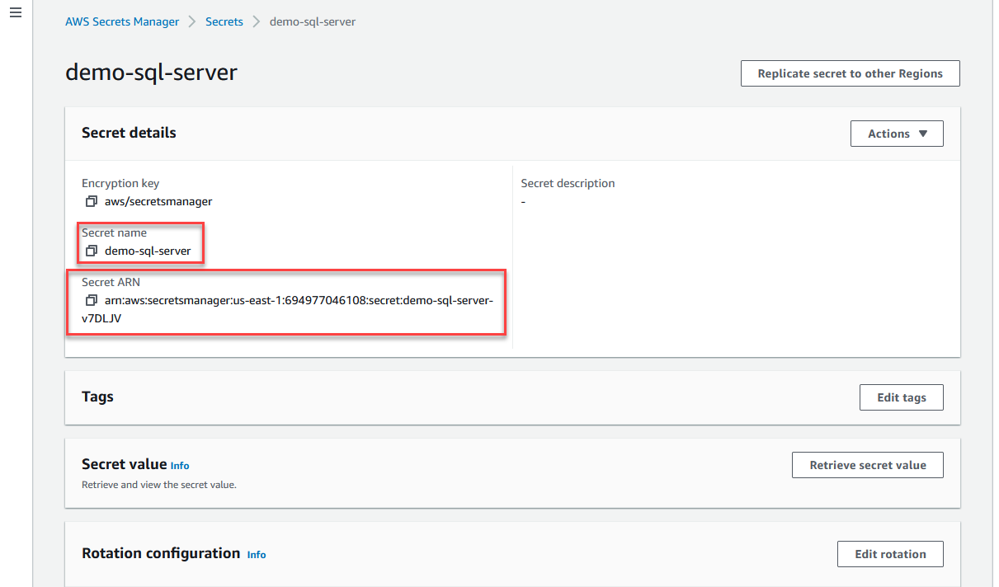
  <figcaption></figcaption>
</figure>
. 

Now you have a database and the credentials to access it. Next you will create the Lambda function that tries to access both Secrets Manager and the database.

## 3 - Create an S3 bucket

Before you can deploy the Lambda function, you need to create an S3 bucket to store the CloudFormation stack that will be created.

Open S3 in the AWS Console [https://s3.console.aws.amazon.com/s3/buckets](https://s3.console.aws.amazon.com/s3/buckets). 

Click on Create bucket.

<figure>
  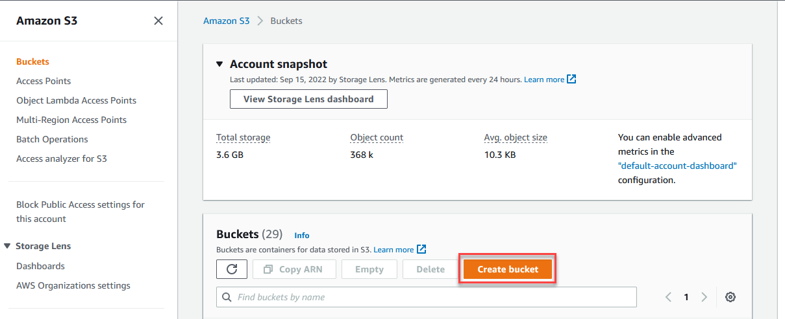
  <figcaption></figcaption>
</figure>

Enter a name for the bucket, Click Create bucket.

<figure>
  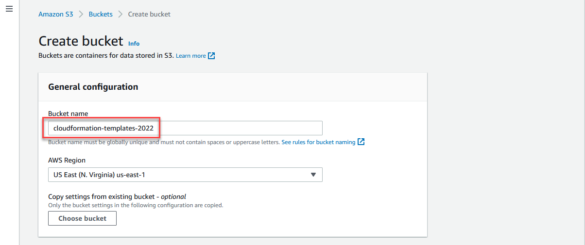
  <figcaption></figcaption>
</figure>

*Note, you must use a [unique name](https://docs.aws.amazon.com/AmazonS3/latest/userguide/bucketnamingrules.html) for the bucket, you can’t use the one shown here.*

## 4 - Deploy the Lambda function

*For this, you are going to use the command line as it is easier and consistent across all operating systems*

At the end of this step you will have a Lambda function that partially works, it will be able to access Secrets Manager, but not the database. 

This is because the Lambda function will not be connected to the VPC yet, that is for later step. Then, when the Lambda function is connected to the VPC, it will be able to access the database, but not Secrets Manager!

I'm not going to guide you through each step in creating the Lambda function code, because it is available as part of this repository. The project was created using the [AWS Lambda Templates](https://github.com/aws/aws-lambda-dotnet/#dotnet-cli-templates), specifically using the `serverless.AspNetCoreWebAPI` template.

Open the accompanying directory, `src`, in your favorite IDE.

Open the `Startup.cs` file. The `ConfigureServices(..)` does three things 
1. loads configuration settings from the `appsettings.json` file
2. creates the database connection string by getting the credentials from Secrets Manager
3. creates an Entity Framework database context

The `Configure(..)` method configures makes sure that the database is created, and seeded. 

Open the `SecretsService.cs` file, it uses the configuration settings to load the appropriate secret from Secrets Manager, and returns a connection string for the database.

Open the `Data` directory, it contains the invoice model, the database context, and the database seeder.  

Open the `Controllers` directory, it contains an `InvoicesController`, its `Get(..)` method returns a list of invoices.

Open the file `appsettings.json`, the `Region` blank, if you need to deploy your Lambda function to a different region than where your secret is stored, set the region of the secret here.

You don't need to make any changes to the code. 

To deploy the function, run the following from the `src` directory:

`dotnet lambda deploy-serverless --stack-name AspNetCoreWebApiRds --s3-bucket cloudformation-templates-2022`

This will take a few minutes to complete the deployment, and will return output that ends like this:
```
//snip..
9/7/2022 3:56 PM     ServerlessRestApiProdStage               CREATE_COMPLETE
9/7/2022 3:56 PM     AspNetCoreFunctionRootResourcePermissionProd CREATE_COMPLETE
9/7/2022 3:56 PM     AspNetCoreFunctionProxyResourcePermissionProd CREATE_COMPLETE
9/7/2022 3:56 PM     AspNetCoreWebApiRdsTestForArticle        CREATE_COMPLETE
Stack finished updating with status: CREATE_COMPLETE

Output Name                    Value
------------------------------ --------------------------------------------------
ApiURL                         https://xxxxxxxx.execute-api.us-east-1.amazonaws.com/Prod/
```

That last line is the URL of your API.

If you try to access it now, you will get an internal server error, because the Lambda function attempts to access the Secret Manager secret, but does NOT have permission to do so. 

## 5 - Grant the Lambda function role access to the secret in Secrets Manager

Before the function can access the secret it needs to be granted permission to do so. You do this by adding a policy to the role that the Lambda function uses.

Open the [Lambda service](https://console.aws.amazon.com/lambda/home) in the AWS Console. Look for your function, its name will look something like `AspNetCoreWebApiRds-AspNetCoreFunction-?????????????`.

Select the Configuration tab. On the left select the Permissions section. Click on the role. This will open a new page where you can add the necessary policy to access the secret.

<figure>
  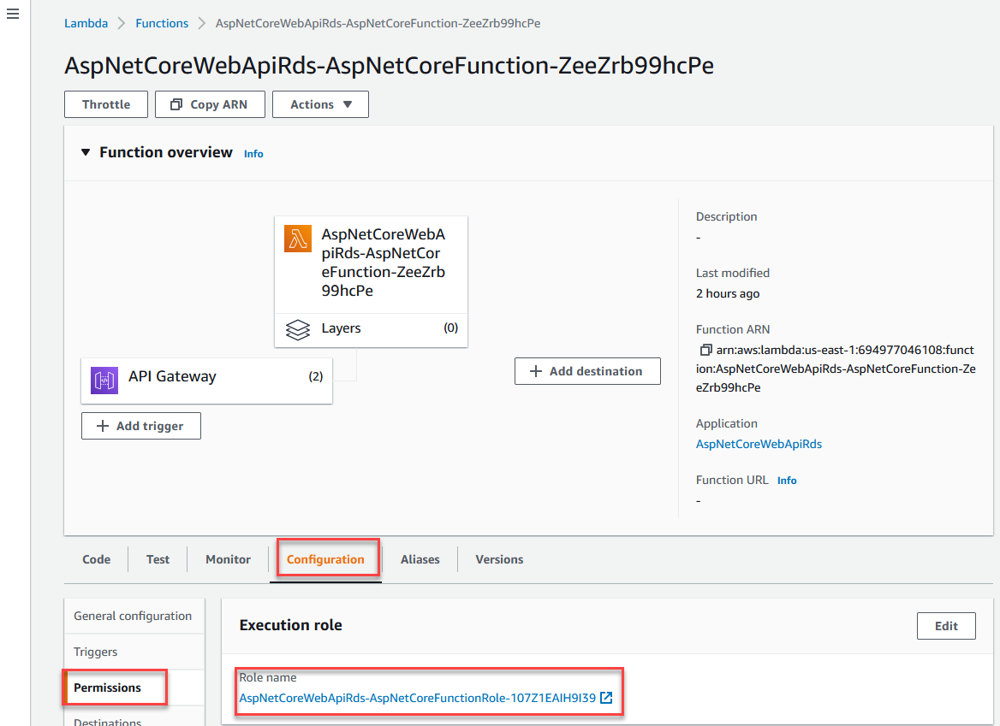
  <figcaption></figcaption>
</figure>

Click Add permissions, and choose Create inline policy.

<figure>
  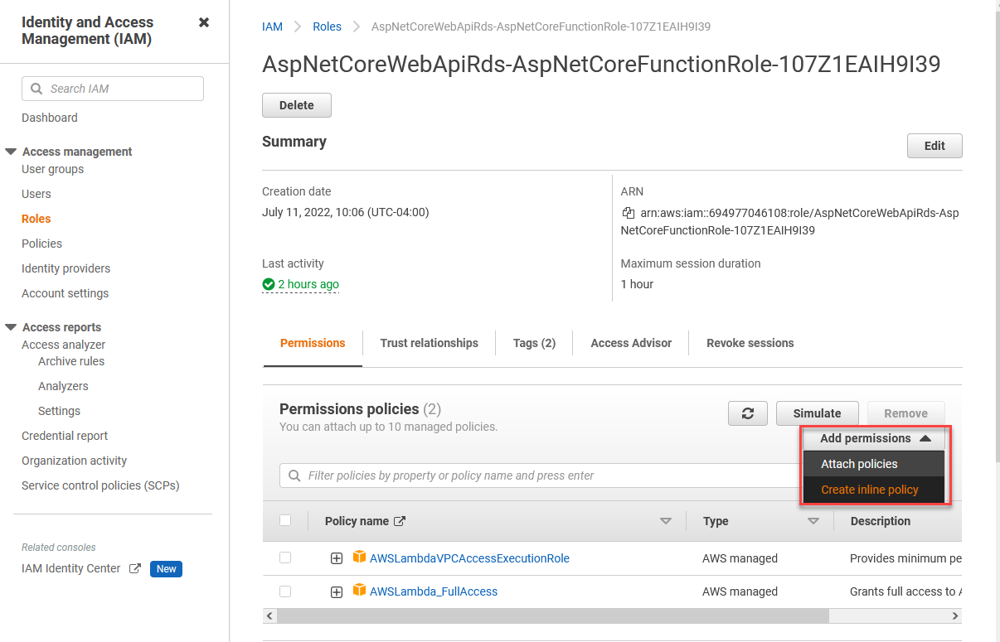
  <figcaption></figcaption>
</figure>

On the new screen, search for and choose "Secrets Manager"from the Service list. For the action, search for and choose GetSecretValue.

The click on Add ARN. 

<figure>
  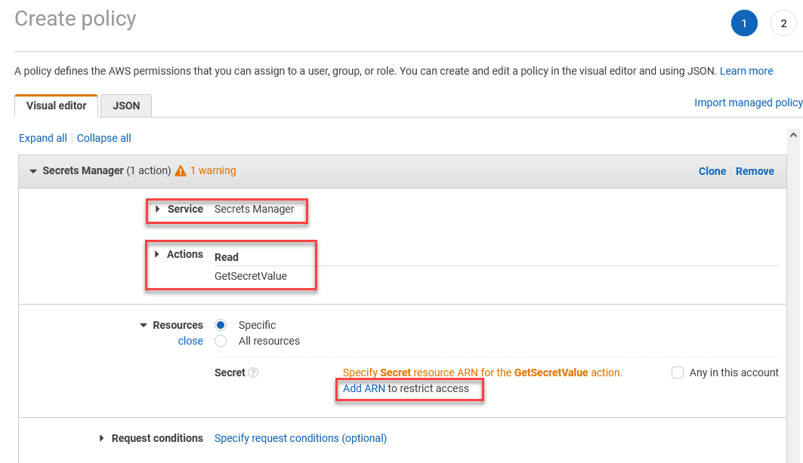
  <figcaption></figcaption>
</figure>


Add in the ARN of the secret you created earlier. It will look something like - `arn:aws:secretsmanager:us-east-1:?????????????:secret:demo-sql-server-??????????????`.

<figure>
  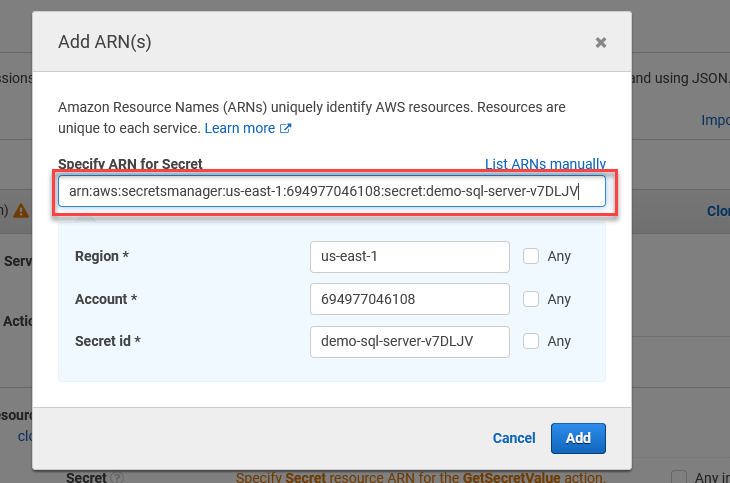
  <figcaption></figcaption>
</figure>

Click Review policy.

Enter a name for the policy, and click Create policy.

<figure>
  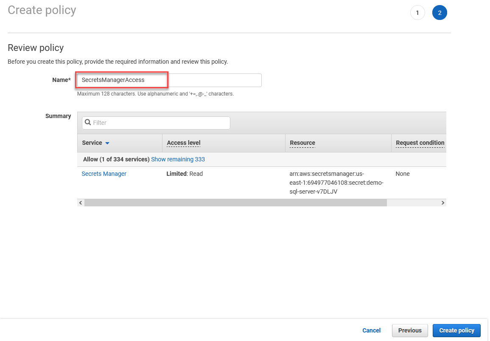
  <figcaption></figcaption>
</figure>

At this point, your function can access the secret in Secrets Manager, but not the database. If you invoked the Lambda now, it would fail when it tries to connect to the database, but you would see a message in the log with the database name on port.

<figure>
  
  <figcaption>Lambda function has access to Secrets Manager, but not the database</figcaption>
</figure>

## 6 - Connect the Lambda function the VPC

Now you are going to connect the Lambda function to the VPC. This will allow the Lambda function to access the database, but you will lose access to Secrets Manager!

For simplicity, you are going to connect the Lambda function to a single subnet in the VPC. If you want more resiliency, you can connect the Lambda function to multiple subnets in different availability zones. If you do connect the Lambda function to multiple subnets, you should to make the VPC endpoint available on those subnets too (keep in mind that you pay more for VPC endpoints connected to multiple subnets).

Open your Lambda function, select the Configuration tab. On the left select the VPC section. Click Edit.

<figure>
  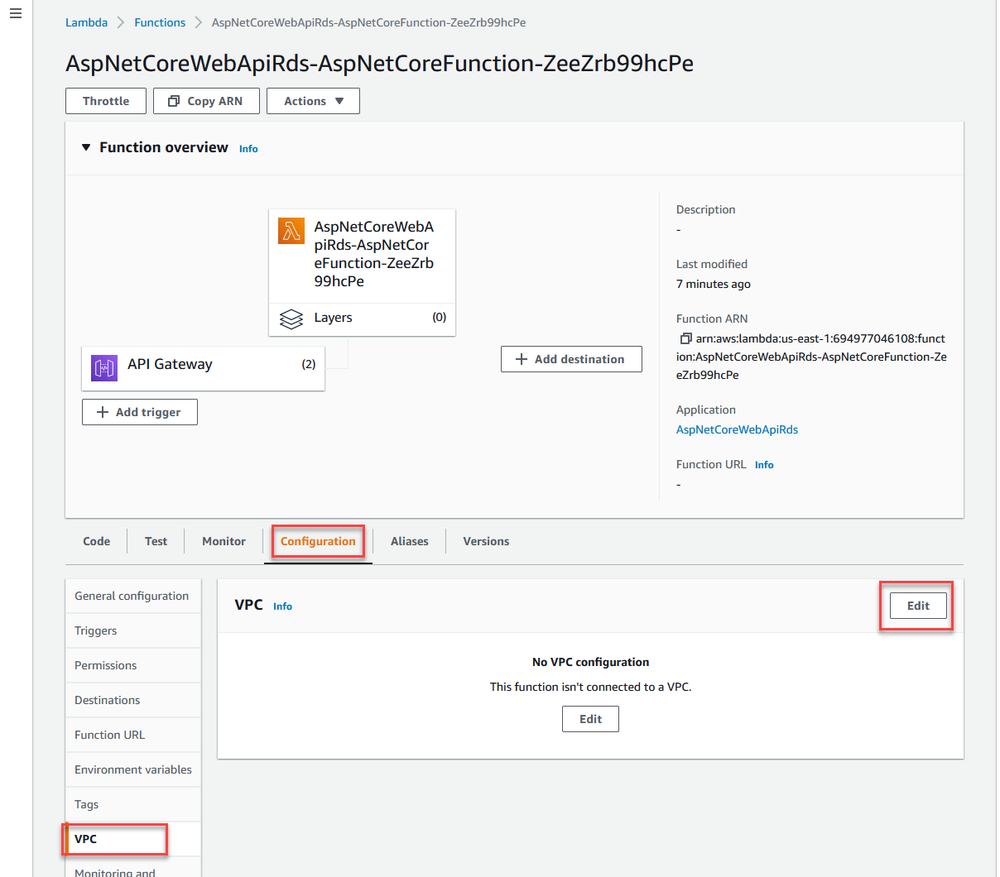
  <figcaption></figcaption>
</figure>

Choose the default VPC, select a single subnet (note which one you pick), select the default security group. Click Save. 

This will take a few minutes to complete.

Once complete, the Lambda function will have access to the database, but not Secrets Manager! If you attempt to invoke the function, it will fail again!

<figure>
  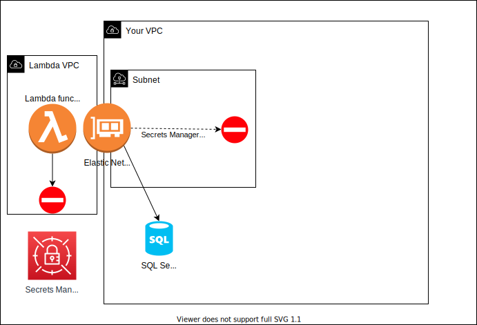
  <figcaption>Lambda function has access to the database, but not Secrets Manager</figcaption>
</figure>

### Permissions to connect the Lambda function to the VPC

If you are wondering how the Lambda function was able to connect to the VPC, it's because the Lambda function role has a policy that allows it to do so.
Open the `serverless.template` file in the root of the project, there is a section that looks like this:

```
"Policies": [
    "AWSLambda_FullAccess",
    "AWSLambdaVPCAccessExecutionRole"
]
```

These are the polices that are attached to the role that the Lambda function uses. The policy `AWSLambdaVPCAccessExecutionRole` allows the role to create the required network interfaces to connect to the VPC.

## 7 Create a VPC endpoint for Secrets Manager

One last step. 

Open the [VPC service](https://console.aws.amazon.com/vpc/home) in the AWS Console. Select the Endpoints section. Click Create endpoint.

<figure>
  
  <figcaption></figcaption>
</figure>


1. Choose a name for the VPC endpoint
2. Choose AWS services as the service category
3. Filter the list of services to find Secrets Manager
4. Choose the default VPC
5. Leave the DNS name as is
6. Choose the subnet you selected when you connected the Lambda function to the VPC
7. Choose the default security group
   
Click Create endpoint.

<figure>
  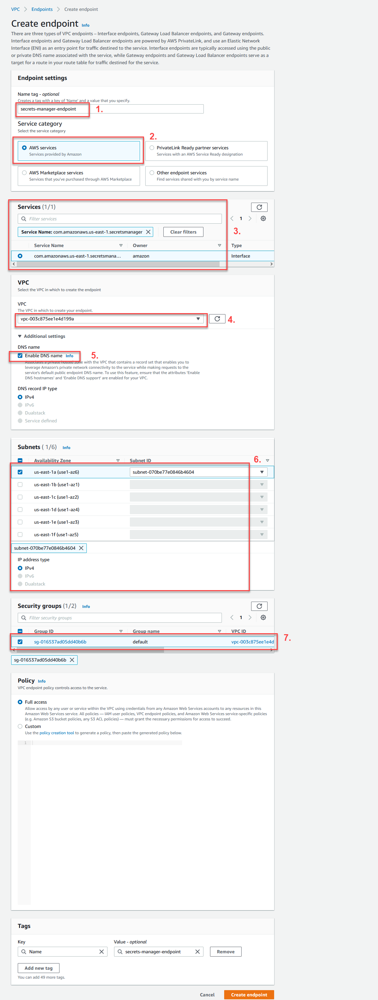
  <figcaption></figcaption>
</figure>

This will take a few minutes to complete.

Now your Lambda function has access to both the database and Secrets Manager. If you invoke the function, it will succeed!

<figure>
  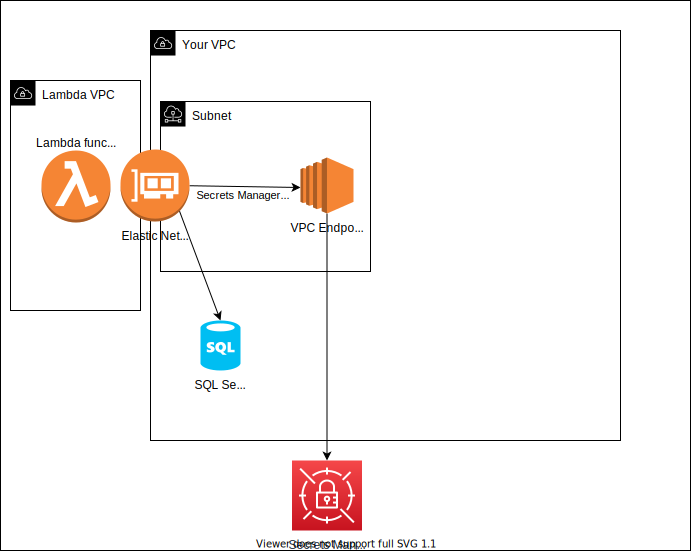
  <figcaption>Lambda function has access to Secrets Manager, and the database</figcaption>
</figure>

## 9 Invoke the Lambda function

Back in your browser, go to the URL from step 4, https://xxxxxxxx.execute-api.us-east-1.amazonaws.com/Prod/Invoices.

You should see a list of invoices displayed in the browser.

There you go, a Lambda function that accesses a non public database, and Secrets Manager via a VPC endpoint.

If you want to create more Lambda functions that do the same, the process is much easier now that the VPC endpoint in place. All you need to do is connect the Lambda function to the VPC, using the same subnet and security group as you did for this function.


## Clean up

It's always a good idea to delete resources after you are finished with them.

### 1 - Delete the database

Open the [RDS service](https://console.aws.amazon.com/rds/home) in the AWS Console. Select the Databases on the left.

Select the database you created earlier. Click the Action button, choose Delete.

<figure>
  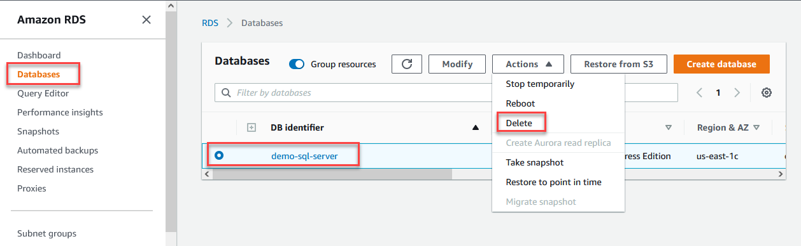
  <figcaption></figcaption>
</figure>

Choose the options you want around snapshots and backups. Type "delete me" in the text box and click Delete. 

<figure>
  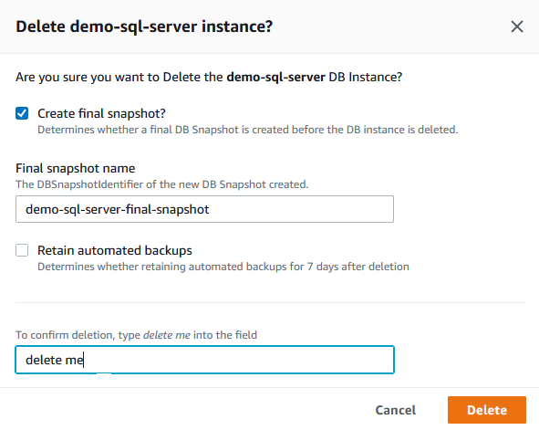
  <figcaption></figcaption>
</figure>

### 2 - Delete the Secrets Manager secret

Open the [Secrets Manager service](https://console.aws.amazon.com/secretsmanager/home) in the AWS Console. Click the demo-sql-server secret.

<figure>
  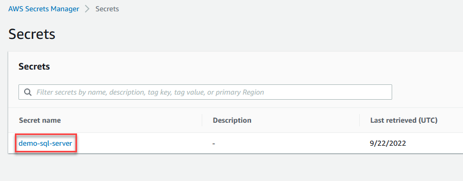
  <figcaption></figcaption>
</figure>

Open the Actions menu, click Delete secret.

<figure>
  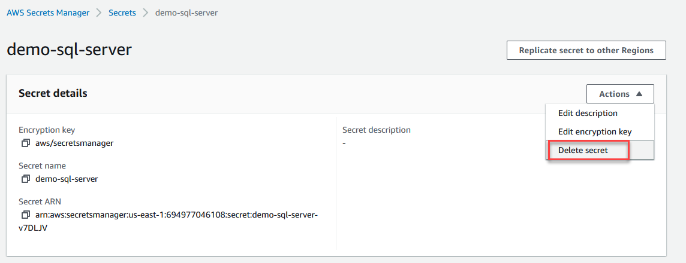
  <figcaption></figcaption>
</figure>

Choose waiting period you want, and click Schedule deletion.

<figure>
  
  <figcaption></figcaption>
</figure>

### 3 - Delete the Lambda function

In the search bar at the of the AWS Console, type in "cloudformation". Then click Stacks.

<figure>
  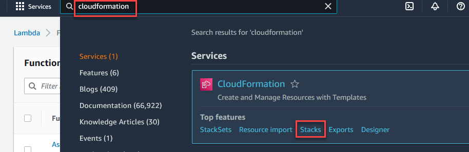
  <figcaption></figcaption>
</figure>

Select the stack named AspNetCoreWebApiRds, click Delete.

<figure>
  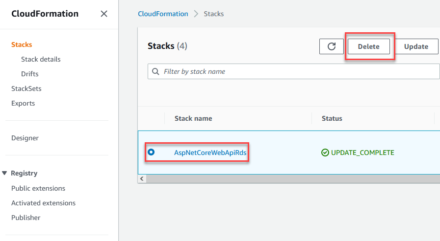
  <figcaption></figcaption>
</figure>

Confirm deletion in the popup.

<figure>
  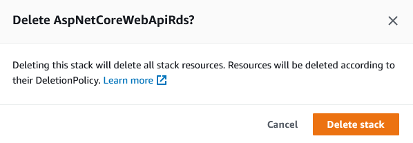
  <figcaption></figcaption>
</figure>

It will delete the Lambda function, its associated role and permissions, and the API Gateway (this was created when you deployed the Lambda function).

This will take a few minutes to complete.

### 4 - Delete the VPC Endpoint

Open the [VPC service](https://console.aws.amazon.com/vpc/home) in the AWS Console. Select Endpoints on the left, be careful to not choose Endpoint Services.

Select the VPC endpoint you created earlier. Click the Action button, choose Delete VPC endpoints.

<figure>
  
  <figcaption></figcaption>
</figure>

Confirm deletion in the popup.
