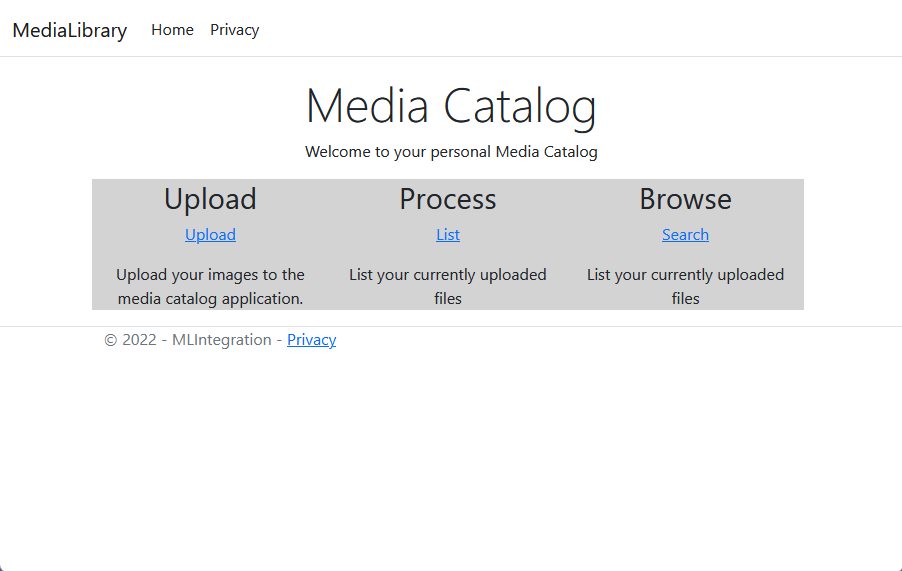
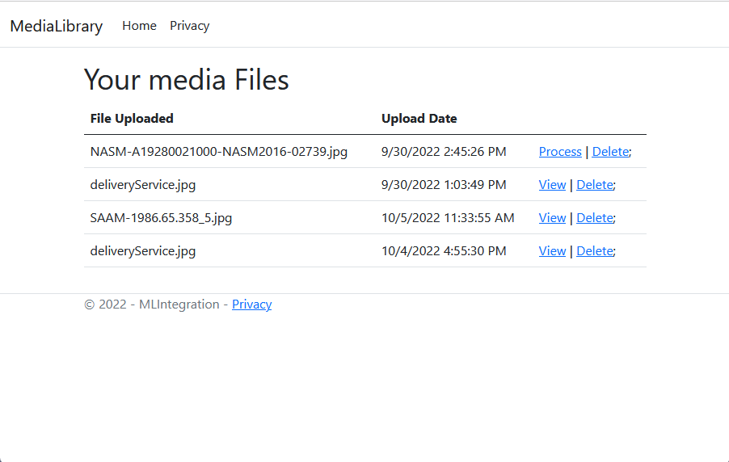
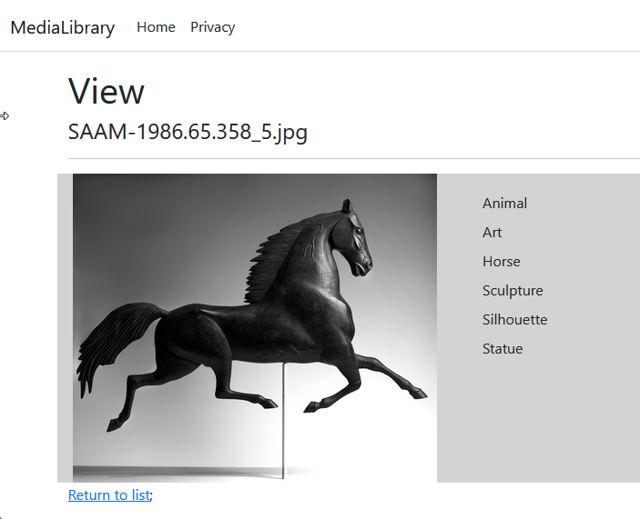
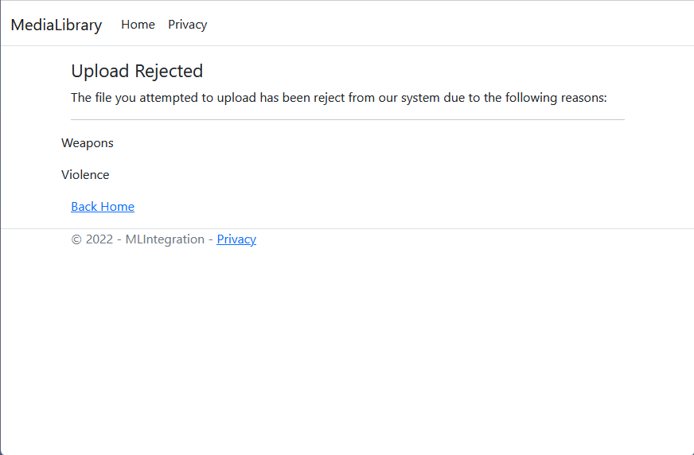

# ML Integration - Media Catalog

This sample application is designed to catalog images using Amazon Rekognition. Using the functionality in this
application users can take advantage of Rekognition's ability to automatically apply moderation to images, and determine 
if images contain potentially offensive materials. Additionally Rekognition will detect the content of images and build 
a cross referance between the items discovered and the images stored.


Upload photos to be cataloged.


List and process the uploads through Rekognition


View what has been identified for specific photos.


Automatically moderate for potentially offensive photos.

## Prerequisits
In order to use this project you will need to deploy the required infrastructure into your account.
The supporing infrastructure has been created as a Cloud Development Kit (CDK) stack and can be deployed 
by running the command CDK Deploy command from the MediaLibrary6.0\CDK folder. 

Instructions for installing CDK can be found [here](https://docs.aws.amazon.com/cdk/v2/guide/getting_started.html)

Documentation for CDK can be found [here](https://docs.aws.amazon.com/cdk/v2/guide/home.html)

## Project Structure:
### MLIntegration/CDK
This Directory contains a CDK project that creates all the backing infrastructure for the project. 
The infrastructure can be created using the CDK Deploy command into your AWS Account. Deployment 
of the stack is performed using the following command in the CDK directory.

```
CDK Deploy 
```

Instructions for installing CDK can be found here:
https://docs.aws.amazon.com/cdk/v2/guide/getting_started.html

### MLIntegration.sln
Main solution for the application. 

### MLIntegration/MLIntegration.Tests
Some basic unit tests for the application.

### MLIntegration/SampleImages
Some sample images that can be used to test the media catalog. All images in this directory were 
obtained from the Smithsonian Open Access platform.

In order to use this solution, users should first deploy the CDK project into their AWS Account. 
Once deployed, you can clean up the resources by removing the Cloud Formation stack that gets 
deployed. Once the CDK infrastructure has been deployed, you can run the application via 
Visual Studio, or deploy the solution into your AWS account. 
