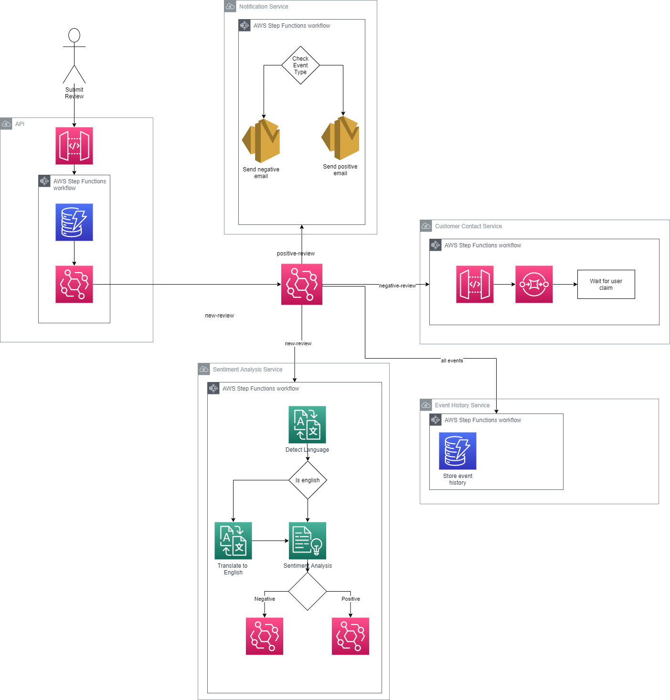

# Event Driven Serverless CDK

This project contains an example of building an AWS native, event driven, customer review analysis application. It uses serverless components and native AWS service integrations. The application is deployed using the AWS CDK, written in C#.

## Architecture

The intention of this application is to show the art of the possible, that does not necessarily mean this would be replicated directly into a production system. AWS Lambda still has a place in the serverless world, these Step Functions show the possibilities.



The application consists of 6 services:

### API

A storage first API that receives requests from a front-end, stores them durably and publishes an event to notify other services that a new review has been received.

This storage first API utilises the native service integrations between Amazon API Gateway and Step Functions to pass the HTTP request directly to a step functions execution. The workkflow stores the request to DynamoDB and then publishes an event to notify other services that an API request has been received.

### Sentiment Analysis

Service to translate the review to English if not currently in English, analyze the review content and detect the sentiment.

This service demonstrates the true power of Amazon Step Functions. There are native service integrations with Amazon Comprehend and Translate. The workflow is also invoked directly from an Amazon Event Bridge rule.

### Notification Service

Sends email notifications back to the reviewer.

### Customer Contact Service

Negative reviews are followed up by a customer service representative. This service manages that customer service flow.

### Event History Service

An audit service, to store all events to a DynamoDB table.

## Deploy

Before you deploy the application you will first need to add the email address to be used for customer service notifications. Email sending uses SES, so ensure that the AWS account you deploy the stack to has permissions to send email to the email address used. [You can find details on verifying an email identity in the AWS documentation.](https://docs.aws.amazon.com/ses/latest/dg/creating-identities.html#verify-email-addresses-procedure).

If you want to disable the email notifications, you can comment on lines 21-24 in the [customer service workflow file.](src/EventDrivenCdk/CustomerContactService/WorkflowStep.cs).

``` csharp
// negativeReviewNotification.AddSubscription(new EmailSubscription("eventdrivencdk@gmail.com", new EmailSubscriptionProps()
// {
    
// }));
```

### Add Email

If you do wish to enable emails enter the email identity you have verified in the customer contact service workflow:

1) Open [src/EventDrivenCdk/CustomerContactService/WorkflowStep.cs](src/EventDrivenCdk/CustomerContactService/WorkflowStep.cs)
2) Add your email address to the AddSubscription line
```
negativeReviewNotification.AddSubscription(new EmailSubscription("", new EmailSubscriptionProps()
```

The entire application can be deployed by running the below command from the root directory.

```
cdk bootstrap
cdk deploy
```

Post deployment the CDK stack will output two parameters, one for the FrontEndApiEndpoint and the other for the AuditApiEndpoint.

## Test

The repository includes a simple Blazor Server application that you can use to test the application:

1. Navigate to the [EventDriven.Front folder](src/EventDriven.Front)
2. Open the appsettings file and populate the FrontEndApiEndpoint and AuditApiEndpoint properties using the output values from the 'cdk deploy' command
3. Run the front end application on local host using the 'dotnet run' command
  - Note, the front-end application interacts directly with the StepFunction and SQS API's. When running the 
  application locally ensure you have configured your default AWS credentials locally
4. Naviate go [http://localhost:5225/](http://localhost:5225/)

Below are sample API request bodies you can use to test positive and negative workflows.

Tests can be executed using the API testing tool of your choice. On deployment the CDK project will output the FrontEndApiEndpoint to use. Make a POST request to the root path using the schema below.

### Positive
```json
{
    "reviewIdentifier": "test",
    "emailAddress": "",
    "reviewContents": "This is a great demo of CDK native integrations."
}
```

### Negative
```json
{
  "reviewIdentifier": "test",
  "emailAddress": "eventdrivencdk@gmail.com",
  "reviewContents": "Esta no es una muy buena demostración, viva Lambda"
}
```