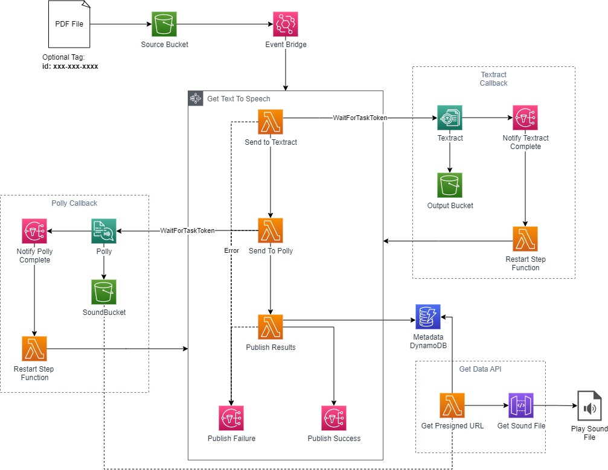

# AWS Text To Speech Assistant 
## (aws-dotnet-accessibility-assistant)

The serverless text to speech assistant is a .NET 6.0-based serverless application(using AWS SAM) that allows you to upload a PDF file into an S3 bucket. The file will be sent to Amazon Textract to read the text that is in the document. Then, the text from the document will be sent to Amazon Polly to convert the text into an MP3 file. The file will be available via a Lambda function, which will provide a pre-signed URL that you can use to retrieve the file from the output S3 bucket. Two SNS topics are provided, one to deliver a notification in the event of failure, and one for success.

The application is mainly self-contained, so by only using input S3 bucket, the success and failure SNS topics and the API Gateway, you can incorporate this application into your own processing system.

## Prerequisites
To deploy this solution, you will need the following
1. An AWS Account that you have permissions to deploy to, with credentials available for an IAM user.
1. Install the AWS CLI
1. Install the AWS SAM CLI
1. Install the .NET 6.0 SDK

## Architecture

The serverless text to speech application uses .NET based AWS Lambda functions coordinated by an AWS Step Function. All ML-based processing is asynchronous. The Step Function is halted until processing is complete. Although logic could be organized to poll for job completion, by running asynchronously, you do not need to worry about unneeded state transitions, and unnecessary API calls.



### .NET Projects
Each Lambda function is a separate .NET 6.0 project, using top-level statements (a function of C#10 with the ```LambdaBoostrapBuilder``` class). The *Common* project includes common functionality, including initialization of a DI container that is used in the rest of the functions.

The functions/projects that are included are:

- **SendToTextract** 
(Lambda Function - SendToTextract) - 

    Uses the AWS SDK for .NET to submit the PDF file for processing with Amazon Textract. Creates a record for this run in the DynamoDB table.

- **ProcessTextAndSendToPolly** 
(Lambda Function - ProcessTextAndSendToPolly) - 

    Uses the AWS SDK for .NET to retrieve the results from Textract and submit to Amazon Polly. Updates the DynamoDB record.

- **CompleteTextract**
(Lambda Function - NotifyTextractComplete) - 

    Lambda function triggered by SNS with the result of the completion of the asyncnronous textract processing. Sends either success or failure back, depending on Textract results. USes the JobTag property of the Textract Job to identify the ID of the run and get the task token from DynamoDB.

- **CompletePolly**
(Lambda Function - NotifyPollyComplete) -

    Lambda function triggered by SNS with the result of the completion of the Polly job. Since Polly does not have a JobTag, attribute, the DynamoDB table is scanned, looking for the Polly Job ID to get the associated Task Token. The Step Function is restarted (success or fail depending on the Polly status).


- **PublishResults**
(Lambda Function - PublishResults) - 

    Lambda function that updates the DynamoDB table with the final results of the run. This includes nulling out temporary data like task tokens and job IDs, and adds the URL for the resultant key.

- **SoundFileUrl**
(Lambda Function - SoundFileFunction) -  

    Lamdba function that sits behind an API gateway. It returns a 302 redirect to a signed URL for the sould file.

### Resources
The following AWS Services are added as resources in the in this architecture via the SAM template:

1. Amazon S3 buckets

    **SourceBucket** - Bucket where PDF files are placed for processing.
    **OutputBucket** - Bucket where the raw Textract output is placed.
    **SoundBucket** - Bucket where the finished mp3 files are placed.

1. Amazon DynamoDB table

    The DynamoDB table, **MetaDataTable**, is createfd as "AWS::Servereless::SimpleTable. This is a shorthand to create a DynamoDB table that has a primary key (named "id" if not otherwise specified). The metadata for the PDF to mp3 process is stored here.

1. AWS Lambda functions

    - **SendToTextract** - Submits the PDF to Amazon Textract using the AWS SDK for .NET. This is a part of an AWS Step Function state machine.
    - **ProcessTextAndSendToPolly** - Submits the processed text from Textract to Amazon Polly for conversion to speech using the AWS SDK for .NET.
    - **NotifyTextractComplete** - Function that is triggered (via SNS) when textract processing is complete. Its job is to restart the paused step function.
    - **NotifyPollyComplete** - Function that is triggered (via SNS) once the Polly Processing is complete. Its job is to restart the paused step function.
    - **PublishResults** - Function that publishes the final results to DynamoDB using the AWS SDK for .NET (Object Persistence Model).
    - **SoundFleFunction** - Function that sits behind an Amazon API Gateway and when invoked, returns a signed URL to retrieve the MP3 file referred to by the key directly from Amazon S3.

1. Amazon EventBridge Rules
    - **NotifyUploadRule** - EventBridge rule that, when a PDF file is placed into "SourceBucket", will trigger the AWS Step Function directly.

1. AWS Step Functions
    - **ProcessFileStateMachine** - Step function, defined by the "statemachine.asl.yaml" file, defines the entire process of converting the text in the uploaded PDF file into an mp3 file.

1. Amazon Simple Notification Service (SNS) topics
    - **TextractTopic** - Textract will publish a completion message to this topic when processing is complete.
    - **PollyTopic** - Polly will publish a completion mesage to this topic when processing is complete.
    - **SuccessTopic** - When the Step Function is done processing successfully, it will publish a message to this topic.
    - **FailureTopic** - When the Step Function is done processing with errors, it will publish a message to this topic.

1. AWS Identity and Access Management (IAM)
    - **StartStepFunctionRole** - Role that is assigned to the EventBridge Rule that allows it to start the processing Step Function
    - **DescribeTablePolicy** - IAM Policy required for using the Metadata table with 
    .NET Object Persistence Model. The DynamoDB CRUD template does not have "describetable", which is required. 
    - **StateMachineRole** - Role assigned to the main Step Function. Permissions include allowing invocation of the Lambda functions and publishing to the SNS topics
    - **TextractRole** - IAM Role that allows Textract to access the appropriate S3 buckets and publish to the notification SNS topic
    - **SourceFileBucketPolicy** - IAM Policy to allow full access to the Source File Bucket 
    - **SoundFileBucketPolicy** - IAM Policy to allow full access to the Sound File Bucket
### Parameters
The inputs to this SAM template can be specified to modify the behavior of the deployment.

1. **Environment** - A short string that is appended on to the end of resource names in order to differentiate between different instances in the same account/region. This defaults to "dev".

1. **OutputPrefix** - An S3 Prefix ("folder") that is prepended on to each Textract raw output. This is a required value in Amazon Textract, so a default value of "output" is specified.

1. **SoundPrefix** - An S3 Prefix ("folder") that is prepended on to each sound file. Since this is a required value, then a default value of "sounds" is used.

1. **PollyVoice** - The voice that will be used with Amazon Polly. It is important to make sure that you use a supported voice.

1. **S3IdKey** - The tag key that will, if supplied, contain the unique ID for this process. Otherwise a random value will be supplied. The default value is "id".

### Outputs
The outputs of this SAM template can be used to integrate your applications with this process.

1. **ApiUrl** - The URL that can be called to retrieve the signed URL for the sound file.

1. **SuccessTopic** - SNS Topic Published When the Text-To-Speech Process Succeeds

1. **FaiureTopic** - SNS Topic Published When the Text-To-Speech Process Fails

1. **Source Bucket** - S3 Bucket where PDF files should be placed for processing

## Deploying
To deploy this solution, you should open a terminal window to the "serveless-text-to-speech" directoruy.

To build the project you can type:

```sam build```

This will build all the .NET code and process the SAM template. The processed assets will copied to a directory, ".aws-sam"

To deploy the project the first time, you can type:

```sam deploy --guided --capabilities CAPABILITY_NAMED_IAM```

Note: If you are using an IAM profile other than the one called "default", you will need to type the command:

```sam deploy --guided --profile=profilename --capabilities CAPABILITY_NAMED_IAM```

You will be prompted for the following values:
- Stack Name - What you want this CloudFormation stack to be called.
- Region - The AWS region to deploy this stack
- A value for the parameter "Environment". You can override this or accept the default of "dev"
-  A value for the parameter "OutputPrefix". You can override this or accept the default of "output"
-  A value for the parameter "SoundPrefix". You can override this or accept the default of "sounds"\
-  A value for the parameter "PollyVoice". You can override this or accept the default of "Matthew"
-  A value for the parameter "S3IdKey". You can override this or accept the default of "id"
- Whether or not to prompt to actually deploy changes. Enter "N" to deploy without confirmation.
- Whether or not to allow SAM CLI to create the appropriate role. Select "Y" to allow SAM to create a role to connect to resources in your template on your behalf.
- Disable Tollback - If the operation fails, do not roll back the template.
- You will be prompted that the "SoundFileFunction" function does not have authorization defined. For this template, the API to retreive the functions does not have authorization. In a production scenario, you would want to enable this. Enter "Y" to allow it to proceed.
- When asked to save arguments to configuration file, enter "Y". This will allow you to repeat this deployment process without re-entering all the value.
- Choose a config file name. The default is samconfig.toml.
- Enter a configuration environment. The default is "default". You can deply to different environments from within the same .toml file by specifying a different value.

Once the deploy has completed, subsequent deployments can be performed by using the commands:

1. To build the SAM template and .NET projects
```sam build```

2. To redeploy according to the **samconfig.toml** file.

```sam deploy```


## Running
There are several things you should do.
1. Create a subscription to both SuccessTopic and FailureTopic in order to receive the output of the Step Function
1. Upload a PDF file to the SourceBucket S3 bucket. If you want to supply your own ID, add a tag "id" with a unique value. If you do not add that, one will be generated for you.
1. Within a few moments, you will gget a notification from one of the SNS topics.


## Cleanup
To clean up unused resources, you will need to perform the following steps:

1. Empty out the S3 buckets created by the template. If you do not do this, they will fail to delete.
1. Delete the stack, using the command:
    
    ```sam delete```


