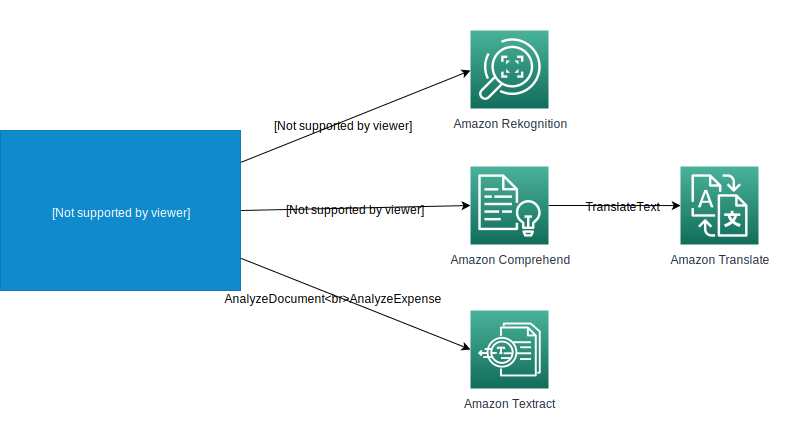

# AWS AI Services 

With AWS AI services, you can add capabilities like image and video analysis, natural language processing, personalized recommendations and translation, virtual assistants, and speech recognition. You can use each service standalone, or you can use them together to build a sophisticated AI-capable application.
This sample application is designed to demo the usage of some of the AWS AI Services to enrich your existing .NET applications with AI capabilities using AWS SDK for .NET.

The following services are used in the demos:
- [Amazon Comprehend](https://aws.amazon.com/comprehend/)
- [Amazon Translate](https://aws.amazon.com/translate/)
- [Amazon Textract](https://aws.amazon.com/textract/) and Textract Query
- [Amazon Rekognition](https://aws.amazon.com/rekognition/)

<figure>
  
  <figcaption></figcaption>
</figure>

## Prerequisites

To run this solution, you will need the following:
1. An AWS Account.
1. Install and configure [AWS Command Line Interface (AWS CLI)](https://docs.aws.amazon.com/cli/latest/userguide/cli-chap-configure.html) to interact with AWS.
1. Sample application is written in .NET 6, so you need to have .NET 6 SDK installed (this is part of Visual Studio 2022 if you use it as your IDE).
1. IDE of your choice to work with .NET 6 project (Visual Studio Code / Visual Studio 2022 / JetBrains Rider).

## Sample files

**Samples** folder contains images that can be used for the demos:

- **bbq_receipt.jpg** and **whole_foods_receipt.jpg** are sample receipts that can be used for Amazon Textract demo.
- **loan_application.png** and **paystub.jpg** can be used for Amazon Textract Query demo to show how it understands context from implied and nested fields. 
  - Following sample queries can be used with the **loan_application.png**:
    - What is the borrower SSN?
    - What is the co-borrower SSN?
    - What is the co-borrower name?
  - Following sample queries can be used with the **paystub.jpg**:
    - What is social security tax?
    - What is social security tax year to date?
- **beer_label.jpg** can be used to extract text from the photo using Amazon Rekognition.
- **family.jpg** can be used to demo how Amazon Rekognition can detect Personal Protective Equipment (PPE) worn by persons in an image.
- **grunt.jpg** can be used to demo how Amazon Rekognition can detect entities in an image.

## How to use

Open the solution or project file in your IDE, start the application. That's it! You don't need to configure the services, or deploy any infrastructure.

Or if you are like using the command line, open the `AIServicesDemo` directory in your terminal and run the following command:

```bash
dotnet run
```
