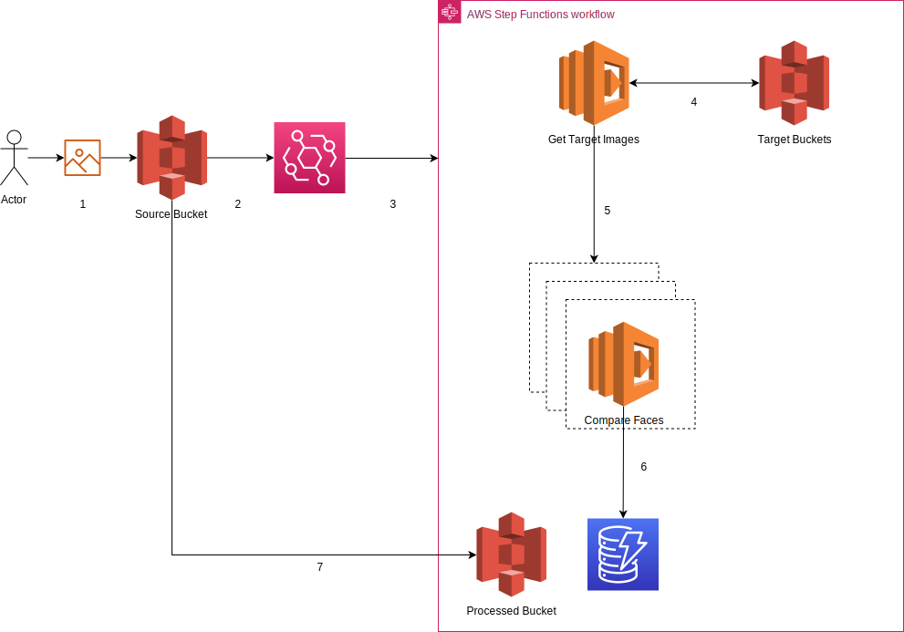

# comparefaces

The purpose and narrative of this .NET sample app on AWS, is to demonstrate how we can compare an photo image  against several other photos images.

My initial thoughts on this and how useful it would be able to use this was to identify 

1. Social Photos  - have you ever wanted to find a picture of yourself or someone you know in a bunch of photos and found it takes forever to search each and every photo one by one, you could then create albums for just specific individuals
2. Identity Parole - have you ever wanted to find a known criminal in photos taken from CCTV 

The code respository written in my favorite lanuage C# and targets .NET 6 provides this capability and utilizes the following AWS services

1. [Amazon EventBridge] (https://aws.amazon.com/eventbridge/) - using the AWS serverless event bus, we generate a rule that will react to the image being uploaded to the S3 bucket by the user to then be trigger the step function
2. [Amazon Rekognition] (https://aws.amazon.com/rekognition/) - using the AWS SDK for .NET we are able to use the Amazon Rekognition service to compare multiple images
3. [Amazon S3] (https://aws.amazon.com/s3/) - using S3 buckets as our storage of images,  for images uploaded and images that are being compared against. A S3 bucket is even utilised to copy images that have completed comparison
4. [AWS Step Functions] (https://aws.amazon.com/step-functions/) - the use of the AWS serverless workflow to orchestrate our processes and steps once the user has uploaded an image
5. [AWS Serverless Application Model] (https://docs.aws.amazon.com/serverless-application-model/latest/developerguide/what-is-sam.html) - A CLI tool to create and manage all our serverless applications. Using the AWS  CLI commands we are able to buld, test our application code, and provision our infrastructure. More information on how to do this is documented below.

The architecture setup is as follows



The following steps occur 

1. A user uploads an photo image into a S3 bucket
2. A notification from the S3 bucket is sent to EventBridge
3. EventBridge triggers our Step Function workflow
4. The Get Target Images lambda is triggered which retrieves a list of images in a Target Bucket and generates a list of comparison object
5. The comparison list is passed onto a dynamic iterator that splits the list into dynamic parallel executions to run on the compare face lambdas. The configuration is currently set to run maximum 5 parallel executions, but this can of course be modified. The comparison lambda usese Amazon Rekognition to perform the comparison, once matches are found a list of results is generated.
6. If matches exist in the list of results, the results are written to DynamoDB table
7. After completion the image in the Source Bucket is copied to a Processed Bucket and the image in the Source Bucket is deleted

The step function workflow is shown in the image below


This project contains source code and supporting files for a serverless application that you can deploy with the SAM CLI. It includes the following files and folders:

- functions - Code for the application's Lambda functions to gather the target images, that are being compared against
- statemachines - Definition for the state machine that orchestrates the Face Comparison workflow.
- tests - Unit tests for the Lambda functions' application code.
- template.yaml - A template that defines the application's AWS resources.


## Deploy the sample application

The Serverless Application Model Command Line Interface (SAM CLI) is an extension of the AWS CLI that adds functionality for building and testing Lambda applications. It uses Docker to run your functions in an Amazon Linux environment that matches Lambda.

To use the SAM CLI, you need the following tools:

* SAM CLI - [Install the SAM CLI](https://docs.aws.amazon.com/serverless-application-model/latest/developerguide/serverless-sam-cli-install.html)
* .NET Core - [Install .NET Core](https://www.microsoft.com/net/download)
* Docker - [Install Docker community edition](https://hub.docker.com/search/?type=edition&offering=community)

To build and deploy your application for the first time, run the following in your shell:

```bash
sam build
sam deploy --guided
```

The first command will build the source of your application. The second command will package and deploy your application to AWS, with a series of prompts:

* **Stack Name**: The name of the stack to deploy to CloudFormation. This should be unique to your account and region, and a good starting point would be something matching your project name.
* **AWS Region**: The AWS region you want to deploy your app to.
* **Confirm changes before deploy**: If set to yes, any change sets will be shown to you before execution for manual review. If set to no, the AWS SAM CLI will automatically deploy application changes.
* **Allow SAM CLI IAM role creation**: Many AWS SAM templates, including this example, create AWS IAM roles required for the AWS Lambda function(s) included to access AWS services. By default, these are scoped down to minimum required permissions. To deploy an AWS CloudFormation stack which creates or modifies IAM roles, the `CAPABILITY_IAM` value for `capabilities` must be provided. If permission isn't provided through this prompt, to deploy this example you must explicitly pass `--capabilities CAPABILITY_IAM` to the `sam deploy` command.
* **Save arguments to samconfig.toml**: If set to yes, your choices will be saved to a configuration file inside the project, so that in the future you can just re-run `sam deploy` without parameters to deploy changes to your application.

## Use the SAM CLI to build and test locally

Build the Lambda functions in your application with the `sam build` command.

```bash
comparefaces$ sam build
```

The SAM CLI installs dependencies defined in `functions/FunctionName.csproj`, creates a deployment package, and saves it in the `.aws-sam/build` folder.

## Add a resource to your application
The application template uses AWS Serverless Application Model (AWS SAM) to define application resources. AWS SAM is an extension of AWS CloudFormation with a simpler syntax for configuring common serverless application resources such as functions, triggers, and APIs. For resources not included in [the SAM specification](https://github.com/awslabs/serverless-application-model/blob/master/versions/2016-10-31.md), you can use standard [AWS CloudFormation](https://docs.aws.amazon.com/AWSCloudFormation/latest/UserGuide/aws-template-resource-type-ref.html) resource types.

## Fetch, tail, and filter Lambda function logs

To simplify troubleshooting, SAM CLI has a command called `sam logs`. `sam logs` lets you fetch logs generated by your deployed Lambda function from the command line. In addition to printing the logs on the terminal, this command has several nifty features to help you quickly find the bug.

`NOTE`: This command works for all AWS Lambda functions; not just the ones you deploy using SAM.

```bash
comparefaces$ sam logs -n GetTargetImagesFunction --stack-name comparefaces --tail
```

You can find more information and examples about filtering Lambda function logs in the [SAM CLI Documentation](https://docs.aws.amazon.com/serverless-application-model/latest/developerguide/serverless-sam-cli-logging.html).

## Unit tests

### dotnet tests
Tests for the Lambda functions are defined in the `tests` folder in this project.

```bash
comparefaces$ dotnet test tests/GetTargetImages.Test
comparefaces$ dotnet test tests/CompareImages.Test
```
### SAM CLI tests

You can invoke the lambdas locally using the SAM CLI

Note: Ensure you have Docker running 

```bash
comparefaces$ sam local invoke "GetTargetImagesFunction" -e ./functions/GetTargetImages/events/event.json
```

Note: Ensure you have the image in the source bucket (Without trigger the Step Function) 

```bash
comparefaces$ sam local invoke "CompareImagesFunction" -e ./functions/CompareImages/events/event.json
```


## Running your app and viewing the output

Note: Ensure you have some images in the target bucket

The following command will copy "your-source-image" to "your-source-bucket" and trigger the step functions worlk flow

```bash
comparefaces$ aws s3 cp "your-souce-image" s3://your-source-bucket/ --region "your-region"
```
After the step function has run you can run the following command to get a list of the images in the target bucket that matched your source image

```bash
aws dynamodb query --table-name your-dynamodb-name --key-condition-expression "SourceImage=:name" --expression-attribute-values '{":name": {"S": "your-source-image"}}' --output text --query 'Items[*].TargetImage' 
```

## Cleanup

To delete the sample application that you created, use the AWS CLI. Assuming you used your project name for the stack name, you can run the following query against your dynamo db table to view what images in your target bucket are a match to your source image


```bash
comparefaces$ aws s3 cp "your-souce-image" s3://your-source-bucket/ --region "your-region"
```


```bash
comparefaces$ sam delete --stack-name comparefaces
```

## Resources

See the [AWS SAM developer guide](https://docs.aws.amazon.com/serverless-application-model/latest/developerguide/what-is-sam.html) for an introduction to SAM specification, the SAM CLI, and serverless application concepts.

Next, you can use AWS Serverless Application Repository to deploy ready to use Apps that go beyond hello world samples and learn how authors developed their applications: [AWS Serverless Application Repository main page](https://aws.amazon.com/serverless/serverlessrepo/)
