# **Build a Serverless app using API Gateway, Lambda and DynamoDB**

## Overview

The .NET serverless application provides a basic web service using [Amazon API Gateway](https://aws.amazon.com/api-gateway/) and [AWS Lambda](https://aws.amazon.com/lambda/) to retrieve reading list details stored in [Amazon DynamoDB](https://aws.amazon.com/dynamodb/).

The application uses Amazon API Gateway to provide a simple RESTful API that can be called from client applications to display or act on the data. The API Gateway passes requests on to an AWS Lambda function which queries  an Amazon DynamoDB table for the reading list data. The AWS Lambda function converts data returned from DynamoDB into JSON, and then returns the converted data back to the API Gateway for initial request. To use .NET 5, the application leverages Lambda's support for container images. For more details see the [.NET 5 AWS Lambda Support with Container](https://aws.amazon.com/blogs/developer/net-5-aws-lambda-support-with-container-images/) Images blog post.

The application demonstrates how .NET can be used to quickly create serverless applications, allowing teams to develop, deploy and run code without provisioning or managing servers, and only paying for the compute time and storage consumed by the application.
The code for this tutorial is available to download from a git repository, although downloading it is optional since all the steps are listed to create the code from scratch. 

### Architecture

The application architecture uses Amazon API Gateway to communicate with an AWS Lambda function written in .NET, which calls Amazon DynamoDB, with AWS Identity and Access Management (IAM) providing access control between the components, as shown below:

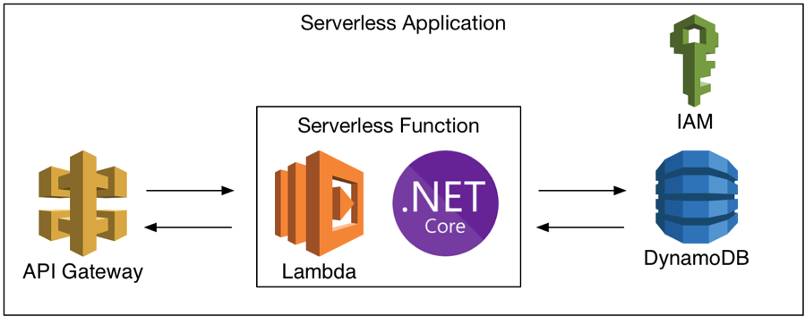

### Deployment

Deployment of the application components is handled by AWS CloudFormation which uses the AWS Serverless Application Model (AWS SAM) to simplify the template. 

The CloudFormation template contains configuration details for each component, and also references an S3 bucket used to stage deployment artifacts, such as the .NET assembly. On execution, CloudFormation uses the template and the S3 bucket to create a CloudFormation stack which then deploys the application components.

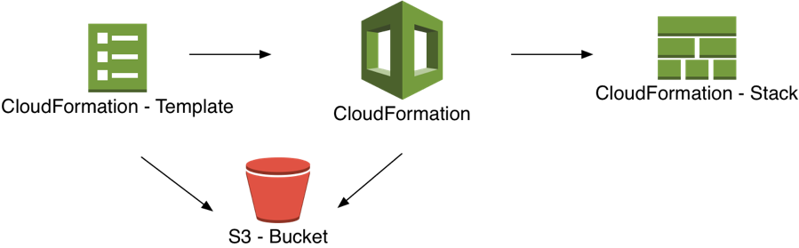

### Modules
This workshop is broken up into four modules. You must complete each module before proceeding to the next.

1. Setup Environment
1. Create a Basic Lambda Function
1. Integrate Lambda with DynamoDB
1. Delete Serverless Resources

### Prerequisites

*    AWS Experience—Beginner
*    Time to Complete—60 mins
*    Cost to Complete—Each service used in this architecture is eligible for the AWS Free Tier. If you are outside the usage limits of the Free Tier, completing this learning path will cost you less than $0.25\*.
*    Tutorial Prereqs—To complete this learning path, you will need:
    * An AWS Account\*\*
    * An IAM user with access key credentials\*\*\*
    * (Optionally) Visual Studio 2019 for Windows

\* This estimate assumes you follow the recommended configurations throughout the tutorial and terminate all resources within 24 hours.

\*\* Accounts that have been created within the last 24 hours might not yet have access to the resources required for this learning. If you don’t have an account visit https://aws.amazon.com and click Sign Up.

\*\*\* You must have a set of valid AWS credentials, consisting of an access key and a secret key, which are used to sign programmatic requests to AWS. You can obtain a set of account credentials when you create your account, although we recommend you do not use these credentials and instead create an IAM user and use those credentials.

## Module 1: Setup Environment

In this module, you'll configure your development environment for working with AWS Lambda functions. These instructions provide 2 different options to choose from for your development environment, Visual Studio 2019 for Windows, or the .NET CLI on Windows, Mac, or Linux, using an editor of your choice.

### Things to Note
* Time to Complete - 10 mins

### Implementation Instructions

#### Step 1: Setup Visual Studio 2019 for Windows
If your development environment is Visual Studio 2019 on Windows, you will need to ensure the following components are installed:

1. The .NET 5 for Windows: https://dotnet.microsoft.com/download/dotnet
1. Visual Studio 2019
1. The AWS Toolkit for Visual Studio: https://aws.amazon.com/visualstudio/ 
1. The AWS CLI https://docs.aws.amazon.com/cli/latest/userguide/cli-chap-install.html

#### Step 2: Setup .NET CLI on Windows, Mac, or Linux

If you are using .NET CLI on Windows, Mac, or Linux, you will need to install a few components, as follows:

1. The .NET for Windows, Mac, or Linux: https://dotnet.microsoft.com/download/dotnet
1. Install the AWS Lambda templates with the AWS Lambda NuGet package by running the following in a terminal window.
    ```shell
    dotnet new -i Amazon.Lambda.Templates::*
    ``` 
1. Verify the new AWS Lambda templates have been installed by running the following in a terminal window.
    ```shell
    dotnet new lambda.EmptyFunction -l
    ```
    If the command returns details of a single Lambda Empty Function template then the templates have been installed correctly.
1. Install the [.NET Global Tools for AWS](https://aws.amazon.com/blogs/developer/net-core-global-tools-for-aws/). To install Amazon.Lambda.Tools use the dotnet tool install command.
   ```shell
   dotnet tool install -g Amazon.Lambda.Tools
   ```

You will also need a text editor or an IDE for modifying, such as vi, emacs, nano, [Visual Studio for Mac](https://www.microsoft.com/net/download/), or [Visual Studio Code](https://code.visualstudio.com/) for Windows, Mac, or Linux.

## Module 2: Create a Basic Lambda Function

In this module you'll create a project for your Lambda function, write the code for a basic Lambda function, and finally deploy and test the Lambda function. 
These instructions provide options for 2 different development environments: Visual Studio 2019 for Windows, or .NET CLI on Windows, Mac, or Linux.

### Things to Note
* Time to Complete - 20 mins

### Implementation Instructions

#### Step 1: Create Project using Visual Studio 2019 for Windows
If you are using Visual Studio 2019 on Windows as your development environment, you can create a solution as follows:

1. In Visual Studio, from the menu, select *File > New > Project* to launch the New Project dialog.
1. In the New Project dialog, click on *AWS* in the Platform dropdown

    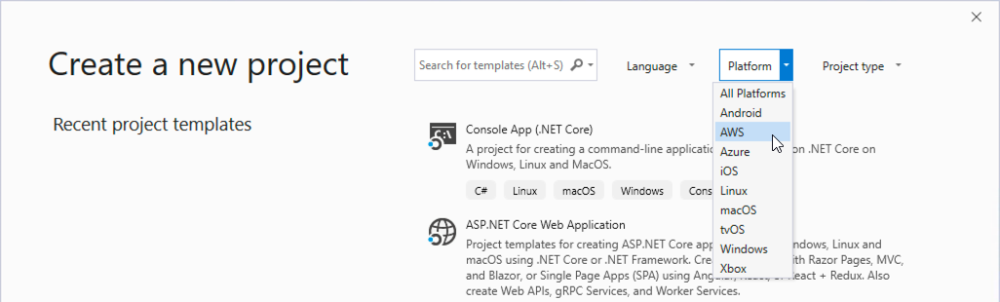

2. Select the *AWS Serverless Application (.NET Core - C#)* project type.

    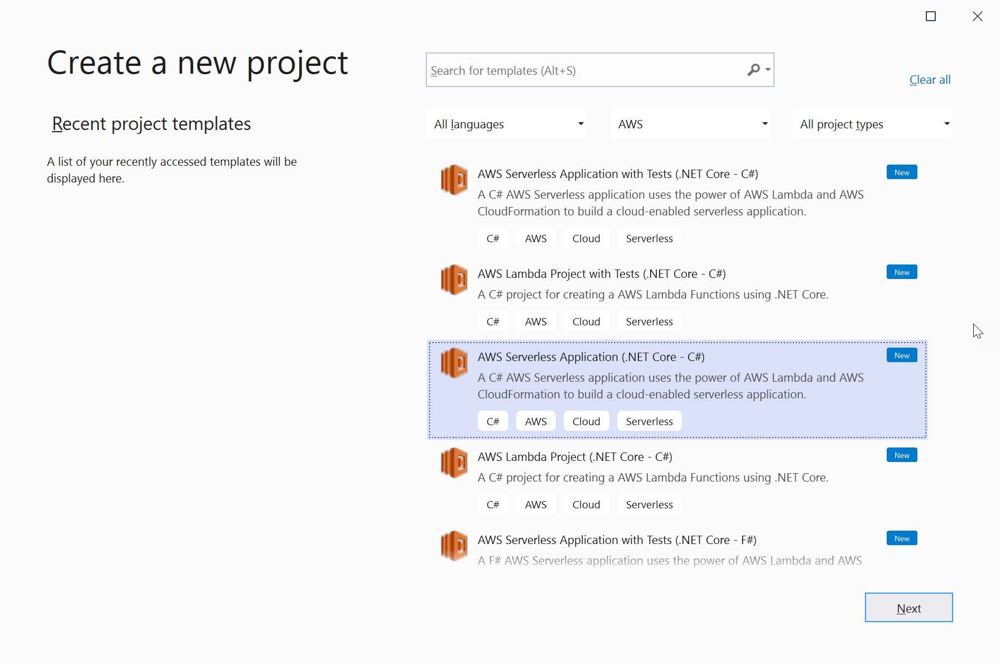

3. Select a name for your project, and then click the **Create** button.

    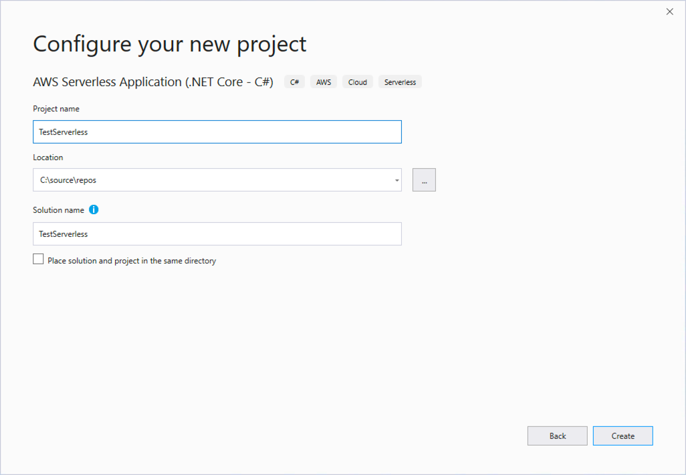

4. On the Select Blueprint dialog, select the *.NET 5 (Container Image) Serverless* blueprint then click the **Finish** button. Visual Studio will take a few moments to create the solution and will then open the **Solution Explorer** window containing a variety of files.

    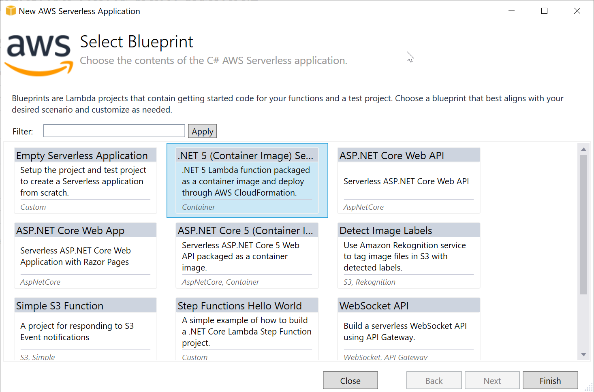

#### Step 1: Create Project using .NET CLI

You can also build and deploy .NET Lambda functions to AWS from the command line, which works equally well on Windows, Mac OS X and Linux.

For this walk-through, we’ll make use of the same blueprint (template) that we used in the previous section in Visual Studio. 

Follow the steps below to create your Lambda function.
1. Open a command line or terminal window.
2. Create a folder to contain your new project. The folder name becomes the name of your .NET project, so choose something meaningful. For this walk-through, we are using *TestServerless* as the folder name.
3. Navigate to the folder created above and to create the new Lambda project enter the command 
    ```shell
    dotnet new serverless.image.EmptyServerless
    ```
    This creates two subfolders-*src* and *test*-each of which has a .NET project folder inside. We won’t use the *test* project in this walk-through.

#### Step 2: Open Solution Files in Visual Studio 2019 for Windows
The solution will already contain the skeleton code required to build and deploy a basic Lambda function and an API Gateway.

1. In the *Solution Explorer* pane, expand the **TestServerless** project node for the app and double-click **Function.cs**, which contains the code for our basic Lambda function, to open it in an editing pane.
1. In the *Solution Explorer* pane, double-click **serverless.template**, which contains the CloudFormation template for deployment, to open it in an editing pane.

#### Step 2: Open Solution Files using .NET CLI
The solution will already contain the skeleton code required to build and deploy a basic Lambda function and an API Gateway.

1. Change directory into the *src* folder, and then into the project folder. For example:
    ```shell
    cd src/TestServerless
    ```
1. Use the editor of your choice to review the code in the file **Function.cs**, which contains the code for our basic Lambda function, and **serverless.template**, which contains the CloudFormation template for deployment.

#### Step 3: Review Lambda Function Code
The **Function.cs** file contains the C# code for the auto-generated Lambda function.

1. Look through the *Functions* class and locate the *Get* method. This is the method that will be called when your Lambda function is invoked and contains the logic you want to execute.

    > Note: You can create other methods and classes to hold your logic and call them from Get, as well as referencing other .NET Standard libraries. You can also change the name of the Get method, as the name of the method is part of the Lambda configuration. For this walk-through, we’ll keep the default name.

The top of the file contains a number of using statements, after which is an assembly attribute that enables automatic deserialization of requests from the API Gateway into `APIGatewayProxyRequest` objects and also automatically serializes responses from `APIGatewayProxyResponse` objects.

```csharp
[assembly: LambdaSerializer(typeof(Amazon.Lambda.Serialization.SystemTextJson.DefaultLambdaJsonSerializer)]
```

The rest of the file contains the Function class, which contains a single `Get` method to handle requests from the API Gateway and return a static response, `"Hello AWS Serverless"`.

```csharp
public APIGatewayProxyResponse Get(APIGatewayProxyRequest request, ILambdaContext context)
{
    context.Logger.LogLine("Get Request\n");

    var response = new APIGatewayProxyResponse
    {
        StatusCode = (int)HttpStatusCode.OK,
        Body = "Hello AWS Serverless",
        Headers = new Dictionary<string, string> { { "Content-Type", "text/plain" } }
    };

    return response;        
} 
```

This is all the barebones code we need to create a basic Lambda function.

#### Step 4: Edit serverless.template

Use the editor of your choice to review the code in the file *serverless.template* file. This file contains the CloudFormation template that can be used for deploying the solution’s components.

While by default the template contains all the details for creating the API Gateway and Lambda components, there are a couple of changes you’ll need to make to make customize the Lambda function’s settings.

First of all, you’ll add a `FunctionName` parameter with a value of **TestServerless**, 

Secondly, since our Lambda function is very simple it won’t need much memory to run so we can reduce the requested memory down from 256MB to **128MB** by editing the `MemorySize` parameter. 
Both these changes are shown below:

```json
{
  "AWSTemplateFormatVersion" : "2010-09-09",
  "Transform" : "AWS::Serverless-2016-10-31",
  "Description" : "An AWS Serverless Application.",
  "Resources" : {
    "Get" : {
      "Type" : "AWS::Serverless::Function",
      "Properties": {
        "FunctionName": "TestServerless",
        "PackageType": "Image",
        "ImageConfig": {
          "EntryPoint": [
            "/lambda-entrypoint.sh"
          ],
          "Command": [
            "TestServerless::TestServerless.Functions::Get"
          ]
        },
        "ImageUri": "",
        "MemorySize": 128,
        "Timeout": 30,
        "Role": null,
        "Policies": [ "AWSLambdaBasicExecutionRole" ],
        "Events": {
          "RootGet": {
            "Type": "Api",
            "Properties": {
              "Path": "/",
              "Method": "GET"
            }
          }
        }
      },
      "Metadata": {
        "Dockerfile": "Dockerfile",
        "DockerContext": ".",
        "DockerTag": ""
      }
    }
  },
  "Outputs" : {
    "ApiURL" : {
      "Description" : "API endpoint URL for Prod environment",
      "Value" : { "Fn::Sub" : "https://${ServerlessRestApi}.execute-api.${AWS::Region}.amazonaws.com/Prod/" }
    }
  }
}
```
Save your changes to the file and you are now ready to build the solution and deploy to AWS.

#### Step 5: Build and Deploy using Visual Studio 2019 for Windows

Now, we’ll use the Lambda publishing wizard in the AWS Toolkit for Visual Studio to publish the function to AWS Lambda, and then test it using the toolkit’s built-in testing functionality.

> Before starting the Lambda publishing wizard, make sure that Docker has been configured to use Linux containers.

1. Right-click the project node in the Visual Studio Solution Explorer pane, and select, **Publish to AWS Lambda**. This launches the publishing wizard.

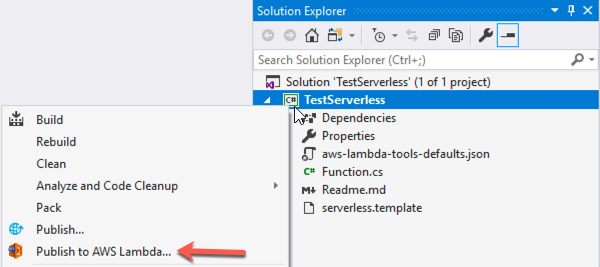

2. In the first step of the wizard, ensure the Region drop-down shows the region to which you want to publish and run the Lambda function. Type in the stack name and S3 bucket. 

> If you already have a suitable S3 bucket for storing deployment files you can select it in the drop-down, otherwise create a new S3 bucket by clicking New next the S3 Bucket drop-down, entering a suitable name, and then clicking Ok.

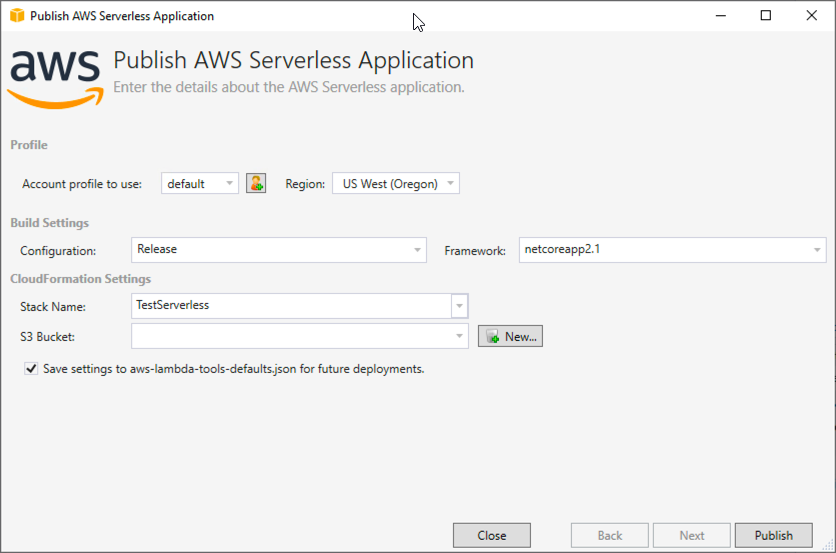

3. Click the **Publish** button to finish the deployment. The dialog will display a Publishing progress bar and will show all the deployment actions as it carries them out.

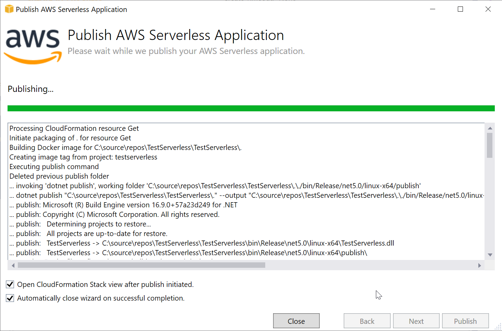

4. Visual Studio will now display details of the CloudFormation stack in a Stack window, and you can use the window to review including the CloudFormation actions that were executed, and the resources created during deployment.

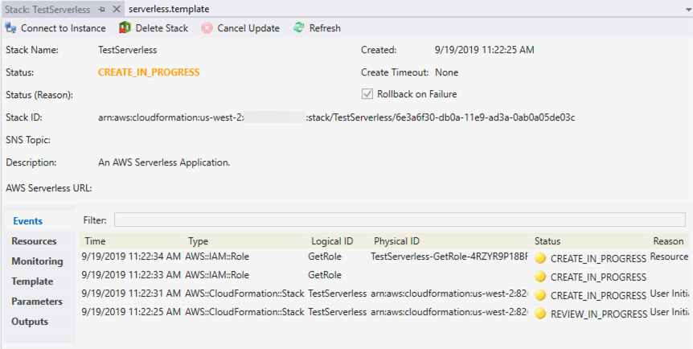

You are now ready to test the deployed solution.

### Step 5: Deploy to AWS using .NET CLI

Now we will use the [.NET Global Tools for AWS](https://aws.amazon.com/blogs/developer/net-core-global-tools-for-aws/) to deploy the Lambda function to AWS. The tools were installed in Module 1. Before deploying the solution you will need to choose a region to deploy the resources to, and you will also need an S3 bucket in that region for storing the deployment assets. When you’ve chosen a region and an S3 bucket, you can deploy your serverless application as follows:

1. Replace `<BUCKET NAME>` in the commands below with the s3 bucket you will be using.
    ```shell
    aws s3 mb s3://<BUCKET NAME> --region us-west-2
    ```

2. Use the dotnet lambda deploy-serverless function command to deploy your function. You can either enter it without any arguments, in which case you will be prompted for the name of the stack, the region, and S3 bucket, or you can supply them as arguments like this:
    ```shell
    dotnet lambda deploy-serverless --region us-west-2 --stack-name TestServerless --s3-bucket <BUCKET NAME>
    ```

    The command will then display progress as it deploys the components to AWS, and on successful completion will print the message shown below.

    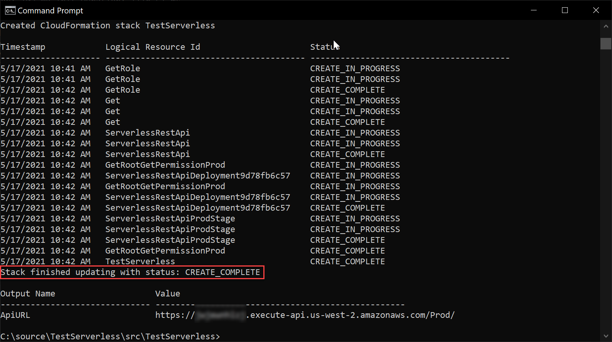

You are now ready to test the deployed solution.

#### Step 6: Test API Gateway and Lambda using Visual Studio 2019 for Windows

To test the deployed solution, expand the **AWS Explorer** window in Visual Studio, and then under **AWS Lambda** double-click on the **TestServerless** Lambda function to open its *Function* window. Refresh the pane if it isn’t showing in the list.

The window contains a number of tabs, and you can use the Test Function tab to test the function by clicking the Invoke button.

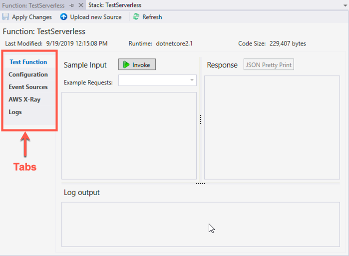

Now, we’ll test our function with sample input from the View Function pane and view the result.
The window contains a number of tabs such as "Test Function" and Configuration on the left side of the pane.,You can use the **Test Function** tab to test the function by clicking the **Invoke** button.

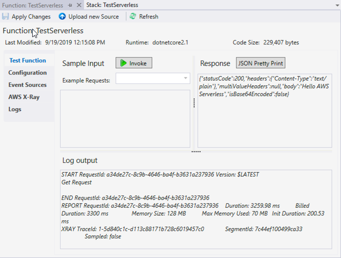

After the call to the API Gateway and the Lambda function completes, you will see the full JSON response in the Response area of the screen, and the Log output area shows details of the request, including its execution time.

Congratulations! You’ve now created a working Lambda function and deployed it along with an API Gateway endpoint to AWS. 

If you want to play with the function you can easily change the message returned in the Function.cs file, re-deploy the solution, and then test it again.

### Step 6: Test API Gateway and Lambda using .NET CLI

Now we will use the AWS Lambda tools for .NET to test the Lambda function. 

1. Use the lambda invoke-function command to execute the test. You can either enter the command without any arguments, in which case you will be prompted for the name of the function and the region, or you can supply them as arguments like this, replacing the region with the region code you selected previously:

    ```shell
    dotnet lambda invoke-function TestServerless -–region us-west-2
    ```

1. When the command completes successfully you should see a Payload message displayed in the terminal or command-line window that contains the body provided by your Lambda function, `"Hello AWS Serverless"`.

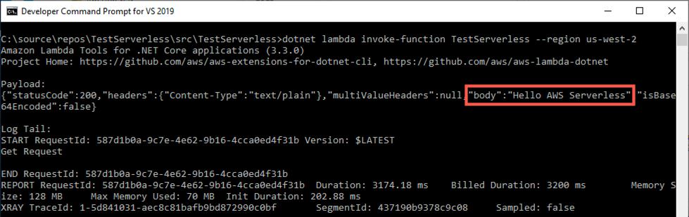

Congratulations! You’ve now created a working Lambda function and deployed it along with an API Gateway endpoint to AWS. 

If you want to play with the function you can easily change the message returned in the Function.cs file, re-deploy the solution again, and then test it as above.

## Module 3: Integrate Lambda with DynamoDB

In this module you'll extend the solution from Module 2 by creating a DynamoDB table to store reading list details, and then updating the Lambda function to retrieve the reading list data from DynamoDB.

These instructions provide options for 2 different development environments: Visual Studio 2019 for Windows, or .NET CLI on Windows, Mac, or Linux.

### Things to Note
* Time to Complete - 25 mins

### Implementation Instructions

#### Step 1: Add NuGet Packages using Visual Studio 2019 for Windows

First of all, you need to add some additional NuGet packages to the Visual Studio solution, one to provide access to DynamoDB, and the other to carry out some rudimentary JSON formatting.
To add the required NuGet packages:

1. Open the solution from Module 2 in Visual Studio.
1. Open the Package Manager Console by going to **Tools > NuGet Package Manager > Package Manager Console**
1. In the Package Manager Console window, enter the following command to install the Newtonsoft JSON package:
    ```shell
    Install-Package Newtonsoft.Json
    ```
1. Once it has successfully installed, add the AWS SDK's DynamoDBv2 package by running the following command in the Package Manager Console window 
    ```shell
    Install-Package AWSSDK.DynamoDBv2
    ```

#### Step 1: Add NuGet Packages using .NET CLI

Before updating the solution code, you first of all need to add some additional NuGet packages to the solution, one providing access to DynamoDB, and the other to help format the reading list results as JSON.

To add the required NuGet packages:

1. Open a command-line or terminal window.
1. Navigate to the **/TestServerless/src/TestServerles**s directory
1. Run the following command 
    ```shell
    dotnet add package Newtonsoft.Json
    ```
1. Once it has successfully completed, run the command 
    ```shell
    dotnet add package AWSSDK.DynamoDBv2
    ```
#### Step 2: Integrate code with DynamoDB

Use the editor of your choice to edit the code in the file **Function.cs**, which contains the code for our basic Lambda function

1. Once the NuGet packages have been added to the solution, you’ll need to update the **Function.cs** file. Start by adding the following using statements at the top of the file:

    ```csharp
    using Amazon.DynamoDBv2;
    using Amazon.DynamoDBv2.Model;
    using Newtonsoft.Json;
    ```

1. You’ll then need to create a new asynchronous function, `ScanReadingListAsync`, to call DynamoDB, to scan the table for data, and convert the results into JSON:

    ```csharp
    private async Task<string> ScanReadingListAsync()
    {
        using var client = new AmazonDynamoDBClient(Amazon.RegionEndpoint.USWest2);

        var response = await client.ScanAsync(new ScanRequest("readingList"));
        
        return JsonConvert.SerializeObject(response.Items);
    } 
    ```

    > Since the code scans the DynamoDB table without setting a filter, it will return all the data contained in the table, which is fine for this example, but would *need proper consideration for a production system to reduce the data retrieved by the Lambda function*.

1. Next, you need to change the Get method by making it asynchronous so it can call the `ScanReadingListAsync` method. You do this by first of all adding an `async` modifier to the method declaration, then changing its return type to `Task< APIGatewayProxyResponse>`, and finally changing its name to `GetAsync` to fit with .NET naming conventions. The method signature should look like the following:

    ```csharp
    public async Task<APIGatewayProxyResponse> GetAsync(APIGatewayProxyRequest request, ILambdaContext context)
    ```

2. You then need to change the line that sets the Body of the response to call the new method, ScanReadingListAsync, remembering to add an await to its call, since it’s an asynchronous method. The method should now be:

    ```csharp
    public async Task<APIGatewayProxyResponse> GetAsync(APIGatewayProxyRequest request, ILambdaContext context)
    {
        context.Logger.LogLine("Get Request\n");

        var response = new APIGatewayProxyResponse
        {
            StatusCode = (int)HttpStatusCode.OK,
            Body = await ScanReadingListAsync(),
            Headers = new Dictionary<string, string> { { "Content-Type", "text/plain" } }
        };

        return response;
    }
    ```

    Those are the only code changes needed in the Lambda function.

2. You also need to ensure the DynamoDB table is created when the solution is deployed, which can be done by making the following changes to the **serverless.template** file:
   
    * Change the **Command** in the **AWS::Serverless::Function** section to **GetAsync**, since we updated the name of the method in the Function.cs file. 
    * Change the permissions granted to the Lambda function by updating the Policies parameter to include **dynamodb:Scan**, since it’ll now need permission to call the DynamoDB table. The sample below shows a policy providing just that permission for the readingList DynamoDB table created.
    * Finally, you need to add a new resource section containing settings for the DynamoDB table.

    The **serverless.template** file should now look like the following:

```json
{
  "AWSTemplateFormatVersion" : "2010-09-09",
  "Transform" : "AWS::Serverless-2016-10-31",
  "Description" : "An AWS Serverless Application.",
  "Resources" : {
    "Get" : {
      "Type" : "AWS::Serverless::Function",
      "Properties": {
        "FunctionName": "TestServerless",
        "PackageType": "Image",
        "ImageConfig": {
          "EntryPoint": [
            "/lambda-entrypoint.sh"
          ],
          "Command": [
            "TestServerless::TestServerless.Functions::GetAsync"
          ]
        },
        "ImageUri": "",
        "MemorySize": 128,
        "Timeout": 30,
        "Role": null,
        "Policies": [ 
          "AWSLambdaBasicExecutionRole",
          {
            "Version": "2012-10-17",
            "Statement": [
              {
                "Effect": "Allow",
                "Action": [ "dynamodb:Scan" ],
                "Resource": { "Fn::GetAtt": [ "readingListDynamoDBTable", "Arn" ] }
              }
            ]
          }
        ],
        "Events": {
          "RootGet": {
            "Type": "Api",
            "Properties": {
              "Path": "/",
              "Method": "GET"
            }
          }
        }
      },
      "Metadata": {
        "Dockerfile": "Dockerfile",
        "DockerContext": ".",
        "DockerTag": ""
      }
    },
    "readingListDynamoDBTable" : {
      "Type" : "AWS::DynamoDB::Table",
      "Properties" : {
        "TableName" : "readingList",
        "AttributeDefinitions" : [
          {
            "AttributeName" : "ItemId",
            "AttributeType" : "S"   
          },
          {
            "AttributeName" : "Title",
            "AttributeType" : "S"
          }
        ],
        "KeySchema" : [
          {
            "AttributeName" : "ItemId",
            "KeyType" : "HASH"
          },
          {
            "AttributeName" : "Title",
            "KeyType" : "RANGE"
          }
        ],
        "ProvisionedThroughput" : {
          "ReadCapacityUnits" : "1",
          "WriteCapacityUnits" : "1"
        }
      }
    },
  },
  "Outputs" : {
    "ApiURL" : {
      "Description" : "API endpoint URL for Prod environment",
      "Value" : { "Fn::Sub" : "https://${ServerlessRestApi}.execute-api.${AWS::Region}.amazonaws.com/Prod/" }
    }
  }
}
```
#### Step 3: Build and Deploy to AWS using Visual Studio 2019 for Windows

Now, we’ll use the Lambda publishing wizard in the AWS Toolkit for Visual Studio to publish the function to AWS Lambda, and then test it using the toolkit’s built-in testing functionality. Deploying the solution is almost exactly the same as before

1. Before deploying the solution you will need to build the application. You can do this by right-clicking the project node in the Visual Studio Solution Explorer pane, and select, **Build**.

    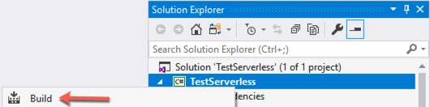

    Once the build has completed successfully you are ready to deploy the solution.

1. Right-click the project node in the Visual Studio Solution Explorer pane, and select, **Publish to AWS Lambda**. This launches the publishing wizard.

    

1. In the first step of the wizard, the dialog should now be pre-populated with the answers you entered last time.

    

2. Click the **Publish** button to finish the deployment. The dialog will display a Publishing progress bar and will show all the deployment actions as it carries them out.

    

3. Visual Studio will now display details of the CloudFormation stack in a Stack window, and you can use the window to review including the CloudFormation actions that were executed, and the resources created during deployment.

    

You are now ready to test the deployed solution.

### Step 3: Build and Deploy to AWS using .NET CLI

Now we will use the [.NET Global Tools for AWS](https://aws.amazon.com/blogs/developer/net-core-global-tools-for-aws/) to deploy the Lambda function to AWS. The tools were installed in Module 1. 

1. Before deploying the solution you will need to build the application. You can do this by executing the following command in the terminal or command-line window:

    ```shell
    dotnet build
    ```

    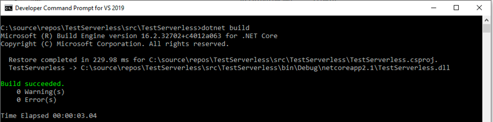

2. Use the dotnet lambda deploy-serverless function command to deploy your function. You can either enter it without any arguments, in which case you will be prompted for the name of the stack, the region, and S3 bucket, or you can supply them as arguments when executing the command. Replace `<BUCKET NAME>` in the commands below with the s3 bucket you created in the previous module.

    ```shell
    dotnet lambda deploy-serverless --region us-west-2 --stack-name TestServerless --s3-bucket <BUCKET NAME>
    ```

    The command will then display progress as it deploys the components to AWS, and on successful completion will print the message shown below.

    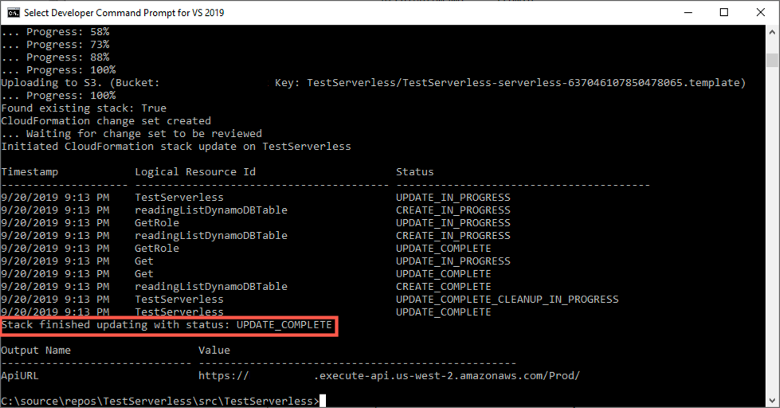

You are now ready to test the deployed solution.

#### Step 4: Test API Gateway and Lambda using Visual Studio 2019 for Windows

To test the deployed solution, expand the **AWS Explorer** window in Visual Studio, and then under **AWS Lambda** double-click on the **TestServerless** Lambda function to open its *Function* window. Refresh the pane if it isn’t showing in the list.

The window contains a number of tabs, and you can use the Test Function tab to test the function by clicking the Invoke button.


Now, we’ll test our function with sample input from the View Function pane and view the result.
The window contains a number of tabs such as "Test Function" and Configuration on the left side of the pane.,You can use the **Test Function** tab to test the function by clicking the **Invoke** button.

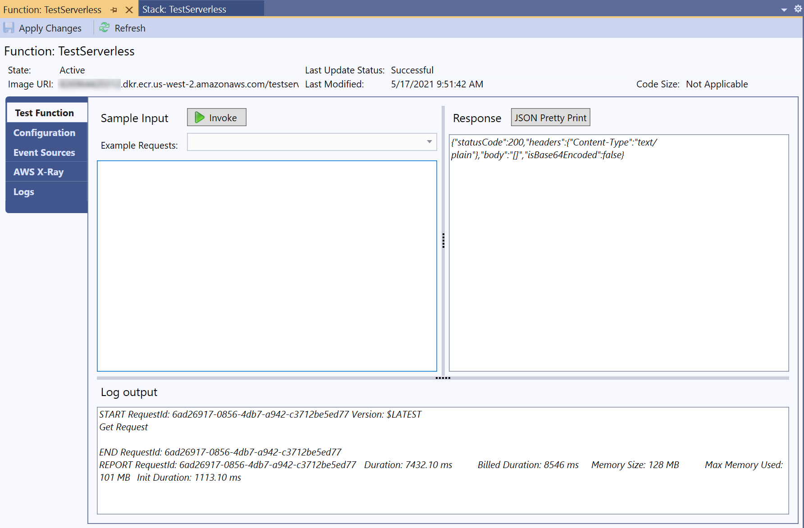

After the call to the API Gateway and the Lambda function completes, you will see the full JSON response in the Response area of the screen, although since there’s no data in the DynamoDB table the response will be minimal. To make it a bit more interesting you can add some data as follows:

1. In the AWS Explorer expand the Amazon DynamoDB section and then double-click on the **readingList** table to open a Table window. Refresh the pane if it isn’t showing in the list.

    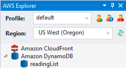

1. The Table window is split into two parts, the top past allowing you to set Scan settings, and the bottom part showing you items in the table. Since the table is empty we’re going to add an item. Click on the row under ItemId and enter a value **A1** for ItemId, and **Cross-platform .NET** for the title. To save the item to DynamoDB click Commit Changes at the top of the window. Once the item has been added it will change colour, and you can add some other rows. 

    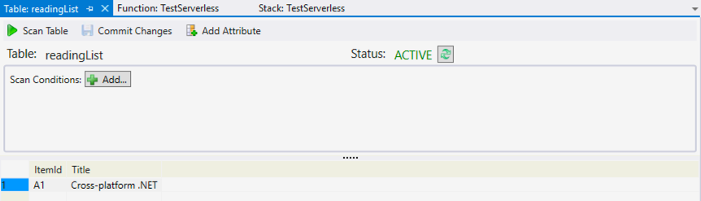

1. If you now go back to the Function window and invoke the Test Function again, your response will be full on JSON containing details of the items you just added to DynamoDB. 

    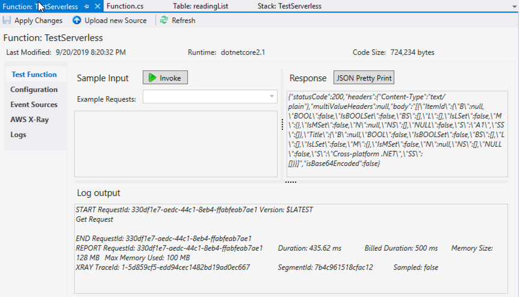

Congratulations! You’ve now extended your Lambda function to call Dynamo DB, deployed the updated Lambda function and DynamoDB table to AWS, and demonstrated that they’re working seamlessly together.


### Step 4: Test API Gateway and Lambda using .NET CLI

Now we will use the AWS Lambda tools for .NET to test the Lambda function. 

1. Use the lambda invoke-function command to execute the test. You can either enter the command without any arguments, in which case you will be prompted for the name of the function and the region, or you can supply them as arguments like this, replacing the region with the region code you selected previously:

    ```shell
    dotnet lambda invoke-function TestServerless -–region us-west-2
    ```

1. When the command completes successfully you should see a Payload message displayed in the terminal or command-line window that contains the body provided by your Lambda function, `although since there’s no data in the DynamoDB table the response will be minimal.

    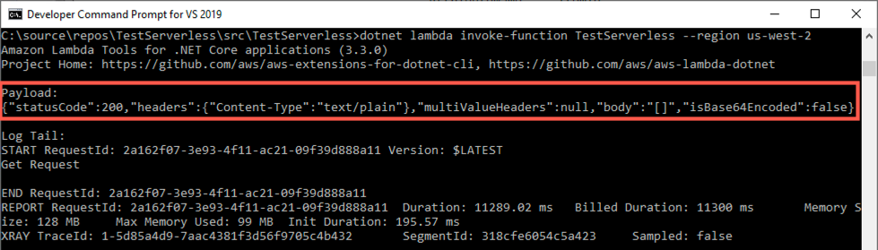

1. To make the test a bit more interesting you can add an item to the DynamoDB table by running the following command in a terminal or command-line window, remembering to change the region for your chosen region:

    On a Mac, or Linux shell use the following command

    ```shell
    aws dynamodb put-item --region us-west-2 --table-name readingList --item '{ "ItemId": {"S": "A1"}, "Title": {"S": "Cross-platform.NET"} }'
    ```

    On a Windows Command prompt the syntax for the --item parameter is slightly different

    ```shell
    aws dynamodb put-item --region us-west-2 --table-name readingList --item {\"ItemId\":{\"S\":\"A1\"},\"Title\":{\"S\":\"Cross-platform.NET\"}}
    ```

1. If you now go re-run the test command in the terminal or command-line window, the payload displayed will now be full of JSON containing details of the items you added to DynamoDB.

    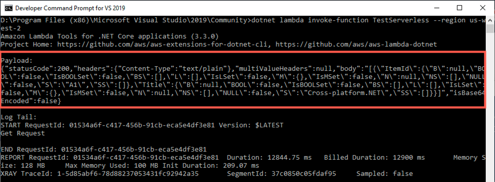

Congratulations! You’ve now extended your Lambda function to call Dynamo DB, deployed the updated Lambda function and DynamoDB table to AWS, and demonstrated that they’re working seamlessly together.

## Module 4: Delete Serverless Resources

Once you’ve had enough playing with the solution you created in Modules 1–3, deleting the AWS resources is simply a matter of deleting the CloudFormation stack, which automatically deletes the associated resources.

These instructions provide options for 2 different development environments: Visual Studio 2017 for Windows, or .NET CLI on Windows, Mac, or Linux.

### Things to Note
* Time to Complete - 5 mins

### Implementation Instructions

#### Step 1: Deleting the CloudFormation Stack using Visual Studio 2019 for Windows

Once you’ve had enough playing with the solution, deleting the AWS resources is simply a matter of deleting the CloudFormation stack, which automatically deletes the associated resources.

To delete a CloudFormation stack from Visual Studio:

1. In **AWS Explorer**, expand the **AWS Cloud Formation** entry. Right-click on the **TestServerless** stack and then select Delete. 

    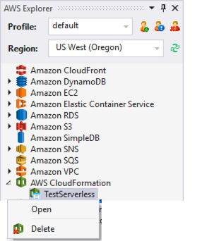

1. A dialog will pop-up asking you if you’re sure you want to delete the stack. Click **Yes** to confirm deletion of the stack.

    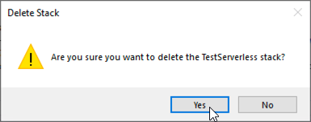

While it might seem a shame to delete a working solution, one of the great advantages of Cloud Formation is that recreating the resources is simply a matter of executing the publish command from Visual Studio and waiting briefly as the resources are automatically created by Cloud Formation.

#### Step 1: Deleting the CloudFormation Stack using .NET CLI

Once you’ve had enough playing with the solution, deleting the AWS resources is simply a matter of deleting the CloudFormation stack, which automatically deletes the associated resources.

1. In the terminal or command-line window, execute the following command: 
    ```shell
    dotnet lambda delete-serverless --stack-name TestServerless --region us-west-2
    ```

1. On successful deletion the command will print the message `CloudFormation stack TestServerless deleted`
    
    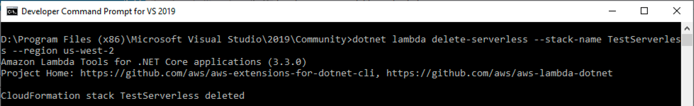

One of the great advantages of CloudFormation is creating and deleting resources can be execute through commands, so if you want to re-create the serverless application, you just need to re-run the dotnet lambda deploy-serverless command and waiting briefly as the resources are automatically provisioned by CloudFormation.

