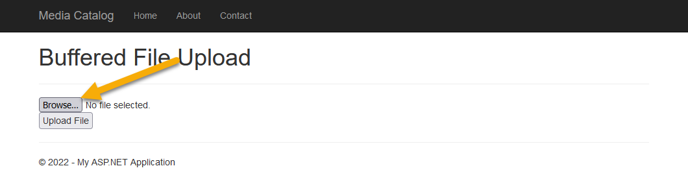
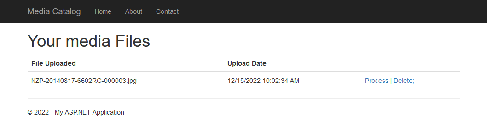

# A Tour of the Sample Application

In visual studio, open the solution file:
```
C:\Source\MediaLibrary4.8\MediaLibrary\MediaLibrary.sln
```

Once the Solution file is open in Visual Studio, run the solution to have a look at the starting point for the sample application.


From the main page, click the "upload" link under the Upload title. 

Use the Browse and Upload buttons to upload an image to the application.



In the sample code folder, there are sample images provided by the Smithsonian Institution. These images can be found in the following location:
```
aws-net-guides\SampleApplications\2022\MediaCatalog\MediaLibrary6.0\SampleImages\
```

Browse to this folder and select the image "NZP-20140817-6602RG-000003.jpg" click "Upload File" once the file has been selected.

The upload process automatically uses Amazon Rekognition to scan the image for any content that might be offensive. The application code automatically rejects any image where any moderation flags have been found. 

Once uploaded, the application will bring you to a list of the files that have been uploaded, and are ready to process. 



Click the "Process" link beside the image. This will use Amazon Rekognition to scan the image and find labels for things that are in the image.

The processing page will give you a list of all the labels that Rekognition has detected and give you an opportunity to save the labels that you want against the image.


Select the options for cheetah, wildlife, animal and mammal. Then click Save.

You will then be brought back to the image list view. The image will no longer have a "Process" link, but will not have a link that allows you to view the previously saved results.


This completes the tour of the Media Catalog application. Feel free to spend more time looking around at the application and becoming familiar with the other functions that are available before moving on to the next part of the guide. 


