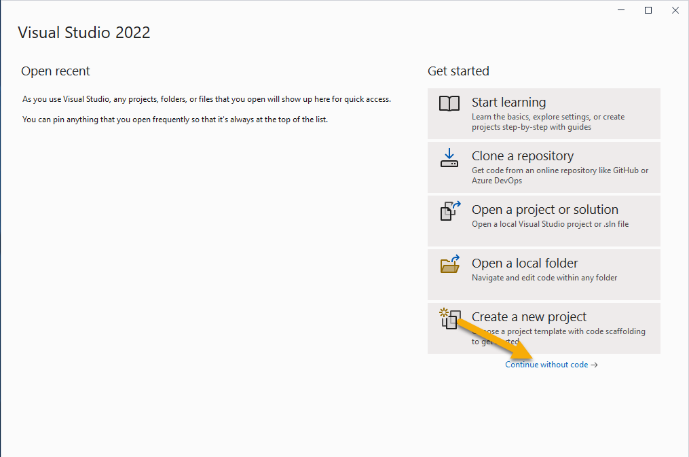
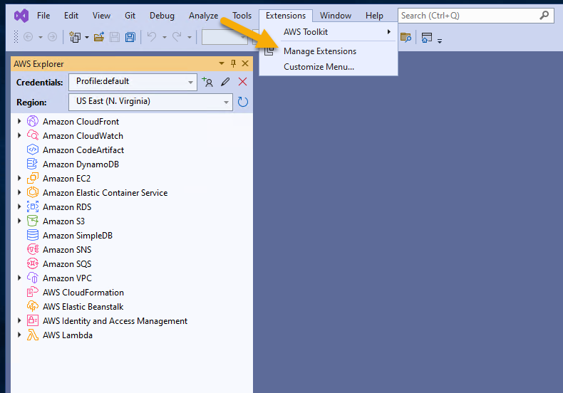
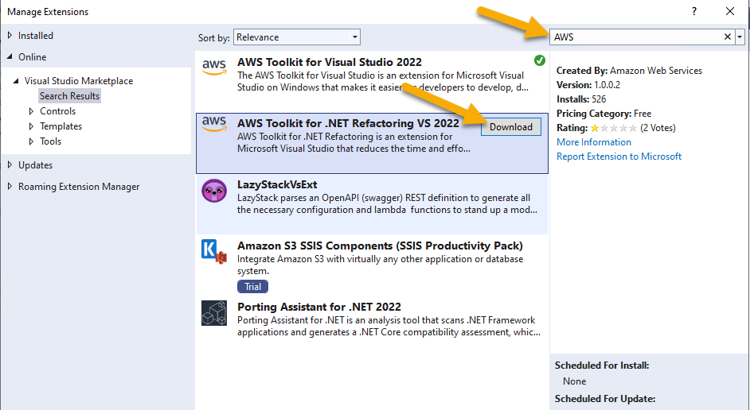
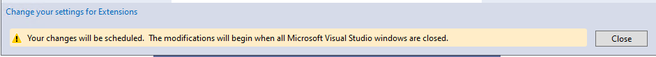
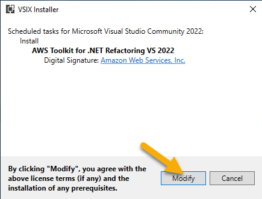

# Installing the AWS Toolkit for .NET Modernization

The AWS Toolkit for .NET Refactoring installs in Visual Studio as an extension. If you don't have Visual Studio open, start it now and select the option to continue without code.

From Visual Studio, click on the Extensions menu item, and then click on Manage Extensions.

Make sure the option to search for “Online” extensions is selected. Then type “AWS” in the search field. Your extensions list will be filtered down. From this menu you can select the “AWS Toolkit for .NET Refactoring VS 2022” from the menu. Once selected, click the Download button.

Once the download has been completed, you will receive a message that the changes will be scheduled once Visual Studio is closed. At this point, click the Close button, and shut down Visual Studio.

Click the Close button, then close Visual Studio. Once Visual Studio closes, the Visual Studio Extension Installer application will run. 

Click the Modify button to allow Visual Studio to install the extension.

This completes the installation of the .NET Refactoring Toolkit for .NET.

[Next](./02-assessing-application.md)  
[Back to Start](../README.md)