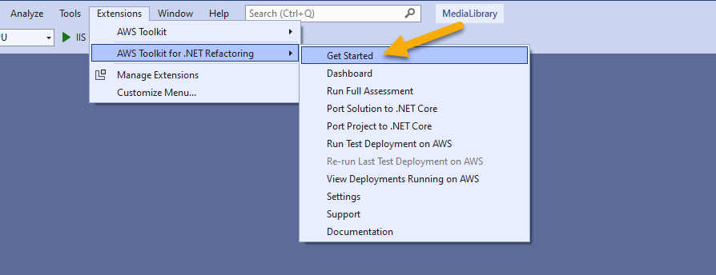
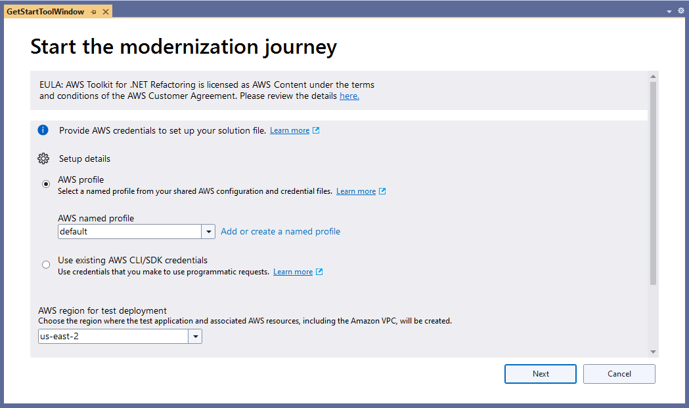
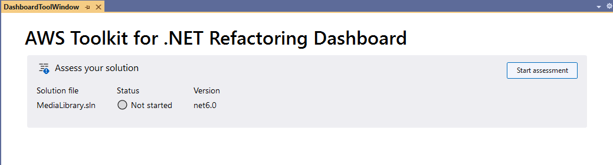
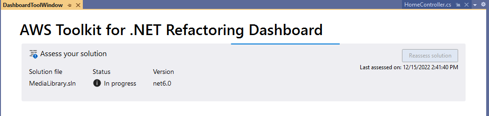
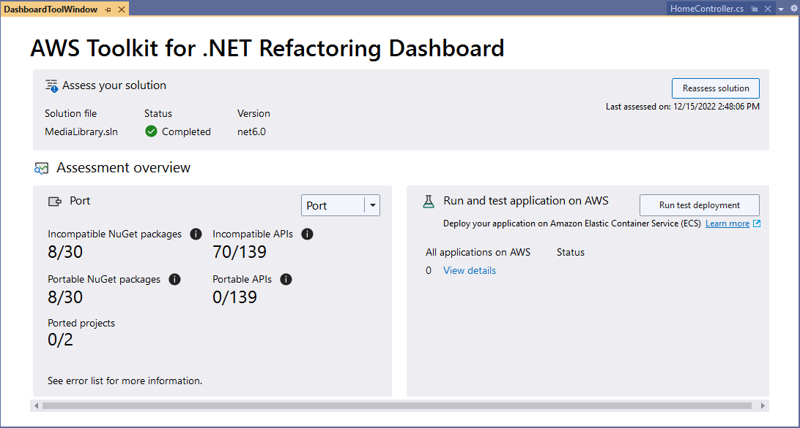
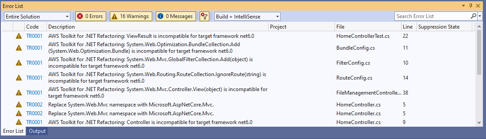

# Assessing your application

The first step in using the AWS Toolkit for .NET Refactoring to refactor your application from .NET Framework 4.8 to .NET 6 is to perform
an assessment of the current application. This assessment will scan through your application code, dependencies and NuGet packages to help determine the level of complexity with converting your application. 

The assessment is nondestructive, the results of the assessment is a report.

From Visual Studio, open the solution file

```
C:\source\MediaLibrary4.8\MediaLibrary\MediaLibrary.sln
```

If the toolkit does not automatically open the Getting Started page below, you can manually launch the Getting Started page by clicking on the extensions menu, select the AWS Toolkit for .NET Refactoring, and then clicking on Getting Started. 



## Configuring the Toolkit

The AWS Toolkit will need to be configured on the first execution. The configuration page is seen here:



In order to progress beyond the first page, you must click on the link under the End User License Agreement (EULA.) Click on this link and read the agreement on the linked page.

The first configuration option is to select how the toolkit will connect to AWS. You have two options for these details. First, you can specify a named profile that has been configured by the AWS Command Line. In this case you have an access key and a secret key configured on your machine. Typically, these credentials are stored by using the command:
```
aws configure
```
And then providing credentials.

The second option is to allow the tool to locate credentials automatically. This option will allow the tool to use credentials that were obtained via IAM Identity Center (Formerly SSO) or inherit credentials from an IAM Role attached to an EC2 Instance.

Functionality for the application will be identical with either method, as long as the selected method has valid credentials for your AWS account. If you are unsure of which option to use, consult with your AWS Account Administrator as they may have policies that determine which method is to be used for obtaining AWS Credentials.

The second configuration option that needs to be set is the region for test deployments. Currently, you can select either "US-EAST-2" or "EU-WEST-2." Note that this selection applies **only** to the test deployments conducted by the toolkit. You have the option to deploy your applications to any AWS region once you are happy with the refactoring.

Once these options have been completed, click Next.

## Starting the Assessment

After configuring the toolkit, you are presented with the Refactoring Dashboard.



At this point, the Assessment is listed as "Not Started." As a result other toolkit functionality may not be available. In order to perform an assessment, you fist need to open one of the code files in the solution. Double click on the "HomeController.cs" file to open it, then click back on the Dashboard Window.


From this window select the option to "Start Assessment" abd the toolkit will begin inspecting your application.



The status on the dashboard will change to "In Progress" while the scanning takes place.



Once your assessment is complete, you will receive an assessment report below.

### Incompatible NuGet packages

This lists the number of packages that as included in the solution that are not compatible with the target version of .NET in this case .NET 6. Note that for these packages, you will need to find alternatives for the required functionality. 

### Incompatible APIs

This lists the number of API calls that are not portable to the new version of .NET. This may be cases where functionality has been deprecated or the API calls have breaking changes. Manual coding effort will be required, after porting, to make the code compatible with the new target version of .NET.

These options provide hints to the amount of manual work, that the toolkit was able to identify, requred after the porting. It is important to understand that these are the incompatibilities that the tool was able to identify, it is not necessarily all of the changes that will be required. You may find code that needs to be reworked when you test your application after porting.

Further details of the incomparable code can be found by looking at the error list, and selecting to view Warnings. Each item in the list shows some manual effort that you will have to complete.




[Next](../03-porting-application/01-porting-application.md) <br/>
[Back to Start](../README.md)


