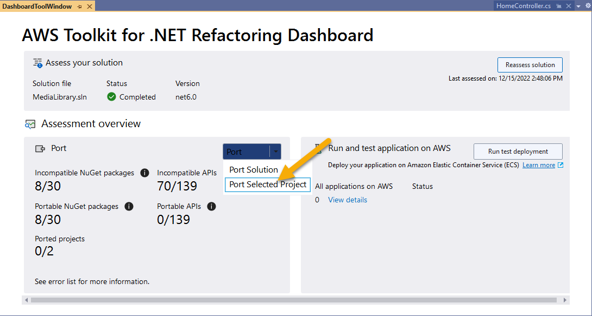
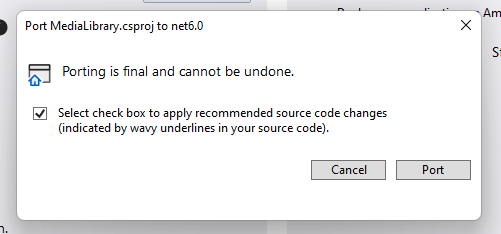
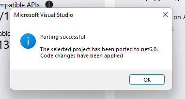
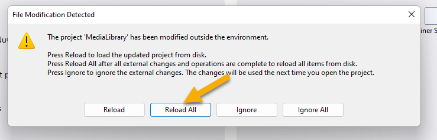
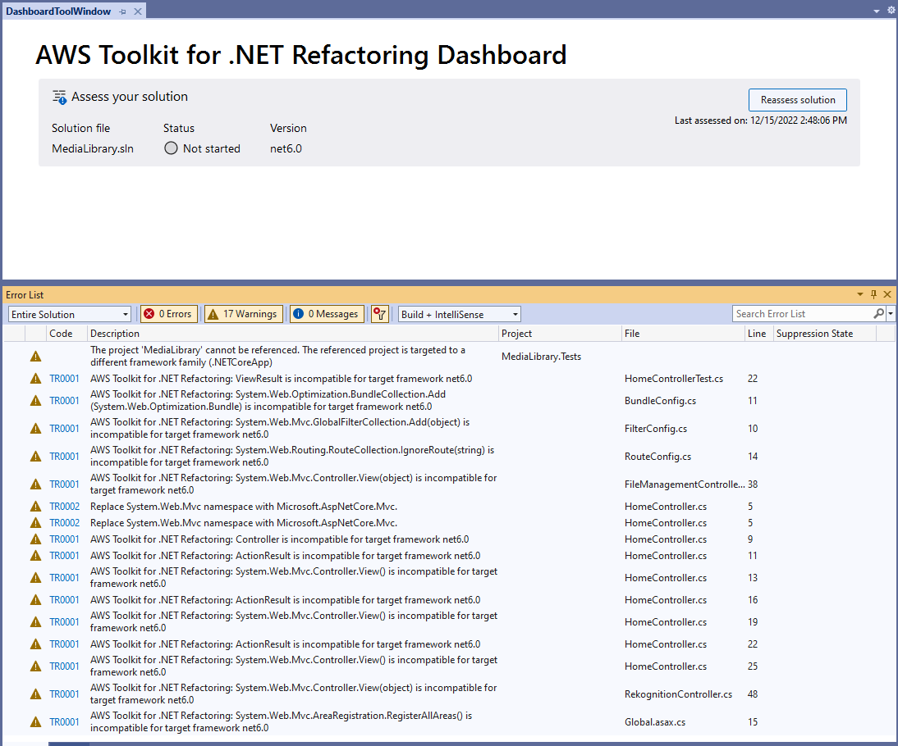

# Porting your application
Once your assessment has been completed, you are able to port your project to the desired version of .NET. 

## Warning:
Porting application code is destructive. You can't undo the changes once the process of porting your solution has begun. Backup all source code before progressing. 

## Start porting your application

You start the porting process for your application from the assessment dashboard. Select the project to be ported in the Solution Explorer, then click the Port drop down, and click "Port Selected Project."

At this point you receive one final warning that the process is permanent.

Check the confirmation and then click the Port button. The time required for porting your application will vary depending on the size of the solution, number of projects, etc. This sample project completes quickly. Once porting has been completed, you will receive a message showing that porting has been successful.

Click Ok to dismiss this dialog. You will then receive a message that your project files have been updated. This dialog will give you the option to reload. You should click the button to "Reload All" before going any further.

Once your project has been reloaded, the dashboard will look like this.

This completes the porting of your application. However, if you attempt to run the application now, the application will not compile. You will need to move onto the manual refactoring stage in order to complete the move to .NET 6. 

[Next](./02-manual-refactoring.md)  
[Back to Start](../README.md)