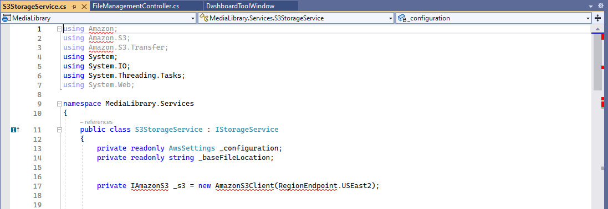
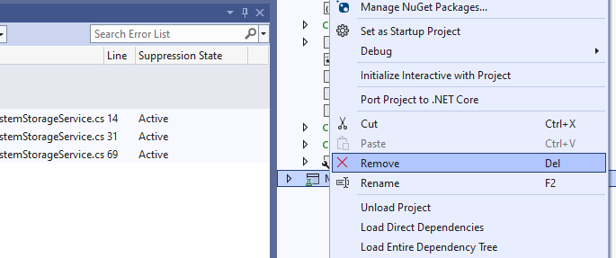
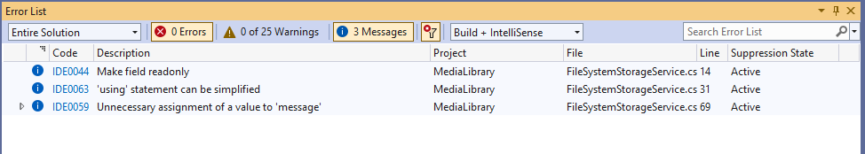
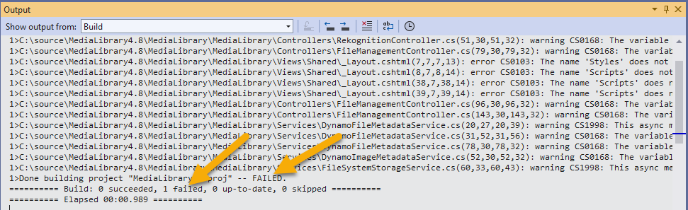
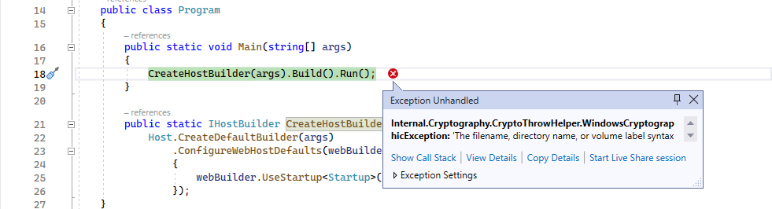
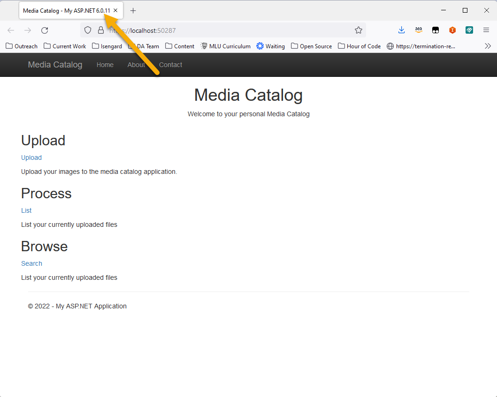
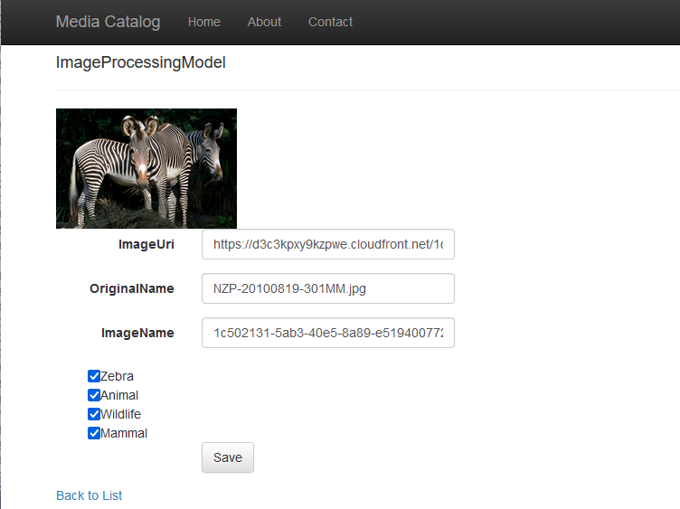
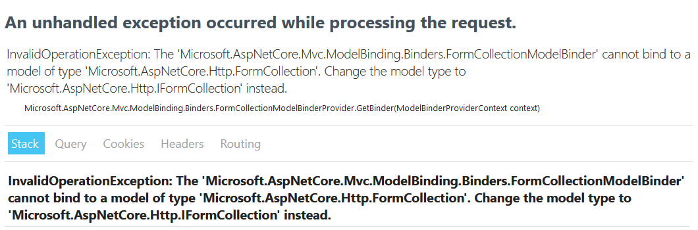

# Manual Post-Porting refactoring

Once your application has been refactored by the toolkit, you will have to go through a process of manually refactoring any of the incompatible code that the toolkit was not able to automatically correct for you.

This section of the guide will walk through some of the manual effort required for completing the porting of this application.

If you need help in progressing with the refactoring effort, there is a copy of the MediaLibrary project built to target .NET 6 in the AWS Samples repository at the following location:

```
aws-net-guides\SampleApplications\2022\MediaCatalog\MediaLibrary6.0
```

## Fixing the missing NuGet packages

When you open up code files that reference the AWS SDKs you will notice errors with the using clauses in the code, and other errors indicating that classes that your code uses can not be found.



These errors are caused by missing NuGet packages. These errors are corrected by adding the list of required AWS SDKs back into the project via NuGet. Right click on your project, select "Manage NuGet Packages..." and then add the following packages to your project.

* AWSSDK.Core
* AWSSDK.S3
* AWSSDK.DynamoDBv2
* AWSSDK.SimpleSystemsManagement 
* AWSSDK.Extensions.NETCore.Setup
* AWSSDK.Rekognition
* AWSSDK.XRay
* AWSXRayRecorder.Handlers.AwsSdk

## Fixing the Upload function

The **Controllers/FileManagementController.cs** file contains an upload method that references the HttpPostedFileBase class. However, this class is no longer available in .NET 6. This is one of the APIs that needs to be manually corrected.

Replace the code:
```C#
public async Task<ActionResult> Upload(HttpPostedFileBase file)
```
with
```C#
public async Task<ActionResult> Upload(IFormFile file)
```

This change will cause additional changes to be required through the code necessary to save the file to Amazon S3. Open the Services/S3StorageService.cs file.

Open the file **Services/IStorageService.cs**

Replace the code:
```C#
string SaveFile(HttpPostedFileBase file);
```
with
```C#
string SaveFile(IFormFile file);
```

Open the **Services/S3StorageService.cs** file. This class will not compile because of the HttpPostedFileBase class not being available in .NET 6. 

replace the code: 
```C#
public string SaveFile(HttpPostedFileBase file)
```
with 
```C#
public string SaveFile(IFormFile file)
```

replace the code:
```C#
try
{
    var stream = new MemoryStream();
    file.InputStream.CopyTo(stream);

    request.InputStream = file.InputStream;
    utility.Upload(request);
}
```
with 
```C#
try
{
    var stream = new MemoryStream();
    file.CopyTo(stream);

    request.InputStream = file.OpenReadStream();
    utility.Upload(request);
}
```
Open the file **Services/FileSystemStorageService.cs** this is a class primarily used for local testing of the website when not using Amazon S3 for storage. You can either delete the file from your solution, or you can fix the implementation for .NET 6.

If you choose to fix the optional class, replace the code:
```C#
public string SaveFile(HttpPostedFileBase file)
{
    var filePath = Path.Combine(baseFileLocation, DateTime.Now.Ticks.ToString() + Path.GetExtension(file.FileName));
    using (var stream = System.IO.File.Create(filePath))
    {
        file.InputStream.CopyTo(stream);
        return Path.Combine(baseFileLocation, filePath);
    }
}
```
with
```C#
public string SaveFile(IFormFile file)
{
    var filePath = Path.Combine(baseFileLocation, DateTime.Now.Ticks.ToString() + Path.GetExtension(file.FileName));
    using (var stream = System.IO.File.Create(filePath))
    {
        file.CopyTo(stream);
        return Path.Combine(baseFileLocation, filePath);
    }
}
```

## Removing the Test Project

At this point your main project will compile, however the Test project in the solution will fail to build. Normally you would carry on to fix the test project, however, for the purposes of this guide we will simply remove the test project.

Right click on the test project and select Remove.


Attempting to build your project now will have some results that may appear confusing. A rebuild will show that there are no code errors:


However, the project output will indicate that the build of the project has failed.

This discrepancy comes down to the code that is embedded in the project's CSHTML pages. The specific problems lie in the layout files used by the MVC framework.

## Fix the application views

Open the file **Views/Shared/_layout.cshtml**

replace the code:
```html
<title>@ViewBag.Title - My ASP.NET Application</title>
```
with:
```html
<title>@ViewBag.Title - My ASP.NET @System.Environment.Version</title>
```

replace the code:
```C#
@Styles.Render("~/Content/css")
@Scripts.Render("~/bundles/modernizr")
```
with
```html
<link rel="stylesheet" href="~/Content/bootstrap.min.css" />
<link rel="stylesheet" href="~/Content/bootstrap-theme.min.css" />
<link rel="stylesheet" href="~/Content/Site.css" />
```

replace the code:
```C#
@Scripts.Render("~/bundles/jquery")
@Scripts.Render("~/bundles/bootstrap")
```
with
```html
<script src="~/lib/jquery/dist/jquery.min.js"></script>
<script src="~/lib/bootstrap/dist/js/bootstrap.bundle.min.js"></script>
```

## Fix the App Settings

At this point your application will successfully compile. However, if you run the application locally it will fail with the following error:


This error is caused by the boiler plate code that is used to create the .NET 6 AppSettings.json file. The default app settings attempts to support HTTPS on your test end points when the application is run in debug mode, however the default code does not have a certificate required to support HTTPS.

Open the file **appSettings.json** in the root of the project.

replace the code:
```json
  "AllowedHosts": "*",
  "Kestrel": {
    "Endpoints": {
      "Http": {
        "Url": "http://0.0.0.0:80"
      },
      "Https": {
        "Url": "https://0.0.0.0:443",
        "Certificate": {
          "Path": "<please provide path to cert>",
          "Password": "<certificate password>"
        }
      }
    }
  }
  ```
  with 
  ```json
    "AllowedHosts": "*"
  ```
This change completely eliminated the "Kestrel" section, and removes the trailing comma after the AllowedHosts entry.

Save all of your open files, and run the application using the debug option.

## Testing your application

Once you have run the application, your project should start up correctly, and you should see the following:



Note that the title of the tab calls out that the application is running .NET version 6.0!

You can test your application functionality by interacting with the application. This may uncover additional errors that occur at runtime, despite your application successfully compiling. 

For example, if you attempt to process an image:


your will receive the following runtime error:


You can fix this by opening the file **Controllers/RekognitionController.cs**
replace the code:
```C#
public async Task<ActionResult> Process(ImageProcessingModel model, FormCollection collection)
```
with
```C#
public async Task<ActionResult> Process(ImageProcessingModel model, IFormCollection collection)
```

## Complete

Congradulations! You have completed the porting of your application from .NET 4.8 to .NET 6. 


[Next](../04-Cleanup/01-cleanup.md) <br/>
[Back to Start](../README.md)